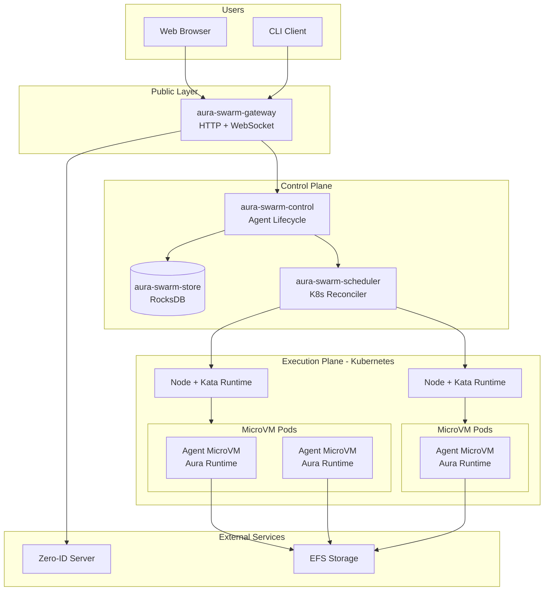
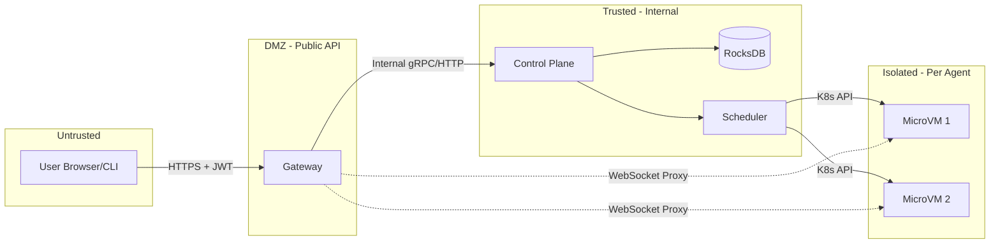
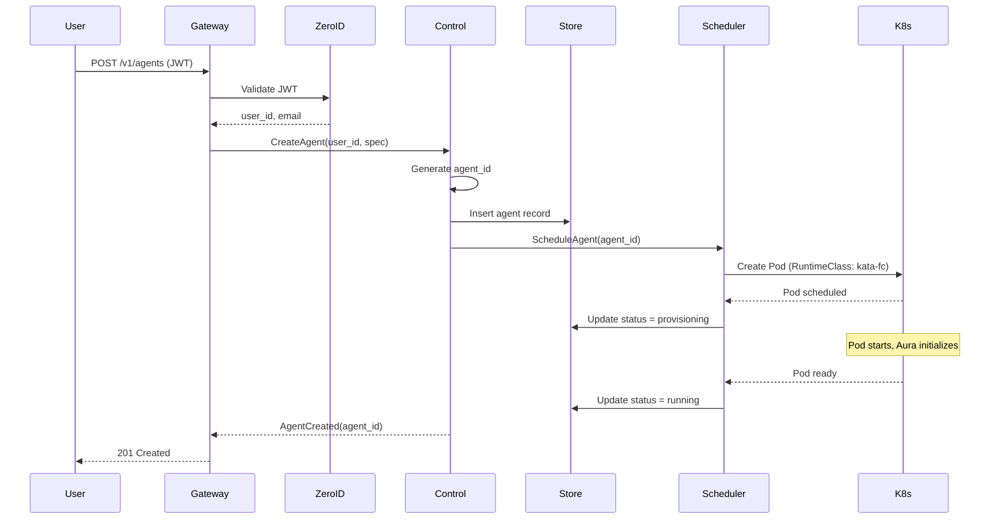
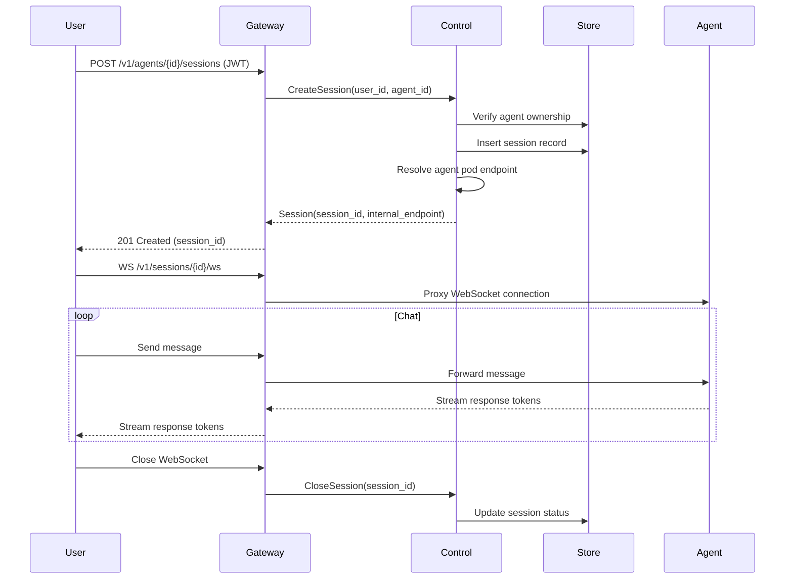
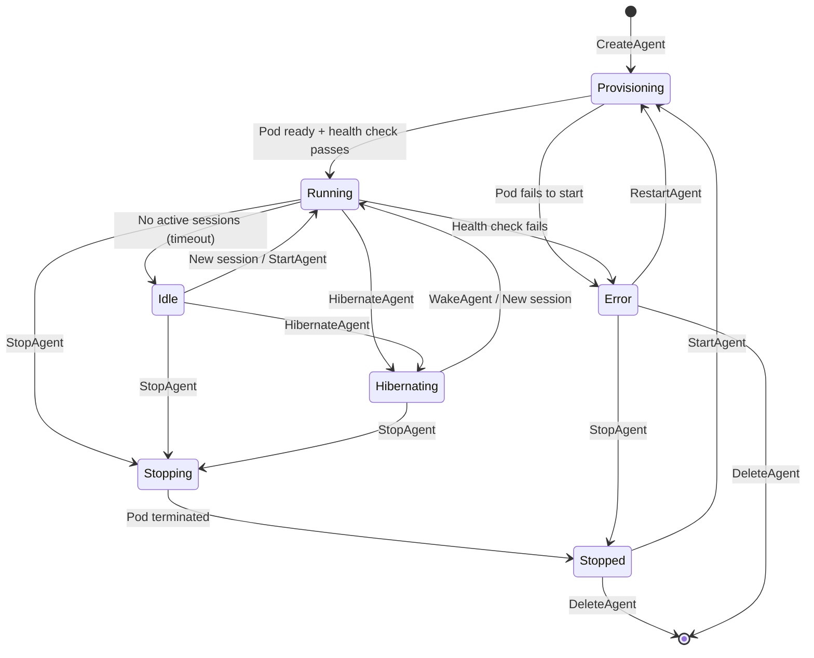
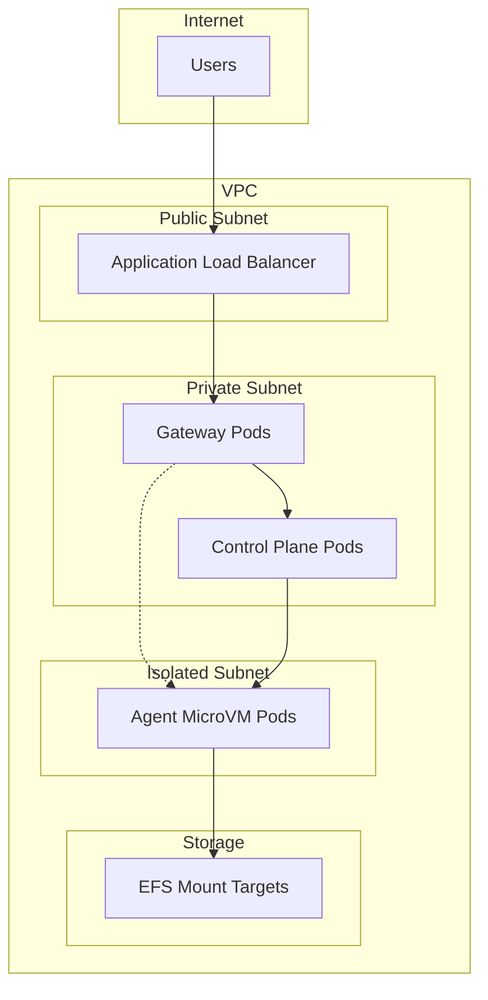
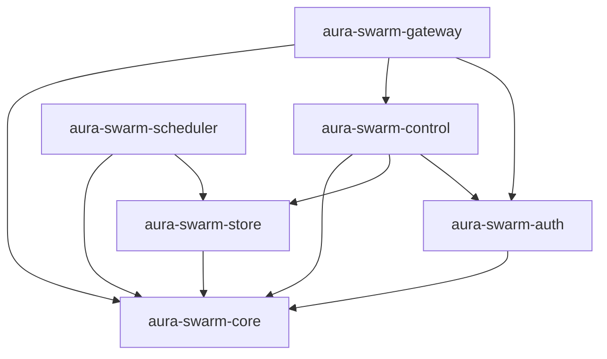

# System Overview — Specification v0.1.0

## 1. Overview

The MicroVM Agent Platform is a multi-user system for running isolated AI agents. Each agent runs in its own microVM (Firecracker-backed via Kata Containers), providing strong security boundaries between users and their workloads.

### 1.1 Purpose

- Allow users to create, manage, and interact with AI agents
- Provide kernel-level isolation between agents using microVMs
- Support long-running background agents with persistent state
- Enable real-time interaction via WebSocket streaming

### 1.2 Core Principles

| Principle | Description |
|-----------|-------------|
| **MicroVM-first isolation** | Every agent runs in its own Firecracker microVM |
| **Stable IDs over ephemeral infra** | Agents addressed by `agent_id`, never by pod IP |
| **User isolation by design** | Data and network boundaries prevent cross-user access |
| **No public agent endpoints** | All access flows through the gateway |
| **Rust everywhere** | All platform services written in safe Rust |

### 1.3 Non-Goals (v0.1.0)

- Multi-tenant namespaces and policies (deferred)
- Cross-user agent communication
- Public per-agent DNS/IPs
- Exposing Kubernetes APIs to users
- Arbitrary user-supplied code (agents run Aura runtime only)

---

## 2. High-Level Architecture

### 2.1 System Layers



### 2.2 Component Summary

| Component | Responsibility |
|-----------|---------------|
| **aura-swarm-gateway** | Public API, WebSocket proxy, JWT validation |
| **aura-swarm-control** | Agent CRUD, lifecycle management, session routing |
| **aura-swarm-store** | RocksDB persistence for agents, users, sessions |
| **aura-swarm-scheduler** | Kubernetes reconciler, pod lifecycle, health monitoring |
| **aura-swarm-auth** | Zero-ID integration, token validation |
| **Aura Runtime** | AI agent execution inside microVM |

---

## 3. Trust Boundaries

### 3.1 Boundary Diagram



### 3.2 Trust Levels

| Zone | Components | Trust Level |
|------|------------|-------------|
| **Untrusted** | User browsers, CLI clients | None — all input validated |
| **DMZ** | aura-swarm-gateway | Authenticated — validates JWTs |
| **Trusted** | Control plane services | Full — internal network only |
| **Isolated** | Agent microVMs | Sandboxed — own kernel, no cross-VM access |

### 3.3 Security Boundaries

1. **Authentication Boundary**: Gateway validates JWT before any operation
2. **Authorization Boundary**: Control plane checks `user_id` ownership on every agent operation
3. **Network Boundary**: Agent pods have no public IPs; ingress only from control plane
4. **Kernel Boundary**: Each agent runs in separate Firecracker VM with own kernel
5. **Storage Boundary**: Agents only access their own `/state/<user_id>/<agent_id>/` path

---

## 4. Data Flow

### 4.1 Agent Creation Flow



### 4.2 Interactive Session Flow



---

## 5. Agent Lifecycle

### 5.1 State Machine



### 5.2 State Descriptions

| State | Description | Pod Status |
|-------|-------------|------------|
| **Provisioning** | Pod being created, Aura initializing | Creating/Pending |
| **Running** | Agent active, accepting sessions | Running |
| **Idle** | No active sessions, still running | Running |
| **Hibernating** | State saved, pod terminated, instant wake | Terminated |
| **Stopping** | Graceful shutdown in progress | Terminating |
| **Stopped** | Pod terminated, state preserved | None |
| **Error** | Health check failed or crash | Failed/CrashLoop |

### 5.3 Hibernation

Hibernation allows cost savings by terminating the pod while preserving state:

1. Agent state is persisted to `/state/<user_id>/<agent_id>/`
2. Pod is terminated (no compute cost)
3. On wake: new pod created, state restored from filesystem
4. Wake triggers: explicit API call, new session request

---

## 6. Storage Architecture

### 6.1 Control Plane Storage (RocksDB)

The control plane uses an embedded RocksDB database:

```
aura-swarm-store/
└── db/
    ├── users/           # User records (from Zero-ID sync)
    ├── agents/          # Agent metadata and status
    ├── agents_by_user/  # Index: user_id -> agent_ids
    └── sessions/        # Active session records
```

Key layout supports future sharding by `user_id` prefix.

### 6.2 Agent State Storage (EFS)

Each agent has isolated persistent storage:

```
/state/
└── <user_id>/
    └── <agent_id>/
        ├── db/          # Aura RocksDB (record, agent_meta, inbox)
        ├── workspaces/  # Agent working directories
        └── config/      # Agent configuration
```

- **Isolation**: Agents can only access their own directory
- **Persistence**: State survives pod restarts and hibernation
- **Backup**: EFS supports snapshots for disaster recovery

---

## 7. Networking Model

### 7.1 Network Topology



### 7.2 Network Policies

| Source | Destination | Allowed |
|--------|-------------|---------|
| Internet | Gateway (443) | Yes |
| Gateway | Control Plane | Yes |
| Gateway | Agent (8080) | Yes (WebSocket proxy) |
| Control Plane | Agent (8080) | Yes (health, lifecycle) |
| Agent | Agent | **No** (cross-agent blocked) |
| Agent | Internet | Allowlist only (LLM APIs) |
| Agent | EFS | Yes (own directory only) |

---

## 8. External Dependencies

### 8.1 Zero-ID

Authentication provider for user identity:

- **Integration**: Simple email/password flow
- **Token**: JWT with `user_id`, `email` claims
- **Validation**: Gateway validates signature and expiry

### 8.2 Aura Runtime

AI agent execution environment:

- **Source**: `github.com/cypher-asi/aura-runtime`
- **Interface**: HTTP health endpoint, WebSocket chat
- **Storage**: RocksDB-based append-only record

### 8.3 Kubernetes + Kata Containers

Execution platform:

- **RuntimeClass**: `kata-fc` (Firecracker backend)
- **Node Requirements**: Kata runtime installed, nested virt or bare metal
- **Pod Spec**: CPU/memory limits, EFS volume mounts

---

## 9. Scalability Considerations

### 9.1 v0.1.0 Limits

| Resource | Limit |
|----------|-------|
| Users | Hundreds |
| Agents per user | 10 |
| Total agents | Thousands |
| Concurrent sessions | Hundreds |

### 9.2 Future Scaling (post-v0.1.0)

- **Cell-based architecture**: Partition users across clusters
- **RocksDB sharding**: Shard by `user_id` prefix
- **Multi-region**: Deploy cells in multiple regions
- **Horizontal gateway**: Stateless gateway pods behind ALB

---

## 10. Crate Dependencies



### 10.1 External Crate Dependencies

| Crate | Version | Purpose |
|-------|---------|---------|
| `tokio` | 1.x | Async runtime |
| `axum` | 0.7.x | HTTP framework |
| `rocksdb` | 0.22.x | Embedded database |
| `serde` | 1.x | Serialization |
| `jsonwebtoken` | 9.x | JWT validation |
| `kube` | 0.88.x | Kubernetes client |
| `tracing` | 0.1.x | Structured logging |
| `thiserror` | 1.x | Error types |
| `uuid` | 1.x | ID generation |
| `blake3` | 1.x | Hashing |
