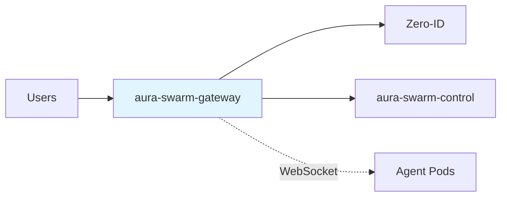
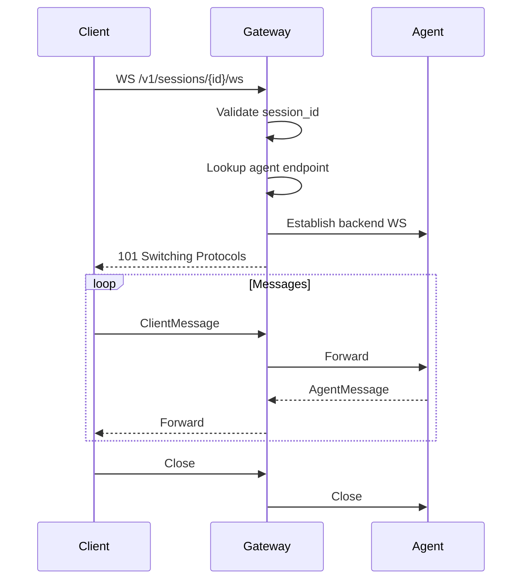

# API Gateway — Specification v0.1.0

## 1. Overview

The `aura-swarm-gateway` crate provides the public-facing HTTP and WebSocket API for the MicroVM Agent Platform. It handles authentication, request routing, and WebSocket proxying to agent pods.

### 1.1 Responsibilities

- Expose RESTful HTTP endpoints for agent management
- Validate JWT tokens from Zero-ID
- Proxy WebSocket connections to agent pods
- Rate limiting and request validation
- CORS and security headers

### 1.2 Position in Architecture



---

## 2. Public Interface

### 2.1 HTTP Endpoints

All endpoints require a valid JWT in the `Authorization: Bearer <token>` header unless marked as public.

#### 2.1.1 Health (Public)

```
GET /health
```

Response: `200 OK`
```json
{
  "status": "healthy",
  "version": "0.1.0"
}
```

#### 2.1.2 Agents

**List Agents**
```
GET /v1/agents
```

Response: `200 OK`
```json
{
  "agents": [
    {
      "agent_id": "a1b2c3d4...",
      "name": "my-agent",
      "status": "running",
      "created_at": "2026-01-15T10:30:00Z",
      "updated_at": "2026-01-15T10:35:00Z"
    }
  ]
}
```

**Create Agent**
```
POST /v1/agents
Content-Type: application/json

{
  "name": "my-agent",
  "spec": {
    "cpu_millicores": 500,
    "memory_mb": 512
  }
}
```

Response: `201 Created`
```json
{
  "agent_id": "a1b2c3d4...",
  "name": "my-agent",
  "status": "provisioning",
  "created_at": "2026-01-15T10:30:00Z"
}
```

**Get Agent**
```
GET /v1/agents/{agent_id}
```

Response: `200 OK`
```json
{
  "agent_id": "a1b2c3d4...",
  "name": "my-agent",
  "status": "running",
  "spec": {
    "cpu_millicores": 500,
    "memory_mb": 512
  },
  "created_at": "2026-01-15T10:30:00Z",
  "updated_at": "2026-01-15T10:35:00Z",
  "last_heartbeat_at": "2026-01-15T10:40:00Z"
}
```

**Delete Agent**
```
DELETE /v1/agents/{agent_id}
```

Response: `204 No Content`

#### 2.1.3 Agent Lifecycle

**Start Agent**
```
POST /v1/agents/{agent_id}:start
```

Response: `200 OK`
```json
{
  "agent_id": "a1b2c3d4...",
  "status": "provisioning"
}
```

**Stop Agent**
```
POST /v1/agents/{agent_id}:stop
```

Response: `200 OK`
```json
{
  "agent_id": "a1b2c3d4...",
  "status": "stopping"
}
```

**Restart Agent**
```
POST /v1/agents/{agent_id}:restart
```

Response: `200 OK`
```json
{
  "agent_id": "a1b2c3d4...",
  "status": "provisioning"
}
```

**Hibernate Agent**
```
POST /v1/agents/{agent_id}:hibernate
```

Response: `200 OK`
```json
{
  "agent_id": "a1b2c3d4...",
  "status": "hibernating"
}
```

**Wake Agent**
```
POST /v1/agents/{agent_id}:wake
```

Response: `200 OK`
```json
{
  "agent_id": "a1b2c3d4...",
  "status": "provisioning"
}
```

#### 2.1.4 Sessions

**Create Session**
```
POST /v1/agents/{agent_id}/sessions
```

Response: `201 Created`
```json
{
  "session_id": "s1e2s3s4...",
  "agent_id": "a1b2c3d4...",
  "ws_url": "/v1/sessions/s1e2s3s4.../ws",
  "created_at": "2026-01-15T10:45:00Z"
}
```

**Get Session**
```
GET /v1/sessions/{session_id}
```

Response: `200 OK`
```json
{
  "session_id": "s1e2s3s4...",
  "agent_id": "a1b2c3d4...",
  "status": "active",
  "created_at": "2026-01-15T10:45:00Z"
}
```

**WebSocket Connection**
```
WS /v1/sessions/{session_id}/ws
```

Upgrade to WebSocket for real-time agent interaction. See Section 3 for protocol details.

#### 2.1.5 Agent Observability

**Get Agent Logs**
```
GET /v1/agents/{agent_id}/logs?tail=100&since=2026-01-15T10:00:00Z
```

Response: `200 OK`
```json
{
  "logs": [
    {
      "timestamp": "2026-01-15T10:30:00Z",
      "level": "info",
      "message": "Agent started"
    }
  ]
}
```

**Get Agent Status**
```
GET /v1/agents/{agent_id}/status
```

Response: `200 OK`
```json
{
  "status": "running",
  "uptime_seconds": 3600,
  "active_sessions": 1,
  "last_heartbeat_at": "2026-01-15T10:40:00Z",
  "resource_usage": {
    "cpu_percent": 15.5,
    "memory_mb": 256
  }
}
```

---

## 3. WebSocket Protocol

### 3.1 Connection Flow



### 3.2 Message Types

#### Client → Agent

```json
{
  "type": "user_message",
  "content": "Hello, agent!",
  "message_id": "m1234"
}
```

```json
{
  "type": "cancel",
  "message_id": "m1234"
}
```

#### Agent → Client

```json
{
  "type": "assistant_message_start",
  "message_id": "m5678"
}
```

```json
{
  "type": "assistant_message_delta",
  "message_id": "m5678",
  "delta": "Hello"
}
```

```json
{
  "type": "assistant_message_end",
  "message_id": "m5678"
}
```

```json
{
  "type": "tool_use_start",
  "message_id": "m5678",
  "tool_use_id": "t001",
  "tool_name": "fs.read"
}
```

```json
{
  "type": "tool_result",
  "message_id": "m5678",
  "tool_use_id": "t001",
  "content": "file contents..."
}
```

```json
{
  "type": "error",
  "message_id": "m5678",
  "error": {
    "code": "agent_error",
    "message": "Tool execution failed"
  }
}
```

### 3.3 Terminal Output Stream

For real-time command output visibility:

```json
{
  "type": "terminal_output",
  "message_id": "m5678",
  "stream": "stdout",
  "content": "$ ls -la\ntotal 16\n..."
}
```

---

## 4. Rust Interface

### 4.1 Gateway State

```rust
use std::sync::Arc;
use swarm_auth::JwtValidator;
use swarm_control::ControlPlane;

pub struct GatewayState {
    pub control: Arc<ControlPlane>,
    pub jwt_validator: Arc<JwtValidator>,
    pub config: GatewayConfig,
}

pub struct GatewayConfig {
    pub listen_addr: String,
    pub cors_origins: Vec<String>,
    pub rate_limit_rps: u32,
    pub websocket_timeout_seconds: u64,
}
```

### 4.2 Router Setup

```rust
use axum::{Router, routing::{get, post, delete}};
use tower_http::cors::CorsLayer;

pub fn create_router(state: GatewayState) -> Router {
    Router::new()
        // Health
        .route("/health", get(health_handler))
        
        // Agents
        .route("/v1/agents", get(list_agents).post(create_agent))
        .route("/v1/agents/:agent_id", get(get_agent).delete(delete_agent))
        .route("/v1/agents/:agent_id:start", post(start_agent))
        .route("/v1/agents/:agent_id:stop", post(stop_agent))
        .route("/v1/agents/:agent_id:restart", post(restart_agent))
        .route("/v1/agents/:agent_id:hibernate", post(hibernate_agent))
        .route("/v1/agents/:agent_id:wake", post(wake_agent))
        
        // Sessions
        .route("/v1/agents/:agent_id/sessions", post(create_session))
        .route("/v1/sessions/:session_id", get(get_session))
        .route("/v1/sessions/:session_id/ws", get(websocket_handler))
        
        // Observability
        .route("/v1/agents/:agent_id/logs", get(get_logs))
        .route("/v1/agents/:agent_id/status", get(get_status))
        
        .layer(CorsLayer::permissive())
        .with_state(Arc::new(state))
}
```

### 4.3 Authentication Extractor

```rust
use axum::{
    extract::FromRequestParts,
    http::request::Parts,
};
use swarm_core::UserId;

/// Authenticated user extracted from JWT
pub struct AuthUser {
    pub user_id: UserId,
    pub email: String,
}

#[async_trait]
impl<S> FromRequestParts<S> for AuthUser
where
    S: Send + Sync,
{
    type Rejection = ApiError;

    async fn from_request_parts(parts: &mut Parts, state: &S) -> Result<Self, Self::Rejection> {
        let auth_header = parts
            .headers
            .get("authorization")
            .and_then(|v| v.to_str().ok())
            .ok_or(ApiError::Unauthorized)?;

        let token = auth_header
            .strip_prefix("Bearer ")
            .ok_or(ApiError::Unauthorized)?;

        let claims = state.jwt_validator.validate(token)?;
        
        Ok(AuthUser {
            user_id: claims.user_id,
            email: claims.email,
        })
    }
}
```

### 4.4 WebSocket Handler

```rust
use axum::{
    extract::{ws::{WebSocket, WebSocketUpgrade}, Path, State},
    response::Response,
};
use tokio_tungstenite::connect_async;

pub async fn websocket_handler(
    ws: WebSocketUpgrade,
    Path(session_id): Path<String>,
    State(state): State<Arc<GatewayState>>,
    user: AuthUser,
) -> Result<Response, ApiError> {
    // Validate session ownership
    let session = state.control.get_session(&session_id).await?;
    if session.user_id != user.user_id {
        return Err(ApiError::Forbidden);
    }
    
    // Get agent endpoint
    let endpoint = state.control.resolve_agent_endpoint(&session.agent_id).await?;
    
    Ok(ws.on_upgrade(move |socket| {
        handle_websocket(socket, endpoint, session_id)
    }))
}

async fn handle_websocket(
    client_socket: WebSocket,
    agent_endpoint: String,
    session_id: String,
) {
    // Connect to agent
    let agent_url = format!("ws://{}/chat", agent_endpoint);
    let (agent_socket, _) = match connect_async(&agent_url).await {
        Ok(conn) => conn,
        Err(e) => {
            tracing::error!(session_id, error = %e, "Failed to connect to agent");
            return;
        }
    };
    
    // Bidirectional proxy
    let (client_write, client_read) = client_socket.split();
    let (agent_write, agent_read) = agent_socket.split();
    
    tokio::select! {
        _ = forward_messages(client_read, agent_write) => {}
        _ = forward_messages(agent_read, client_write) => {}
    }
}
```

---

## 5. Error Responses

### 5.1 Error Format

All errors return JSON:

```json
{
  "error": {
    "code": "not_found",
    "message": "Agent not found",
    "details": {
      "agent_id": "a1b2c3d4..."
    }
  }
}
```

### 5.2 Error Codes

| Code | HTTP Status | Description |
|------|-------------|-------------|
| `unauthorized` | 401 | Missing or invalid JWT |
| `forbidden` | 403 | User doesn't own resource |
| `not_found` | 404 | Resource doesn't exist |
| `conflict` | 409 | Resource in wrong state (e.g., start running agent) |
| `rate_limited` | 429 | Too many requests |
| `internal_error` | 500 | Server error |
| `agent_unavailable` | 503 | Agent pod not reachable |

### 5.3 Error Types

```rust
use axum::response::{IntoResponse, Response};
use axum::http::StatusCode;
use serde::Serialize;
use thiserror::Error;

#[derive(Error, Debug)]
pub enum ApiError {
    #[error("Unauthorized")]
    Unauthorized,
    
    #[error("Forbidden")]
    Forbidden,
    
    #[error("Not found: {0}")]
    NotFound(String),
    
    #[error("Conflict: {0}")]
    Conflict(String),
    
    #[error("Rate limited")]
    RateLimited,
    
    #[error("Internal error: {0}")]
    Internal(#[from] anyhow::Error),
    
    #[error("Agent unavailable")]
    AgentUnavailable,
}

impl IntoResponse for ApiError {
    fn into_response(self) -> Response {
        let (status, code) = match &self {
            ApiError::Unauthorized => (StatusCode::UNAUTHORIZED, "unauthorized"),
            ApiError::Forbidden => (StatusCode::FORBIDDEN, "forbidden"),
            ApiError::NotFound(_) => (StatusCode::NOT_FOUND, "not_found"),
            ApiError::Conflict(_) => (StatusCode::CONFLICT, "conflict"),
            ApiError::RateLimited => (StatusCode::TOO_MANY_REQUESTS, "rate_limited"),
            ApiError::Internal(_) => (StatusCode::INTERNAL_SERVER_ERROR, "internal_error"),
            ApiError::AgentUnavailable => (StatusCode::SERVICE_UNAVAILABLE, "agent_unavailable"),
        };
        
        let body = serde_json::json!({
            "error": {
                "code": code,
                "message": self.to_string()
            }
        });
        
        (status, axum::Json(body)).into_response()
    }
}
```

---

## 6. Security Considerations

### 6.1 Authentication

- All endpoints except `/health` require valid JWT
- JWTs validated for signature, expiry, and issuer
- User ID extracted from token claims

### 6.2 Authorization

- Every agent operation checks `agent.user_id == request.user_id`
- Session access restricted to session owner
- WebSocket connections validated before upgrade

### 6.3 Rate Limiting

- Per-user rate limits (default: 100 req/s)
- Per-IP rate limits for unauthenticated endpoints
- WebSocket message rate limiting (100 msg/s)

### 6.4 Input Validation

- Agent names: alphanumeric + hyphens, 3-64 chars
- Resource limits: within configured bounds
- Session IDs: valid UUID format

---

## 7. Configuration

```rust
#[derive(Clone, Debug, serde::Deserialize)]
pub struct GatewayConfig {
    /// Listen address (e.g., "0.0.0.0:8080")
    pub listen_addr: String,
    
    /// Allowed CORS origins
    pub cors_origins: Vec<String>,
    
    /// Rate limit (requests per second per user)
    pub rate_limit_rps: u32,
    
    /// WebSocket idle timeout
    pub websocket_timeout_seconds: u64,
    
    /// Maximum request body size
    pub max_body_bytes: usize,
    
    /// JWT validation settings
    pub jwt: JwtConfig,
}

#[derive(Clone, Debug, serde::Deserialize)]
pub struct JwtConfig {
    /// Zero-ID server URL for JWKS
    pub jwks_url: String,
    
    /// Expected issuer claim
    pub issuer: String,
    
    /// Expected audience claim
    pub audience: String,
}
```

---

## 8. Dependencies

### 8.1 Internal

| Crate | Purpose |
|-------|---------|
| `aura-swarm-core` | `UserId`, `AgentId`, `SessionId` types |
| `aura-swarm-control` | Agent lifecycle operations |
| `aura-swarm-auth` | JWT validation |

### 8.2 External

| Crate | Version | Purpose |
|-------|---------|---------|
| `axum` | 0.7.x | HTTP framework |
| `tokio` | 1.x | Async runtime |
| `tokio-tungstenite` | 0.21.x | WebSocket client |
| `tower-http` | 0.5.x | HTTP middleware (CORS, compression) |
| `serde_json` | 1.x | JSON serialization |
| `tracing` | 0.1.x | Structured logging |
