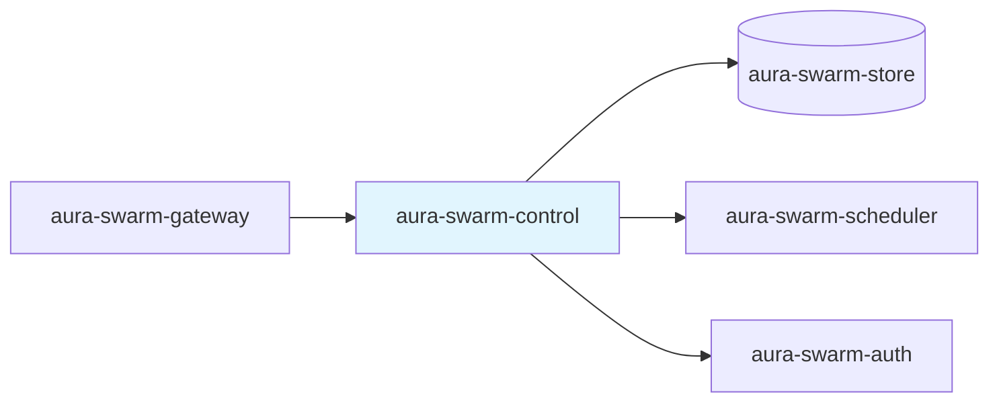
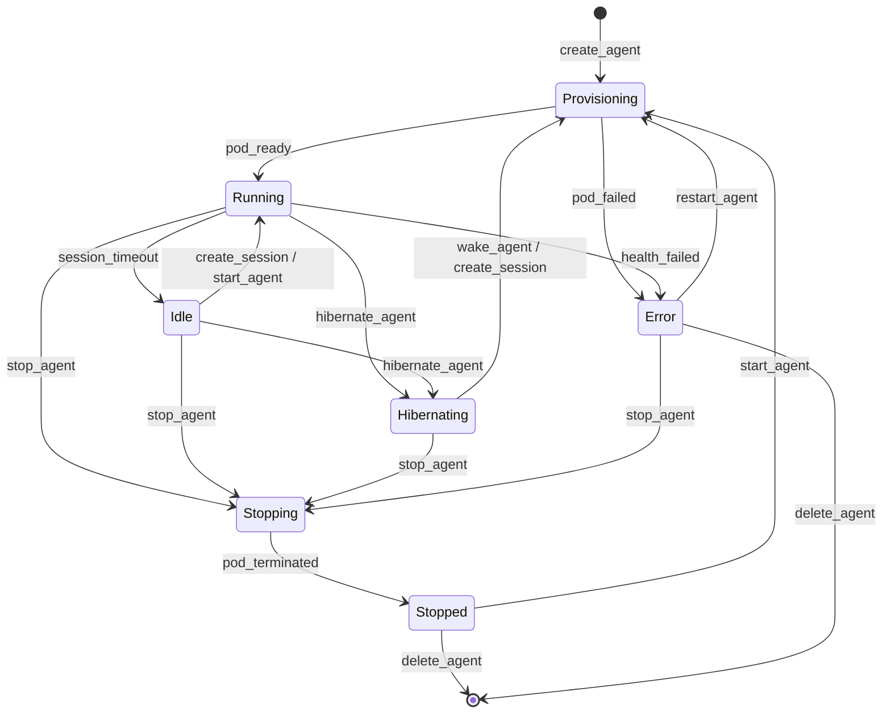
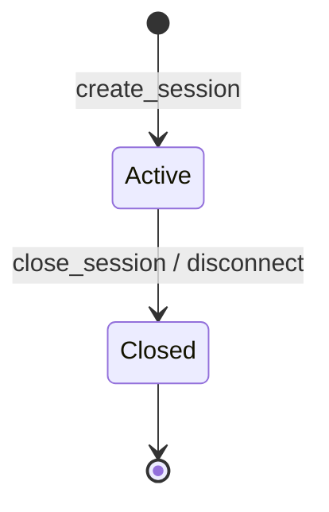
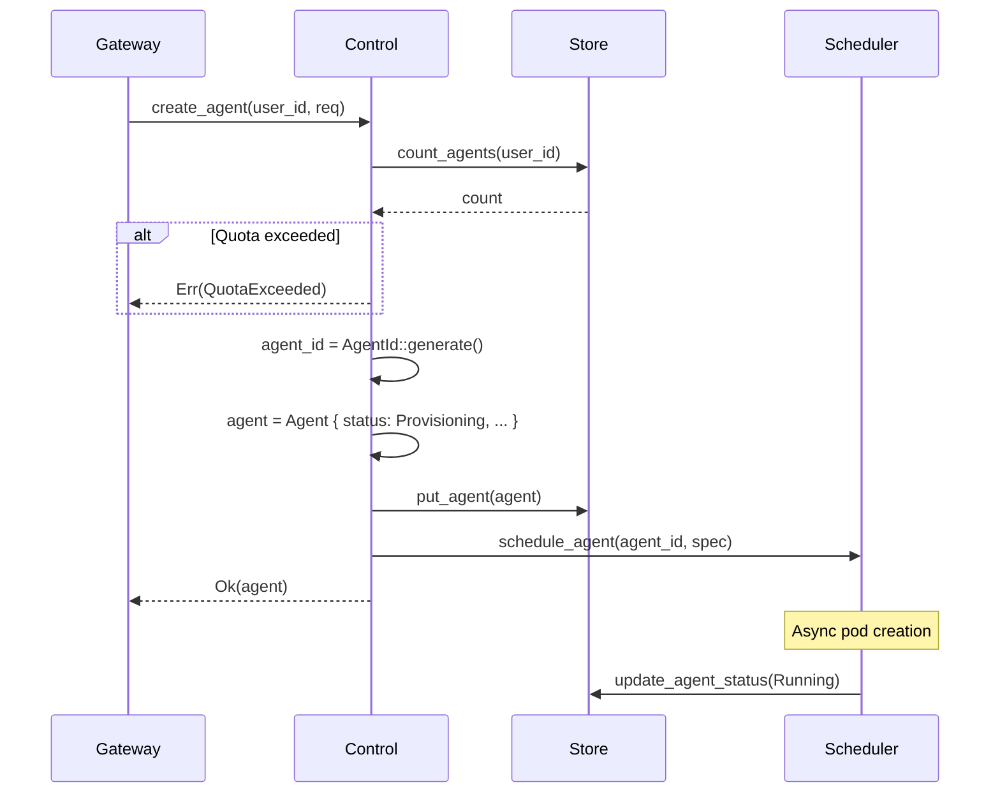
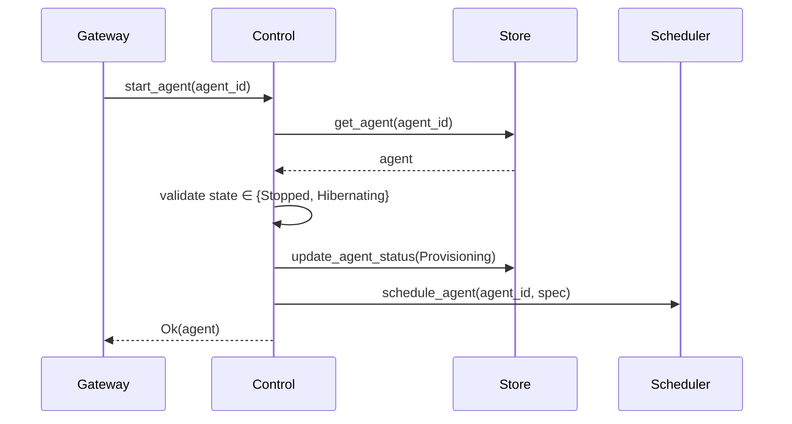
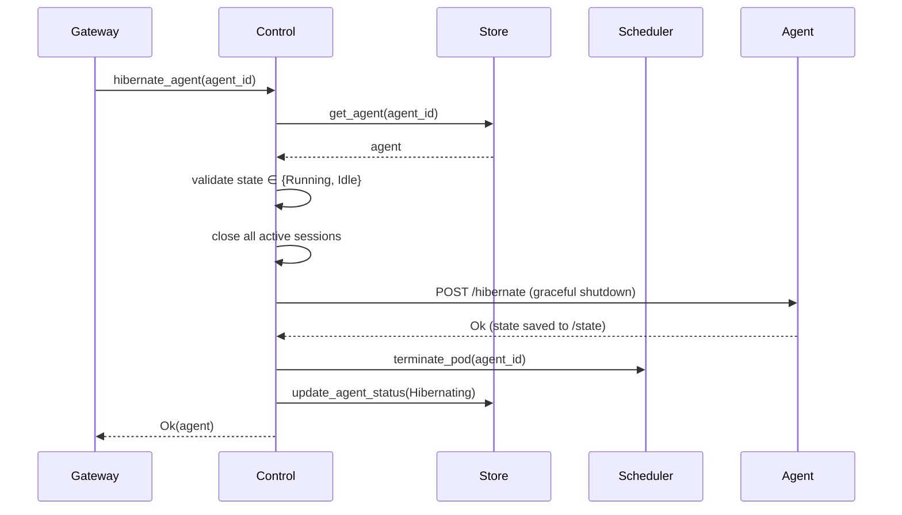
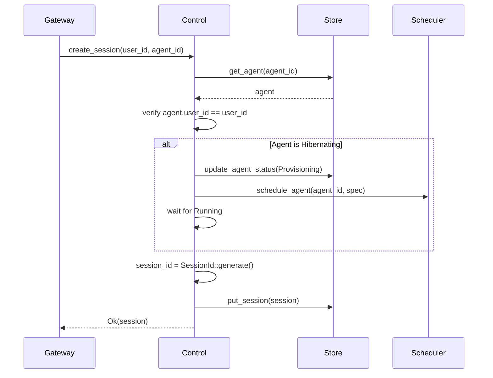
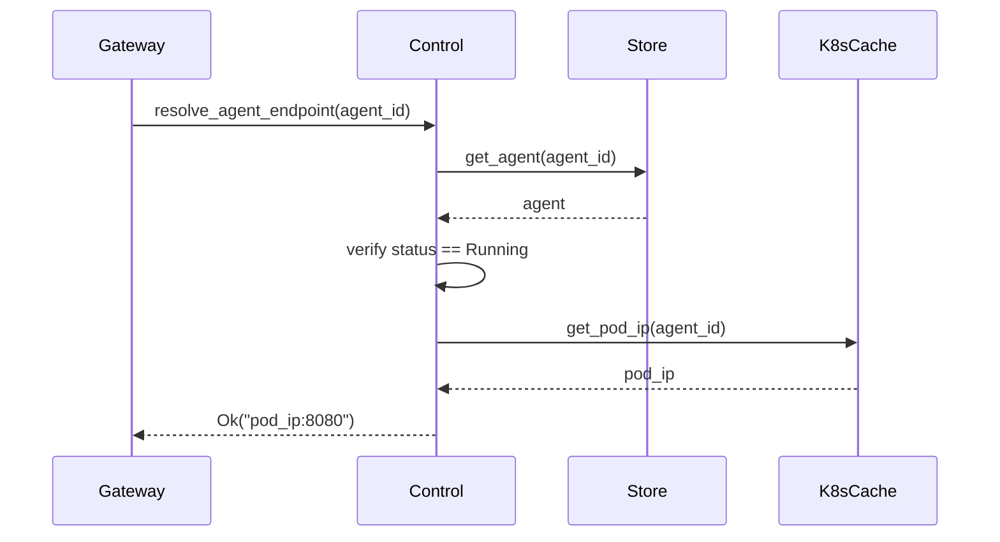

# Control Plane — Specification v0.1.0

## 1. Overview

The `aura-swarm-control` crate is the central coordination service for agent lifecycle management, session handling, and internal routing. It serves as the primary interface between the gateway and the execution layer.

### 1.1 Responsibilities

- Agent CRUD operations
- Lifecycle state machine management
- Session creation and tracking
- Agent endpoint resolution for WebSocket proxy
- Coordination with scheduler for pod operations

### 1.2 Position in Architecture



---

## 2. Public Interface

### 2.1 ControlPlane Trait

```rust
use async_trait::async_trait;
use swarm_core::{AgentId, UserId, SessionId};

#[async_trait]
pub trait ControlPlane: Send + Sync {
    // Agent CRUD
    async fn create_agent(&self, user_id: UserId, req: CreateAgentRequest) -> Result<Agent>;
    async fn get_agent(&self, agent_id: &AgentId) -> Result<Agent>;
    async fn list_agents(&self, user_id: UserId) -> Result<Vec<Agent>>;
    async fn delete_agent(&self, agent_id: &AgentId) -> Result<()>;
    
    // Lifecycle
    async fn start_agent(&self, agent_id: &AgentId) -> Result<Agent>;
    async fn stop_agent(&self, agent_id: &AgentId) -> Result<Agent>;
    async fn restart_agent(&self, agent_id: &AgentId) -> Result<Agent>;
    async fn hibernate_agent(&self, agent_id: &AgentId) -> Result<Agent>;
    async fn wake_agent(&self, agent_id: &AgentId) -> Result<Agent>;
    
    // Sessions
    async fn create_session(&self, user_id: UserId, agent_id: &AgentId) -> Result<Session>;
    async fn get_session(&self, session_id: &SessionId) -> Result<Session>;
    async fn close_session(&self, session_id: &SessionId) -> Result<()>;
    async fn list_sessions(&self, agent_id: &AgentId) -> Result<Vec<Session>>;
    
    // Routing
    async fn resolve_agent_endpoint(&self, agent_id: &AgentId) -> Result<String>;
    
    // Observability
    async fn get_agent_status(&self, agent_id: &AgentId) -> Result<AgentStatus>;
    async fn get_agent_logs(&self, agent_id: &AgentId, opts: LogOptions) -> Result<Vec<LogEntry>>;
}
```

### 2.2 Types

#### Agent

```rust
use chrono::{DateTime, Utc};
use serde::{Deserialize, Serialize};
use swarm_core::{AgentId, UserId};

#[derive(Debug, Clone, Serialize, Deserialize)]
pub struct Agent {
    pub agent_id: AgentId,
    pub user_id: UserId,
    pub name: String,
    pub status: AgentState,
    pub spec: AgentSpec,
    pub created_at: DateTime<Utc>,
    pub updated_at: DateTime<Utc>,
    pub last_heartbeat_at: Option<DateTime<Utc>>,
}

#[derive(Debug, Clone, Serialize, Deserialize)]
pub struct AgentSpec {
    pub cpu_millicores: u32,
    pub memory_mb: u32,
    pub runtime_version: String,
}

impl Default for AgentSpec {
    fn default() -> Self {
        Self {
            cpu_millicores: 500,
            memory_mb: 512,
            runtime_version: "latest".to_string(),
        }
    }
}

#[derive(Debug, Clone, Copy, PartialEq, Eq, Serialize, Deserialize)]
#[serde(rename_all = "snake_case")]
#[repr(u8)]
pub enum AgentState {
    Provisioning = 1,
    Running = 2,
    Idle = 3,
    Hibernating = 4,
    Stopping = 5,
    Stopped = 6,
    Error = 7,
}
```

#### Session

```rust
#[derive(Debug, Clone, Serialize, Deserialize)]
pub struct Session {
    pub session_id: SessionId,
    pub agent_id: AgentId,
    pub user_id: UserId,
    pub status: SessionStatus,
    pub created_at: DateTime<Utc>,
    pub closed_at: Option<DateTime<Utc>>,
}

#[derive(Debug, Clone, Copy, PartialEq, Eq, Serialize, Deserialize)]
#[serde(rename_all = "snake_case")]
#[repr(u8)]
pub enum SessionStatus {
    Active = 1,
    Closed = 2,
}
```

#### Requests

```rust
#[derive(Debug, Clone, Deserialize)]
pub struct CreateAgentRequest {
    pub name: String,
    #[serde(default)]
    pub spec: AgentSpec,
}

#[derive(Debug, Clone, Default)]
pub struct LogOptions {
    pub tail: Option<u32>,
    pub since: Option<DateTime<Utc>>,
}
```

### 2.3 Error Types

```rust
use thiserror::Error;
use swarm_core::{AgentId, SessionId};

#[derive(Error, Debug)]
pub enum ControlError {
    #[error("Agent not found: {0}")]
    AgentNotFound(AgentId),
    
    #[error("Session not found: {0}")]
    SessionNotFound(SessionId),
    
    #[error("Agent in invalid state for operation: {current:?}, expected one of {expected:?}")]
    InvalidState {
        current: AgentState,
        expected: Vec<AgentState>,
    },
    
    #[error("User does not own agent")]
    NotOwner,
    
    #[error("Agent endpoint not available")]
    EndpointUnavailable,
    
    #[error("Agent quota exceeded: {0}")]
    QuotaExceeded(String),
    
    #[error("Storage error: {0}")]
    Storage(#[from] swarm_store::StoreError),
    
    #[error("Scheduler error: {0}")]
    Scheduler(String),
}

pub type Result<T> = std::result::Result<T, ControlError>;
```

---

## 3. State Machines

### 3.1 Agent Lifecycle State Machine



### 3.2 Valid State Transitions

| Current State | Valid Operations |
|---------------|------------------|
| `Provisioning` | (wait for pod) |
| `Running` | `stop`, `hibernate`, `create_session` |
| `Idle` | `start`, `stop`, `hibernate`, `create_session` |
| `Hibernating` | `wake`, `stop`, `create_session` (auto-wake) |
| `Stopping` | (wait for termination) |
| `Stopped` | `start`, `delete` |
| `Error` | `restart`, `stop`, `delete` |

### 3.3 Session State Machine



---

## 4. Control Flow

### 4.1 Create Agent



### 4.2 Start Agent (from Stopped/Hibernating)



### 4.3 Hibernate Agent



### 4.4 Create Session (with auto-wake)



### 4.5 Resolve Agent Endpoint



---

## 5. Implementation

### 5.1 ControlPlane Service

```rust
use std::sync::Arc;
use swarm_store::Store;
use swarm_scheduler::Scheduler;

pub struct ControlPlaneService {
    store: Arc<dyn Store>,
    scheduler: Arc<dyn Scheduler>,
    config: ControlConfig,
}

pub struct ControlConfig {
    /// Maximum agents per user
    pub max_agents_per_user: u32,
    /// Idle timeout before auto-hibernate (seconds)
    pub idle_timeout_seconds: u64,
    /// Session timeout (seconds)
    pub session_timeout_seconds: u64,
}

impl ControlPlaneService {
    pub fn new(
        store: Arc<dyn Store>,
        scheduler: Arc<dyn Scheduler>,
        config: ControlConfig,
    ) -> Self {
        Self { store, scheduler, config }
    }
}
```

### 5.2 Agent Operations

```rust
#[async_trait]
impl ControlPlane for ControlPlaneService {
    async fn create_agent(&self, user_id: UserId, req: CreateAgentRequest) -> Result<Agent> {
        // Check quota
        let count = self.store.count_agents_by_user(&user_id)?;
        if count >= self.config.max_agents_per_user {
            return Err(ControlError::QuotaExceeded(format!(
                "max {} agents per user",
                self.config.max_agents_per_user
            )));
        }
        
        // Create agent record
        let agent = Agent {
            agent_id: AgentId::generate(),
            user_id,
            name: req.name,
            status: AgentState::Provisioning,
            spec: req.spec,
            created_at: Utc::now(),
            updated_at: Utc::now(),
            last_heartbeat_at: None,
        };
        
        self.store.put_agent(&agent)?;
        
        // Schedule pod
        self.scheduler.schedule_agent(&agent.agent_id, &agent.spec).await
            .map_err(|e| ControlError::Scheduler(e.to_string()))?;
        
        Ok(agent)
    }
    
    async fn delete_agent(&self, agent_id: &AgentId) -> Result<()> {
        let agent = self.store.get_agent(agent_id)?
            .ok_or_else(|| ControlError::AgentNotFound(agent_id.clone()))?;
        
        // Must be stopped first
        if !matches!(agent.status, AgentState::Stopped | AgentState::Error) {
            return Err(ControlError::InvalidState {
                current: agent.status,
                expected: vec![AgentState::Stopped, AgentState::Error],
            });
        }
        
        // Close any lingering sessions
        let sessions = self.store.list_sessions_by_agent(agent_id)?;
        for session in sessions {
            self.store.update_session_status(&session.session_id, SessionStatus::Closed)?;
        }
        
        // Delete agent record
        self.store.delete_agent(agent_id)?;
        
        Ok(())
    }
    
    async fn hibernate_agent(&self, agent_id: &AgentId) -> Result<Agent> {
        let mut agent = self.store.get_agent(agent_id)?
            .ok_or_else(|| ControlError::AgentNotFound(agent_id.clone()))?;
        
        // Validate state
        if !matches!(agent.status, AgentState::Running | AgentState::Idle) {
            return Err(ControlError::InvalidState {
                current: agent.status,
                expected: vec![AgentState::Running, AgentState::Idle],
            });
        }
        
        // Close all active sessions
        let sessions = self.store.list_sessions_by_agent(agent_id)?;
        for session in sessions.iter().filter(|s| s.status == SessionStatus::Active) {
            self.store.update_session_status(&session.session_id, SessionStatus::Closed)?;
        }
        
        // Signal agent to save state
        if let Ok(endpoint) = self.resolve_agent_endpoint(agent_id).await {
            let _ = reqwest::Client::new()
                .post(format!("http://{}/hibernate", endpoint))
                .send()
                .await;
        }
        
        // Terminate pod
        self.scheduler.terminate_agent(agent_id).await
            .map_err(|e| ControlError::Scheduler(e.to_string()))?;
        
        // Update state
        agent.status = AgentState::Hibernating;
        agent.updated_at = Utc::now();
        self.store.put_agent(&agent)?;
        
        Ok(agent)
    }
}
```

### 5.3 Session Management

```rust
impl ControlPlaneService {
    async fn create_session(&self, user_id: UserId, agent_id: &AgentId) -> Result<Session> {
        let mut agent = self.store.get_agent(agent_id)?
            .ok_or_else(|| ControlError::AgentNotFound(agent_id.clone()))?;
        
        // Verify ownership
        if agent.user_id != user_id {
            return Err(ControlError::NotOwner);
        }
        
        // Auto-wake hibernating agent
        if agent.status == AgentState::Hibernating {
            agent = self.wake_agent(agent_id).await?;
            // Wait for running (with timeout)
            self.wait_for_running(agent_id).await?;
        }
        
        // Verify agent is running
        if !matches!(agent.status, AgentState::Running | AgentState::Idle) {
            return Err(ControlError::InvalidState {
                current: agent.status,
                expected: vec![AgentState::Running, AgentState::Idle],
            });
        }
        
        // Create session
        let session = Session {
            session_id: SessionId::generate(),
            agent_id: agent_id.clone(),
            user_id,
            status: SessionStatus::Active,
            created_at: Utc::now(),
            closed_at: None,
        };
        
        self.store.put_session(&session)?;
        
        // Update agent to Running if Idle
        if agent.status == AgentState::Idle {
            self.store.update_agent_status(agent_id, AgentState::Running)?;
        }
        
        Ok(session)
    }
    
    async fn wait_for_running(&self, agent_id: &AgentId) -> Result<()> {
        for _ in 0..60 {
            tokio::time::sleep(tokio::time::Duration::from_secs(1)).await;
            if let Some(agent) = self.store.get_agent(agent_id)? {
                if agent.status == AgentState::Running {
                    return Ok(());
                }
                if agent.status == AgentState::Error {
                    return Err(ControlError::InvalidState {
                        current: AgentState::Error,
                        expected: vec![AgentState::Running],
                    });
                }
            }
        }
        Err(ControlError::Scheduler("Timeout waiting for agent".to_string()))
    }
}
```

---

## 6. Background Tasks

### 6.1 Heartbeat Processor

Processes heartbeats from agents to update status:

```rust
impl ControlPlaneService {
    pub async fn process_heartbeat(&self, heartbeat: AgentHeartbeat) -> Result<()> {
        let agent_id = &heartbeat.agent_id;
        
        if let Some(mut agent) = self.store.get_agent(agent_id)? {
            agent.last_heartbeat_at = Some(Utc::now());
            
            // Update status if changed
            if heartbeat.status != agent.status {
                agent.status = heartbeat.status;
                agent.updated_at = Utc::now();
            }
            
            self.store.put_agent(&agent)?;
        }
        
        Ok(())
    }
}

#[derive(Debug, Clone, Deserialize)]
pub struct AgentHeartbeat {
    pub agent_id: AgentId,
    pub status: AgentState,
    pub uptime_seconds: u64,
    pub active_sessions: u32,
    pub last_error: Option<String>,
}
```

### 6.2 Idle Detector

Background task to detect idle agents:

```rust
impl ControlPlaneService {
    pub async fn run_idle_detector(&self) {
        loop {
            tokio::time::sleep(tokio::time::Duration::from_secs(60)).await;
            
            if let Ok(agents) = self.store.list_all_agents() {
                for agent in agents {
                    if agent.status != AgentState::Running {
                        continue;
                    }
                    
                    // Check for active sessions
                    if let Ok(sessions) = self.store.list_sessions_by_agent(&agent.agent_id) {
                        let active = sessions.iter().any(|s| s.status == SessionStatus::Active);
                        
                        if !active {
                            // Check idle timeout
                            let idle_since = agent.updated_at;
                            let idle_duration = Utc::now() - idle_since;
                            
                            if idle_duration.num_seconds() > self.config.idle_timeout_seconds as i64 {
                                tracing::info!(
                                    agent_id = %agent.agent_id,
                                    "Agent idle, transitioning to Idle state"
                                );
                                let _ = self.store.update_agent_status(
                                    &agent.agent_id,
                                    AgentState::Idle
                                );
                            }
                        }
                    }
                }
            }
        }
    }
}
```

---

## 7. Security Considerations

### 7.1 Authorization

Every operation must verify ownership:

```rust
fn verify_ownership(&self, agent: &Agent, user_id: &UserId) -> Result<()> {
    if &agent.user_id != user_id {
        return Err(ControlError::NotOwner);
    }
    Ok(())
}
```

### 7.2 State Validation

All state transitions are validated against the state machine:

```rust
fn validate_transition(current: AgentState, operation: &str) -> Result<()> {
    let valid = match (current, operation) {
        (AgentState::Running | AgentState::Idle, "stop") => true,
        (AgentState::Running | AgentState::Idle, "hibernate") => true,
        (AgentState::Stopped | AgentState::Hibernating, "start") => true,
        (AgentState::Hibernating, "wake") => true,
        (AgentState::Error, "restart") => true,
        (AgentState::Stopped | AgentState::Error, "delete") => true,
        _ => false,
    };
    
    if !valid {
        return Err(ControlError::InvalidState {
            current,
            expected: vec![], // Would list valid states for operation
        });
    }
    
    Ok(())
}
```

---

## 8. Dependencies

### 8.1 Internal

| Crate | Purpose |
|-------|---------|
| `aura-swarm-core` | `AgentId`, `UserId`, `SessionId` types |
| `aura-swarm-store` | Persistence |
| `aura-swarm-scheduler` | Pod lifecycle |

### 8.2 External

| Crate | Version | Purpose |
|-------|---------|---------|
| `tokio` | 1.x | Async runtime |
| `chrono` | 0.4.x | Date/time handling |
| `serde` | 1.x | Serialization |
| `reqwest` | 0.11.x | HTTP client for agent communication |
| `tracing` | 0.1.x | Structured logging |
| `thiserror` | 1.x | Error types |
| `async-trait` | 0.1.x | Async trait support |
