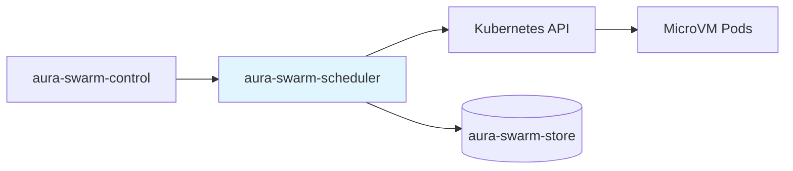

# Scheduler — Specification v0.1.0

## 1. Overview

The `aura-swarm-scheduler` crate manages the lifecycle of agent pods in Kubernetes. It reconciles desired agent state with actual pod state, using Kata Containers with Firecracker for microVM isolation.

### 1.1 Responsibilities

- Create pods for new agents with Kata RuntimeClass
- Monitor pod health and status
- Terminate pods for stopped/hibernated agents
- Maintain endpoint cache for routing
- Report pod status back to control plane

### 1.2 Position in Architecture



---

## 2. Public Interface

### 2.1 Scheduler Trait

```rust
use async_trait::async_trait;
use swarm_core::AgentId;
use swarm_control::{AgentSpec, AgentState};

#[async_trait]
pub trait Scheduler: Send + Sync {
    /// Schedule a new agent pod
    async fn schedule_agent(&self, agent_id: &AgentId, spec: &AgentSpec) -> Result<()>;
    
    /// Terminate an agent pod
    async fn terminate_agent(&self, agent_id: &AgentId) -> Result<()>;
    
    /// Get current pod status
    async fn get_pod_status(&self, agent_id: &AgentId) -> Result<PodStatus>;
    
    /// Get pod endpoint (IP:port) if running
    async fn get_pod_endpoint(&self, agent_id: &AgentId) -> Result<Option<String>>;
    
    /// List all pods managed by scheduler
    async fn list_pods(&self) -> Result<Vec<PodInfo>>;
}
```

### 2.2 Types

```rust
use chrono::{DateTime, Utc};
use swarm_core::AgentId;

#[derive(Debug, Clone)]
pub struct PodStatus {
    pub phase: PodPhase,
    pub ready: bool,
    pub restart_count: u32,
    pub started_at: Option<DateTime<Utc>>,
    pub message: Option<String>,
}

#[derive(Debug, Clone, Copy, PartialEq, Eq)]
pub enum PodPhase {
    Pending,
    Running,
    Succeeded,
    Failed,
    Unknown,
}

#[derive(Debug, Clone)]
pub struct PodInfo {
    pub agent_id: AgentId,
    pub pod_name: String,
    pub node_name: Option<String>,
    pub pod_ip: Option<String>,
    pub status: PodStatus,
}
```

### 2.3 Error Types

```rust
use thiserror::Error;

#[derive(Error, Debug)]
pub enum SchedulerError {
    #[error("Kubernetes API error: {0}")]
    KubeApi(#[from] kube::Error),
    
    #[error("Pod not found: {0}")]
    PodNotFound(String),
    
    #[error("Pod creation failed: {0}")]
    PodCreationFailed(String),
    
    #[error("Timeout waiting for pod: {0}")]
    Timeout(String),
}

pub type Result<T> = std::result::Result<T, SchedulerError>;
```

---

## 3. Pod Specification

### 3.1 Pod Template

```yaml
apiVersion: v1
kind: Pod
metadata:
  name: agent-{agent_id_short}
  namespace: swarm-agents
  labels:
    app: swarm-agent
    swarm.io/agent-id: "{agent_id}"
    swarm.io/user-id: "{user_id}"
  annotations:
    swarm.io/created-at: "{timestamp}"
spec:
  runtimeClassName: kata-fc
  
  containers:
  - name: aura
    image: ghcr.io/cypher-asi/aura-runtime:latest
    ports:
    - containerPort: 8080
      name: http
    
    env:
    - name: AGENT_ID
      value: "{agent_id}"
    - name: USER_ID
      value: "{user_id}"
    - name: STATE_DIR
      value: "/state"
    - name: AURA_LISTEN_ADDR
      value: "0.0.0.0:8080"
    - name: CONTROL_PLANE_URL
      value: "http://aura-swarm-control.swarm-system.svc:8080"
    
    resources:
      requests:
        cpu: "{cpu_millicores}m"
        memory: "{memory_mb}Mi"
      limits:
        cpu: "{cpu_millicores}m"
        memory: "{memory_mb}Mi"
    
    volumeMounts:
    - name: state
      mountPath: /state
      subPath: "{user_id}/{agent_id}"
    
    readinessProbe:
      httpGet:
        path: /health
        port: 8080
      initialDelaySeconds: 5
      periodSeconds: 10
    
    livenessProbe:
      httpGet:
        path: /health
        port: 8080
      initialDelaySeconds: 30
      periodSeconds: 30
  
  volumes:
  - name: state
    persistentVolumeClaim:
      claimName: swarm-agent-state
  
  restartPolicy: Always
  terminationGracePeriodSeconds: 30
  
  securityContext:
    runAsNonRoot: true
    runAsUser: 1000
    fsGroup: 1000
```

### 3.2 RuntimeClass

```yaml
apiVersion: node.k8s.io/v1
kind: RuntimeClass
metadata:
  name: kata-fc
handler: kata-fc
overhead:
  podFixed:
    memory: "160Mi"
    cpu: "250m"
scheduling:
  nodeSelector:
    katacontainers.io/kata-runtime: "true"
```

### 3.3 Namespace

```yaml
apiVersion: v1
kind: Namespace
metadata:
  name: swarm-agents
  labels:
    swarm.io/managed: "true"
```

---

## 4. Implementation

### 4.1 Kubernetes Scheduler

```rust
use kube::{
    api::{Api, DeleteParams, PostParams, ListParams},
    Client,
};
use k8s_openapi::api::core::v1::Pod;
use std::sync::Arc;
use tokio::sync::RwLock;
use std::collections::HashMap;

pub struct K8sScheduler {
    client: Client,
    namespace: String,
    config: SchedulerConfig,
    endpoint_cache: Arc<RwLock<HashMap<AgentId, String>>>,
}

pub struct SchedulerConfig {
    pub namespace: String,
    pub runtime_class: String,
    pub image: String,
    pub control_plane_url: String,
    pub state_pvc_name: String,
}

impl K8sScheduler {
    pub async fn new(config: SchedulerConfig) -> Result<Self> {
        let client = Client::try_default().await?;
        
        Ok(Self {
            client,
            namespace: config.namespace.clone(),
            config,
            endpoint_cache: Arc::new(RwLock::new(HashMap::new())),
        })
    }
}
```

### 4.2 Schedule Agent

```rust
#[async_trait]
impl Scheduler for K8sScheduler {
    async fn schedule_agent(&self, agent_id: &AgentId, spec: &AgentSpec) -> Result<()> {
        let pods: Api<Pod> = Api::namespaced(self.client.clone(), &self.namespace);
        
        let pod_name = format!("agent-{}", &agent_id.to_hex()[..16]);
        
        // Check if pod already exists
        if pods.get_opt(&pod_name).await?.is_some() {
            tracing::warn!(pod_name, "Pod already exists, skipping creation");
            return Ok(());
        }
        
        let pod = self.build_pod_spec(agent_id, spec, &pod_name);
        
        pods.create(&PostParams::default(), &pod).await?;
        
        tracing::info!(
            agent_id = %agent_id,
            pod_name,
            "Created agent pod"
        );
        
        Ok(())
    }
    
    async fn terminate_agent(&self, agent_id: &AgentId) -> Result<()> {
        let pods: Api<Pod> = Api::namespaced(self.client.clone(), &self.namespace);
        let pod_name = format!("agent-{}", &agent_id.to_hex()[..16]);
        
        // Remove from endpoint cache
        {
            let mut cache = self.endpoint_cache.write().await;
            cache.remove(agent_id);
        }
        
        match pods.delete(&pod_name, &DeleteParams::default()).await {
            Ok(_) => {
                tracing::info!(agent_id = %agent_id, pod_name, "Terminated agent pod");
                Ok(())
            }
            Err(kube::Error::Api(e)) if e.code == 404 => {
                tracing::warn!(pod_name, "Pod not found, already terminated");
                Ok(())
            }
            Err(e) => Err(e.into()),
        }
    }
    
    async fn get_pod_endpoint(&self, agent_id: &AgentId) -> Result<Option<String>> {
        // Check cache first
        {
            let cache = self.endpoint_cache.read().await;
            if let Some(endpoint) = cache.get(agent_id) {
                return Ok(Some(endpoint.clone()));
            }
        }
        
        // Fetch from K8s
        let pods: Api<Pod> = Api::namespaced(self.client.clone(), &self.namespace);
        let pod_name = format!("agent-{}", &agent_id.to_hex()[..16]);
        
        if let Some(pod) = pods.get_opt(&pod_name).await? {
            if let Some(status) = &pod.status {
                if let Some(ip) = &status.pod_ip {
                    let endpoint = format!("{}:8080", ip);
                    
                    // Update cache
                    {
                        let mut cache = self.endpoint_cache.write().await;
                        cache.insert(agent_id.clone(), endpoint.clone());
                    }
                    
                    return Ok(Some(endpoint));
                }
            }
        }
        
        Ok(None)
    }
}
```

### 4.3 Pod Builder

```rust
impl K8sScheduler {
    fn build_pod_spec(&self, agent_id: &AgentId, spec: &AgentSpec, pod_name: &str) -> Pod {
        use k8s_openapi::api::core::v1::*;
        use k8s_openapi::apimachinery::pkg::api::resource::Quantity;
        
        Pod {
            metadata: kube::api::ObjectMeta {
                name: Some(pod_name.to_string()),
                namespace: Some(self.namespace.clone()),
                labels: Some([
                    ("app".to_string(), "swarm-agent".to_string()),
                    ("swarm.io/agent-id".to_string(), agent_id.to_hex()),
                ].into_iter().collect()),
                ..Default::default()
            },
            spec: Some(PodSpec {
                runtime_class_name: Some(self.config.runtime_class.clone()),
                containers: vec![Container {
                    name: "aura".to_string(),
                    image: Some(self.config.image.clone()),
                    ports: Some(vec![ContainerPort {
                        container_port: 8080,
                        name: Some("http".to_string()),
                        ..Default::default()
                    }]),
                    env: Some(vec![
                        EnvVar {
                            name: "AGENT_ID".to_string(),
                            value: Some(agent_id.to_hex()),
                            ..Default::default()
                        },
                        EnvVar {
                            name: "STATE_DIR".to_string(),
                            value: Some("/state".to_string()),
                            ..Default::default()
                        },
                        EnvVar {
                            name: "AURA_LISTEN_ADDR".to_string(),
                            value: Some("0.0.0.0:8080".to_string()),
                            ..Default::default()
                        },
                        EnvVar {
                            name: "CONTROL_PLANE_URL".to_string(),
                            value: Some(self.config.control_plane_url.clone()),
                            ..Default::default()
                        },
                    ]),
                    resources: Some(ResourceRequirements {
                        requests: Some([
                            ("cpu".to_string(), Quantity(format!("{}m", spec.cpu_millicores))),
                            ("memory".to_string(), Quantity(format!("{}Mi", spec.memory_mb))),
                        ].into_iter().collect()),
                        limits: Some([
                            ("cpu".to_string(), Quantity(format!("{}m", spec.cpu_millicores))),
                            ("memory".to_string(), Quantity(format!("{}Mi", spec.memory_mb))),
                        ].into_iter().collect()),
                        ..Default::default()
                    }),
                    volume_mounts: Some(vec![VolumeMount {
                        name: "state".to_string(),
                        mount_path: "/state".to_string(),
                        sub_path: Some(agent_id.to_hex()),
                        ..Default::default()
                    }]),
                    readiness_probe: Some(Probe {
                        http_get: Some(HTTPGetAction {
                            path: Some("/health".to_string()),
                            port: k8s_openapi::apimachinery::pkg::util::intstr::IntOrString::Int(8080),
                            ..Default::default()
                        }),
                        initial_delay_seconds: Some(5),
                        period_seconds: Some(10),
                        ..Default::default()
                    }),
                    liveness_probe: Some(Probe {
                        http_get: Some(HTTPGetAction {
                            path: Some("/health".to_string()),
                            port: k8s_openapi::apimachinery::pkg::util::intstr::IntOrString::Int(8080),
                            ..Default::default()
                        }),
                        initial_delay_seconds: Some(30),
                        period_seconds: Some(30),
                        ..Default::default()
                    }),
                    ..Default::default()
                }],
                volumes: Some(vec![Volume {
                    name: "state".to_string(),
                    persistent_volume_claim: Some(PersistentVolumeClaimVolumeSource {
                        claim_name: self.config.state_pvc_name.clone(),
                        ..Default::default()
                    }),
                    ..Default::default()
                }]),
                restart_policy: Some("Always".to_string()),
                termination_grace_period_seconds: Some(30),
                security_context: Some(PodSecurityContext {
                    run_as_non_root: Some(true),
                    run_as_user: Some(1000),
                    fs_group: Some(1000),
                    ..Default::default()
                }),
                ..Default::default()
            }),
            ..Default::default()
        }
    }
}
```

---

## 5. Reconciliation Loop

### 5.1 Status Watcher

```rust
use kube::runtime::watcher;
use futures::StreamExt;

impl K8sScheduler {
    pub async fn run_reconciler(&self, store: Arc<dyn Store>) {
        let pods: Api<Pod> = Api::namespaced(self.client.clone(), &self.namespace);
        
        let watcher = watcher(pods, ListParams::default().labels("app=swarm-agent"));
        
        tokio::pin!(watcher);
        
        while let Some(event) = watcher.next().await {
            match event {
                Ok(watcher::Event::Applied(pod)) => {
                    self.handle_pod_update(&pod, &store).await;
                }
                Ok(watcher::Event::Deleted(pod)) => {
                    self.handle_pod_deleted(&pod, &store).await;
                }
                Err(e) => {
                    tracing::error!(error = %e, "Watcher error");
                }
                _ => {}
            }
        }
    }
    
    async fn handle_pod_update(&self, pod: &Pod, store: &Arc<dyn Store>) {
        let Some(agent_id_hex) = pod.metadata.labels.as_ref()
            .and_then(|l| l.get("swarm.io/agent-id")) else {
            return;
        };
        
        let Ok(agent_id) = AgentId::from_hex(agent_id_hex) else {
            return;
        };
        
        let phase = pod.status.as_ref()
            .and_then(|s| s.phase.as_deref())
            .unwrap_or("Unknown");
        
        let ready = pod.status.as_ref()
            .and_then(|s| s.conditions.as_ref())
            .map(|c| c.iter().any(|c| c.type_ == "Ready" && c.status == "True"))
            .unwrap_or(false);
        
        // Update endpoint cache
        if let Some(ip) = pod.status.as_ref().and_then(|s| s.pod_ip.as_ref()) {
            let mut cache = self.endpoint_cache.write().await;
            cache.insert(agent_id.clone(), format!("{}:8080", ip));
        }
        
        // Map pod phase to agent state
        let new_state = match (phase, ready) {
            ("Running", true) => AgentState::Running,
            ("Running", false) => AgentState::Provisioning,
            ("Pending", _) => AgentState::Provisioning,
            ("Failed", _) => AgentState::Error,
            _ => return,
        };
        
        if let Err(e) = store.update_agent_status(&agent_id, new_state) {
            tracing::error!(
                agent_id = %agent_id,
                error = %e,
                "Failed to update agent status"
            );
        }
    }
    
    async fn handle_pod_deleted(&self, pod: &Pod, store: &Arc<dyn Store>) {
        let Some(agent_id_hex) = pod.metadata.labels.as_ref()
            .and_then(|l| l.get("swarm.io/agent-id")) else {
            return;
        };
        
        let Ok(agent_id) = AgentId::from_hex(agent_id_hex) else {
            return;
        };
        
        // Remove from cache
        {
            let mut cache = self.endpoint_cache.write().await;
            cache.remove(&agent_id);
        }
        
        // Update state to Stopped (unless it's Hibernating)
        if let Ok(Some(agent)) = store.get_agent(&agent_id) {
            if agent.status != AgentState::Hibernating {
                let _ = store.update_agent_status(&agent_id, AgentState::Stopped);
            }
        }
    }
}
```

---

## 6. Health Monitoring

### 6.1 Heartbeat Receiver

Control plane exposes an endpoint for agent heartbeats:

```rust
// In aura-swarm-control HTTP server
async fn heartbeat_handler(
    State(state): State<Arc<ControlState>>,
    Json(heartbeat): Json<AgentHeartbeat>,
) -> impl IntoResponse {
    state.control.process_heartbeat(heartbeat).await
        .map(|_| StatusCode::OK)
        .map_err(|e| (StatusCode::INTERNAL_SERVER_ERROR, e.to_string()))
}
```

### 6.2 Pod Health Check

```rust
impl K8sScheduler {
    pub async fn check_agent_health(&self, agent_id: &AgentId) -> Result<bool> {
        if let Some(endpoint) = self.get_pod_endpoint(agent_id).await? {
            let url = format!("http://{}/health", endpoint);
            
            match reqwest::Client::new()
                .get(&url)
                .timeout(std::time::Duration::from_secs(5))
                .send()
                .await
            {
                Ok(resp) if resp.status().is_success() => Ok(true),
                _ => Ok(false),
            }
        } else {
            Ok(false)
        }
    }
}
```

---

## 7. Configuration

```rust
#[derive(Debug, Clone, serde::Deserialize)]
pub struct SchedulerConfig {
    /// Kubernetes namespace for agent pods
    pub namespace: String,
    
    /// RuntimeClass name (kata-fc)
    pub runtime_class: String,
    
    /// Aura runtime container image
    pub image: String,
    
    /// Control plane internal URL
    pub control_plane_url: String,
    
    /// PVC name for agent state storage
    pub state_pvc_name: String,
    
    /// Default CPU millicores for agents
    pub default_cpu_millicores: u32,
    
    /// Default memory MB for agents
    pub default_memory_mb: u32,
    
    /// Maximum CPU millicores allowed
    pub max_cpu_millicores: u32,
    
    /// Maximum memory MB allowed
    pub max_memory_mb: u32,
}

impl Default for SchedulerConfig {
    fn default() -> Self {
        Self {
            namespace: "swarm-agents".to_string(),
            runtime_class: "kata-fc".to_string(),
            image: "ghcr.io/cypher-asi/aura-runtime:latest".to_string(),
            control_plane_url: "http://aura-swarm-control.swarm-system.svc:8080".to_string(),
            state_pvc_name: "swarm-agent-state".to_string(),
            default_cpu_millicores: 500,
            default_memory_mb: 512,
            max_cpu_millicores: 4000,
            max_memory_mb: 8192,
        }
    }
}
```

---

## 8. Dependencies

### 8.1 Internal

| Crate | Purpose |
|-------|---------|
| `aura-swarm-core` | `AgentId` type |
| `aura-swarm-store` | Status updates |
| `aura-swarm-control` | `AgentSpec`, `AgentState` types |

### 8.2 External

| Crate | Version | Purpose |
|-------|---------|---------|
| `kube` | 0.88.x | Kubernetes client |
| `k8s-openapi` | 0.21.x | K8s API types |
| `tokio` | 1.x | Async runtime |
| `futures` | 0.3.x | Stream utilities |
| `reqwest` | 0.11.x | HTTP client for health checks |
| `tracing` | 0.1.x | Structured logging |
| `thiserror` | 1.x | Error types |
| `async-trait` | 0.1.x | Async trait support |
