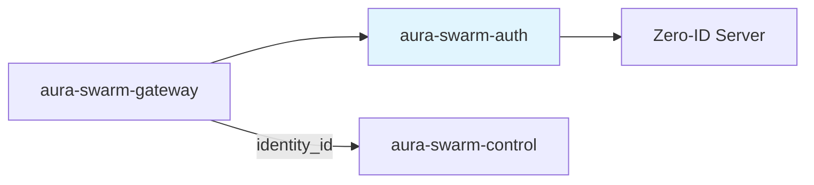
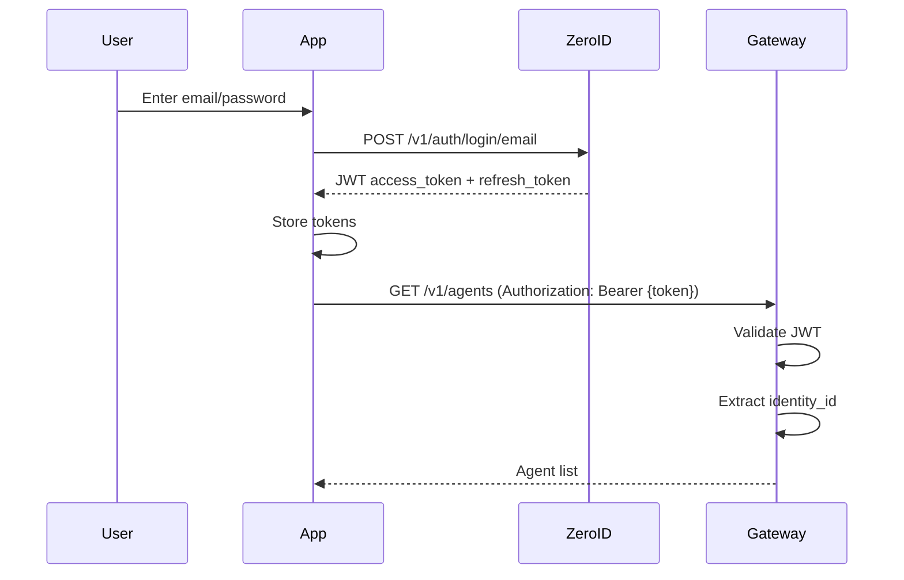
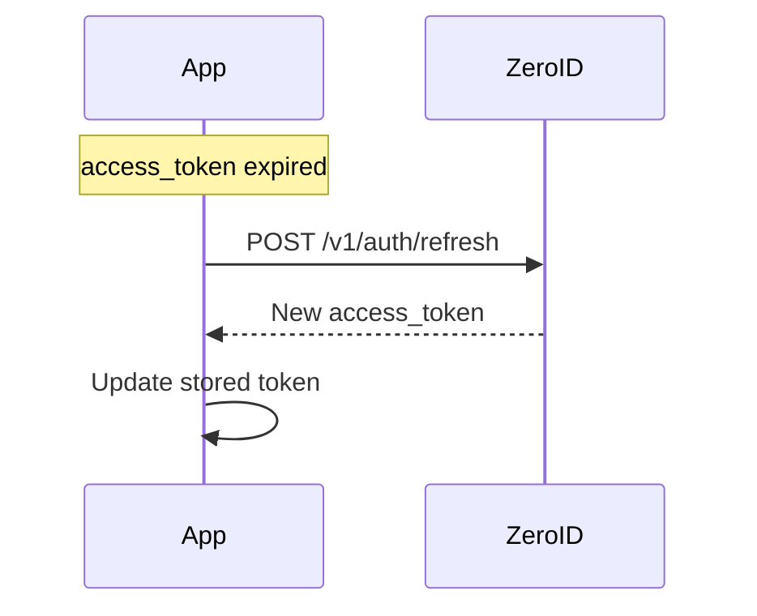

# Authentication — Specification v0.1.0

## 1. Overview

The `aura-swarm-auth` crate provides authentication integration with Zero-ID (ZID). For v0.1.0, we use email/password authentication with JWT tokens.

### 1.1 Scope (v0.1.0)

- Email/password login via Zero-ID server
- JWT token validation with JWKS
- Identity ID, Namespace ID, and Session ID extraction from tokens
- MFA support (optional)
- Token refresh support
- No policies (deferred to future versions)

### 1.2 Position in Architecture



---

## 2. Authentication Flow

### 2.1 Login Flow



### 2.2 Token Refresh Flow



---

## 3. Zero-ID Integration

### 3.1 Base URLs

| Environment | Base URL |
|-------------|----------|
| Production  | `https://auth.zero.tech` |
| Local Dev   | `http://localhost:3000` |

### 3.2 Login Endpoint

The application (not the platform) calls Zero-ID directly:

```
POST {base_url}/v1/auth/login/email
Content-Type: application/json

{
  "email": "user@example.com",
  "password": "secret123",
  "mfa_code": "123456"  // Optional, only if MFA enabled
}
```

Response:
```json
{
  "access_token": "eyJhbGciOiJFZERTQSIsInR5cCI6IkpXVCJ9...",
  "refresh_token": "dGhpcyBpcyBhIHJlZnJlc2g...",
  "session_id": "550e8400-e29b-41d4-a716-446655440000",
  "expires_in": 3600
}
```

### 3.3 Token Refresh Endpoint

```
POST {base_url}/v1/auth/refresh
Content-Type: application/json

{
  "refresh_token": "dGhpcyBpcyBhIHJlZnJlc2g...",
  "session_id": "550e8400-e29b-41d4-a716-446655440000",
  "machine_id": "device-fingerprint-abc"
}
```

Response: Same structure as login response.

### 3.4 JWKS Endpoint

For JWT validation, Zero-ID exposes public keys:

```
GET {base_url}/.well-known/jwks.json
```

Response:
```json
{
  "keys": [
    {
      "kty": "OKP",
      "crv": "Ed25519",
      "x": "11qYAYKxCrfVS_7TyWQHOg7hcvPapiMlrwIaaPcHURo",
      "kid": "key-1",
      "alg": "EdDSA",
      "use": "sig"
    }
  ]
}
```

### 3.5 Error Codes

| Code | HTTP Status | Description |
|------|-------------|-------------|
| `UNAUTHORIZED` | 401 | Invalid credentials |
| `MFA_REQUIRED` | 403 | MFA code required but not provided |
| `IDENTITY_FROZEN` | 403 | Account is frozen |
| `RATE_LIMITED` | 429 | Too many attempts |

Error response format:
```json
{
  "code": "MFA_REQUIRED",
  "message": "Multi-factor authentication is required"
}
```

---

## 4. JWT Structure

### 4.1 Token Claims

```json
{
  "iss": "https://auth.zero.tech",
  "sub": "550e8400-e29b-41d4-a716-446655440000",
  "namespace_id": "6ba7b810-9dad-11d1-80b4-00c04fd430c8",
  "session_id": "7c9e6679-7425-40de-944b-e07fc1f90ae7",
  "mfa_verified": true,
  "aud": "swarm-platform",
  "exp": 1706745600,
  "iat": 1706742000
}
```

| Claim | Type | Description |
|-------|------|-------------|
| `iss` | String | Issuer (ZID server URL) |
| `sub` | UUID | Subject (identity_id) |
| `namespace_id` | UUID | Tenant context |
| `session_id` | UUID | Current session |
| `mfa_verified` | Boolean | MFA completion status |
| `aud` | String | Audience (must be "swarm-platform") |
| `exp` | Number | Expiration timestamp |
| `iat` | Number | Issued at timestamp |

### 4.2 Identity ID Derivation

The `sub` claim contains the identity_id as a UUID string:

```rust
use aura_swarm_core::IdentityId;

fn extract_identity_id(claims: &Claims) -> Result<IdentityId, AuthError> {
    IdentityId::from_str(&claims.sub)
        .map_err(|_| AuthError::InvalidIdentityId)
}
```

---

## 5. Rust Interface

### 5.1 JWT Validator

```rust
use async_trait::async_trait;
use aura_swarm_core::{IdentityId, NamespaceId, SessionId};

#[async_trait]
pub trait JwtValidator: Send + Sync {
    /// Validate a JWT and extract claims
    async fn validate(&self, token: &str) -> Result<ValidatedClaims, AuthError>;
}

#[derive(Debug, Clone)]
pub struct ValidatedClaims {
    pub identity_id: IdentityId,
    pub namespace_id: NamespaceId,
    pub session_id: SessionId,
    pub mfa_verified: bool,
    pub expires_at: chrono::DateTime<chrono::Utc>,
}
```

### 5.2 ZID Client

```rust
pub struct ZidClient { /* ... */ }

pub struct LoginRequest {
    pub email: String,
    pub password: String,
    pub mfa_code: Option<String>,
}

pub struct LoginResponse {
    pub access_token: String,
    pub refresh_token: String,
    pub session_id: SessionId,
    pub expires_at: DateTime<Utc>,
}

pub struct RefreshRequest {
    pub refresh_token: String,
    pub session_id: SessionId,
    pub machine_id: String,
}

impl ZidClient {
    pub fn new(config: AuthConfig) -> Self;
    pub async fn login(&self, req: LoginRequest) -> Result<LoginResponse, AuthError>;
    pub async fn refresh(&self, req: RefreshRequest) -> Result<LoginResponse, AuthError>;
}
```

### 5.3 Error Types

```rust
use thiserror::Error;

#[derive(Error, Debug)]
pub enum AuthError {
    #[error("token expired")]
    TokenExpired,
    
    #[error("invalid signature")]
    InvalidSignature,
    
    #[error("invalid issuer")]
    InvalidIssuer,
    
    #[error("invalid audience")]
    InvalidAudience,
    
    #[error("invalid identity ID format")]
    InvalidIdentityId,
    
    #[error("invalid namespace ID format")]
    InvalidNamespaceId,
    
    #[error("invalid session ID format")]
    InvalidSessionId,
    
    #[error("MFA required")]
    MfaRequired,
    
    #[error("identity frozen")]
    IdentityFrozen,
    
    #[error("rate limited")]
    RateLimited,
    
    #[error("login failed: {0}")]
    LoginFailed(String),
    
    #[error("missing required claim: {0}")]
    MissingClaim(String),
    
    #[error("JWKS fetch failed: {0}")]
    JwksFetchFailed(String),
    
    #[error("key not found: {0}")]
    KeyNotFound(String),
    
    #[error("invalid token format: {0}")]
    InvalidToken(String),
    
    #[error("internal error: {0}")]
    Internal(String),
}
```

---

## 6. Implementation

### 6.1 JWKS-based Validator

```rust
pub struct JwksValidator {
    config: AuthConfig,
    jwks: JwksProvider,
}

impl JwksValidator {
    pub fn new(config: AuthConfig) -> Self {
        let jwks = JwksProvider::new(config.clone());
        Self { config, jwks }
    }
}

#[async_trait]
impl JwtValidator for JwksValidator {
    async fn validate(&self, token: &str) -> Result<ValidatedClaims, AuthError> {
        // 1. Decode header to get kid
        // 2. Get decoding key from JWKS
        // 3. Validate signature and claims
        // 4. Extract identity_id, namespace_id, session_id
        // 5. Return ValidatedClaims
    }
}
```

---

## 7. Gateway Integration

### 7.1 Auth Extractor

```rust
use axum::{
    extract::FromRequestParts,
    http::request::Parts,
};

pub struct AuthUser {
    pub identity_id: IdentityId,
    pub namespace_id: NamespaceId,
    pub session_id: SessionId,
    pub mfa_verified: bool,
}

#[async_trait]
impl<S> FromRequestParts<S> for AuthUser
where
    S: Send + Sync + AsRef<Arc<dyn JwtValidator>>,
{
    type Rejection = AuthError;

    async fn from_request_parts(parts: &mut Parts, state: &S) -> Result<Self, Self::Rejection> {
        // Extract Bearer token
        let auth_header = parts
            .headers
            .get("authorization")
            .and_then(|v| v.to_str().ok())
            .ok_or(AuthError::MissingClaim("Authorization header".into()))?;
        
        let token = auth_header
            .strip_prefix("Bearer ")
            .ok_or(AuthError::MissingClaim("Bearer token".into()))?;
        
        // Validate token
        let validator = state.as_ref();
        let claims = validator.validate(token).await?;
        
        Ok(AuthUser {
            identity_id: claims.identity_id,
            namespace_id: claims.namespace_id,
            session_id: claims.session_id,
            mfa_verified: claims.mfa_verified,
        })
    }
}
```

### 7.2 Protected Endpoint Example

```rust
use axum::{extract::State, Json};

async fn list_agents(
    user: AuthUser,
    State(state): State<Arc<AppState>>,
) -> Result<Json<Vec<Agent>>, ApiError> {
    let agents = state.control
        .list_agents(user.identity_id)
        .await?;
    
    Ok(Json(agents))
}
```

---

## 8. Configuration

```rust
#[derive(Debug, Clone)]
pub struct AuthConfig {
    /// Base URL for ZID (e.g., "https://auth.zero.tech")
    pub base_url: String,
    
    /// Expected audience claim
    pub audience: String,
    
    /// JWKS cache refresh interval (seconds)
    pub jwks_refresh_seconds: u64,
}

impl AuthConfig {
    pub fn jwks_url(&self) -> String {
        format!("{}/.well-known/jwks.json", self.base_url)
    }
    
    pub fn login_url(&self) -> String {
        format!("{}/v1/auth/login/email", self.base_url)
    }
    
    pub fn refresh_url(&self) -> String {
        format!("{}/v1/auth/refresh", self.base_url)
    }
    
    pub fn issuer(&self) -> &str {
        &self.base_url
    }
}

impl Default for AuthConfig {
    fn default() -> Self {
        Self {
            base_url: "https://auth.zero.tech".to_string(),
            audience: "swarm-platform".to_string(),
            jwks_refresh_seconds: 300,
        }
    }
}
```

---

## 9. Security Considerations

### 9.1 Token Security

- Tokens are validated on every request
- Signature verification using Ed25519
- Expiration is checked
- Issuer and audience are validated

### 9.2 Key Rotation

- JWKS is cached but refreshed periodically
- Multiple keys supported via `kid` header
- Graceful key rotation without downtime

### 9.3 Error Handling

- Errors do not leak sensitive information
- Failed validations return generic 401
- Detailed errors logged server-side only

### 9.4 MFA Considerations

- MFA status is included in JWT claims
- Applications can enforce MFA for sensitive operations
- MFA code is only required during initial login

---

## 10. Future Enhancements (post-v0.1.0)

### 10.1 Policy Integration

Zero-ID has a policy engine that could be integrated:

```rust
pub struct PolicyContext {
    pub identity_id: IdentityId,
    pub namespace_id: NamespaceId,
    pub operation: Operation,
    pub resource: Resource,
}
```

### 10.2 Machine Keys

For agent-to-agent communication (future):

```rust
pub struct MachineAuth {
    pub machine_id: MachineId,
    pub identity_id: IdentityId,
    pub capabilities: u32,
}
```

### 10.3 Token Introspection

For advanced token validation scenarios:

```
POST {base_url}/v1/auth/introspect
```

---

## 11. Dependencies

### 11.1 Internal

| Crate | Purpose |
|-------|---------|
| `aura-swarm-core` | `IdentityId`, `NamespaceId`, `SessionId` types |

### 11.2 External

| Crate | Version | Purpose |
|-------|---------|---------|
| `jsonwebtoken` | 9.x | JWT validation |
| `reqwest` | 0.11.x | HTTP client for JWKS and login |
| `serde` | 1.x | JSON serialization |
| `chrono` | 0.4.x | Timestamp handling |
| `thiserror` | 1.x | Error types |
| `async-trait` | 0.1.x | Async trait support |
| `base64` | 0.21.x | Base64 decoding |
| `parking_lot` | 0.12.x | Synchronization primitives |

---

## 12. Notes

- The existing `UserId` (32-byte hex) remains for internal use; `IdentityId` is the ZID-specific UUID
- No registration endpoint per requirements ("email login to start")
- MFA support is optional (pass `mfa_code` only if MFA enabled)
- Introspection endpoint not implemented (local JWKS validation is recommended)
