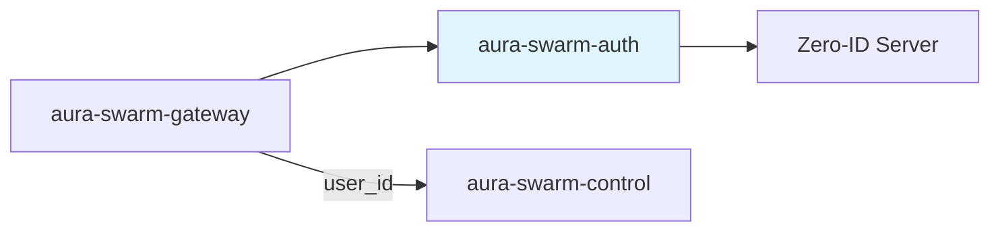
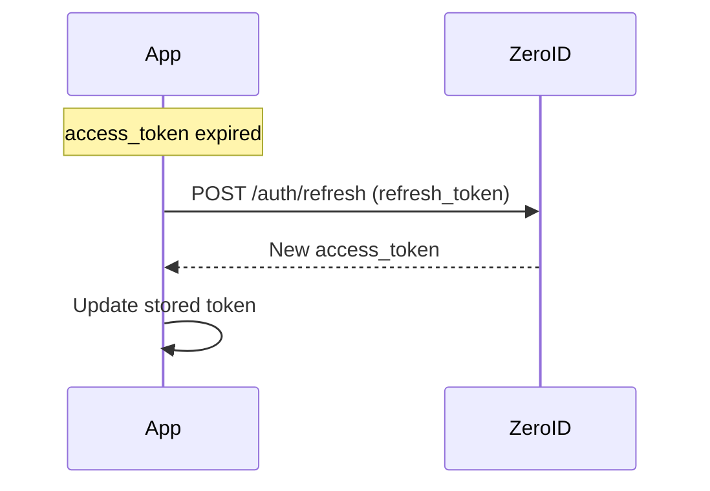

# Authentication — Specification v0.1.0

## 1. Overview

The `aura-swarm-auth` crate provides authentication integration with Zero-ID. For v0.1.0, we use simple email/password authentication with JWT tokens.

### 1.1 Scope (v0.1.0)

- Email/password login via Zero-ID server
- JWT token validation
- User ID extraction from tokens
- No namespaces or policies (deferred to future versions)

### 1.2 Position in Architecture



---

## 2. Authentication Flow

### 2.1 Login Flow


### 2.2 Token Refresh Flow



---

## 3. Zero-ID Integration

### 3.1 Login Endpoint

The application (not the platform) calls Zero-ID directly:

```
POST https://auth.example.com/auth/login
Content-Type: application/json

{
  "email": "user@example.com",
  "password": "secret123"
}
```

Response:
```json
{
  "access_token": "eyJhbGciOiJFZDI1NTE5...",
  "refresh_token": "dGhpcyBpcyBhIHJlZnJlc2g...",
  "token_type": "Bearer",
  "expires_in": 3600
}
```

### 3.2 Token Refresh Endpoint

```
POST https://auth.example.com/auth/refresh
Content-Type: application/json

{
  "refresh_token": "dGhpcyBpcyBhIHJlZnJlc2g..."
}
```

### 3.3 JWKS Endpoint

For JWT validation, Zero-ID exposes public keys:

```
GET https://auth.example.com/.well-known/jwks.json
```

Response:
```json
{
  "keys": [
    {
      "kty": "OKP",
      "crv": "Ed25519",
      "x": "...",
      "kid": "key-1"
    }
  ]
}
```

---

## 4. JWT Structure

### 4.1 Token Claims

```json
{
  "iss": "https://auth.example.com",
  "sub": "u1234567890abcdef...",
  "aud": "swarm-platform",
  "exp": 1706745600,
  "iat": 1706742000,
  "email": "user@example.com",
  "email_verified": true
}
```

| Claim | Description |
|-------|-------------|
| `iss` | Issuer (Zero-ID server URL) |
| `sub` | Subject (user_id as hex string) |
| `aud` | Audience (must be "swarm-platform") |
| `exp` | Expiration timestamp |
| `iat` | Issued at timestamp |
| `email` | User's email address |
| `email_verified` | Email verification status |

### 4.2 User ID Derivation

The `sub` claim contains the user_id as a hex-encoded 32-byte identifier:

```rust
use swarm_core::UserId;

fn extract_user_id(claims: &Claims) -> Result<UserId, AuthError> {
    UserId::from_hex(&claims.sub)
        .map_err(|_| AuthError::InvalidUserId)
}
```

---

## 5. Rust Interface

### 5.1 JWT Validator

```rust
use async_trait::async_trait;
use swarm_core::UserId;

#[async_trait]
pub trait JwtValidator: Send + Sync {
    /// Validate a JWT and extract claims
    async fn validate(&self, token: &str) -> Result<ValidatedClaims, AuthError>;
}

#[derive(Debug, Clone)]
pub struct ValidatedClaims {
    pub user_id: UserId,
    pub email: String,
    pub email_verified: bool,
    pub expires_at: chrono::DateTime<chrono::Utc>,
}
```

### 5.2 Error Types

```rust
use thiserror::Error;

#[derive(Error, Debug)]
pub enum AuthError {
    #[error("Token expired")]
    TokenExpired,
    
    #[error("Invalid signature")]
    InvalidSignature,
    
    #[error("Invalid issuer")]
    InvalidIssuer,
    
    #[error("Invalid audience")]
    InvalidAudience,
    
    #[error("Invalid user ID format")]
    InvalidUserId,
    
    #[error("Missing required claim: {0}")]
    MissingClaim(String),
    
    #[error("JWKS fetch failed: {0}")]
    JwksFetchFailed(String),
    
    #[error("Key not found: {0}")]
    KeyNotFound(String),
}
```

---

## 6. Implementation

### 6.1 JWKS-based Validator

```rust
use jsonwebtoken::{decode, decode_header, Algorithm, DecodingKey, Validation};
use reqwest::Client;
use std::collections::HashMap;
use std::sync::RwLock;
use std::time::{Duration, Instant};

pub struct JwksValidator {
    jwks_url: String,
    issuer: String,
    audience: String,
    client: Client,
    keys: RwLock<CachedKeys>,
}

struct CachedKeys {
    keys: HashMap<String, DecodingKey>,
    fetched_at: Instant,
}

impl JwksValidator {
    pub fn new(config: AuthConfig) -> Self {
        Self {
            jwks_url: config.jwks_url,
            issuer: config.issuer,
            audience: config.audience,
            client: Client::new(),
            keys: RwLock::new(CachedKeys {
                keys: HashMap::new(),
                fetched_at: Instant::now() - Duration::from_secs(3600),
            }),
        }
    }
    
    async fn refresh_keys(&self) -> Result<(), AuthError> {
        let response: JwksResponse = self.client
            .get(&self.jwks_url)
            .send()
            .await
            .map_err(|e| AuthError::JwksFetchFailed(e.to_string()))?
            .json()
            .await
            .map_err(|e| AuthError::JwksFetchFailed(e.to_string()))?;
        
        let mut new_keys = HashMap::new();
        for key in response.keys {
            if let (Some(kid), Some(x)) = (&key.kid, &key.x) {
                // Ed25519 key
                let public_key = base64_url_decode(x)?;
                let decoding_key = DecodingKey::from_ed_der(&public_key);
                new_keys.insert(kid.clone(), decoding_key);
            }
        }
        
        let mut cache = self.keys.write().unwrap();
        cache.keys = new_keys;
        cache.fetched_at = Instant::now();
        
        Ok(())
    }
    
    async fn get_key(&self, kid: &str) -> Result<DecodingKey, AuthError> {
        // Check if refresh needed (every 5 minutes)
        {
            let cache = self.keys.read().unwrap();
            if cache.fetched_at.elapsed() < Duration::from_secs(300) {
                if let Some(key) = cache.keys.get(kid) {
                    return Ok(key.clone());
                }
            }
        }
        
        // Refresh keys
        self.refresh_keys().await?;
        
        // Try again
        let cache = self.keys.read().unwrap();
        cache.keys.get(kid)
            .cloned()
            .ok_or_else(|| AuthError::KeyNotFound(kid.to_string()))
    }
}

#[async_trait]
impl JwtValidator for JwksValidator {
    async fn validate(&self, token: &str) -> Result<ValidatedClaims, AuthError> {
        // Decode header to get kid
        let header = decode_header(token)
            .map_err(|_| AuthError::InvalidSignature)?;
        
        let kid = header.kid
            .ok_or_else(|| AuthError::MissingClaim("kid".to_string()))?;
        
        // Get decoding key
        let key = self.get_key(&kid).await?;
        
        // Validate token
        let mut validation = Validation::new(Algorithm::EdDSA);
        validation.set_issuer(&[&self.issuer]);
        validation.set_audience(&[&self.audience]);
        
        let token_data = decode::<Claims>(token, &key, &validation)
            .map_err(|e| match e.kind() {
                jsonwebtoken::errors::ErrorKind::ExpiredSignature => AuthError::TokenExpired,
                jsonwebtoken::errors::ErrorKind::InvalidIssuer => AuthError::InvalidIssuer,
                jsonwebtoken::errors::ErrorKind::InvalidAudience => AuthError::InvalidAudience,
                _ => AuthError::InvalidSignature,
            })?;
        
        let claims = token_data.claims;
        
        // Extract user_id
        let user_id = UserId::from_hex(&claims.sub)
            .map_err(|_| AuthError::InvalidUserId)?;
        
        Ok(ValidatedClaims {
            user_id,
            email: claims.email,
            email_verified: claims.email_verified,
            expires_at: chrono::DateTime::from_timestamp(claims.exp as i64, 0)
                .unwrap_or_default(),
        })
    }
}

#[derive(Debug, serde::Deserialize)]
struct Claims {
    iss: String,
    sub: String,
    aud: String,
    exp: u64,
    iat: u64,
    email: String,
    #[serde(default)]
    email_verified: bool,
}

#[derive(Debug, serde::Deserialize)]
struct JwksResponse {
    keys: Vec<JwkKey>,
}

#[derive(Debug, serde::Deserialize)]
struct JwkKey {
    kty: String,
    crv: Option<String>,
    x: Option<String>,
    kid: Option<String>,
}
```

---

## 7. Gateway Integration

### 7.1 Auth Extractor

```rust
use axum::{
    extract::FromRequestParts,
    http::request::Parts,
};

pub struct AuthUser {
    pub user_id: UserId,
    pub email: String,
}

#[async_trait]
impl<S> FromRequestParts<S> for AuthUser
where
    S: Send + Sync + AsRef<Arc<dyn JwtValidator>>,
{
    type Rejection = AuthError;

    async fn from_request_parts(parts: &mut Parts, state: &S) -> Result<Self, Self::Rejection> {
        // Extract Bearer token
        let auth_header = parts
            .headers
            .get("authorization")
            .and_then(|v| v.to_str().ok())
            .ok_or(AuthError::MissingClaim("Authorization header".into()))?;
        
        let token = auth_header
            .strip_prefix("Bearer ")
            .ok_or(AuthError::MissingClaim("Bearer token".into()))?;
        
        // Validate token
        let validator = state.as_ref();
        let claims = validator.validate(token).await?;
        
        Ok(AuthUser {
            user_id: claims.user_id,
            email: claims.email,
        })
    }
}
```

### 7.2 Protected Endpoint Example

```rust
use axum::{extract::State, Json};

async fn list_agents(
    user: AuthUser,
    State(state): State<Arc<AppState>>,
) -> Result<Json<Vec<Agent>>, ApiError> {
    let agents = state.control
        .list_agents(user.user_id)
        .await?;
    
    Ok(Json(agents))
}
```

---

## 8. Configuration

```rust
#[derive(Debug, Clone, serde::Deserialize)]
pub struct AuthConfig {
    /// Zero-ID JWKS endpoint URL
    pub jwks_url: String,
    
    /// Expected issuer claim
    pub issuer: String,
    
    /// Expected audience claim
    pub audience: String,
    
    /// JWKS cache refresh interval (seconds)
    pub jwks_refresh_seconds: u64,
}

impl Default for AuthConfig {
    fn default() -> Self {
        Self {
            jwks_url: "https://auth.example.com/.well-known/jwks.json".to_string(),
            issuer: "https://auth.example.com".to_string(),
            audience: "swarm-platform".to_string(),
            jwks_refresh_seconds: 300,
        }
    }
}
```

---

## 9. Security Considerations

### 9.1 Token Security

- Tokens are validated on every request
- Signature verification using Ed25519
- Expiration is checked
- Issuer and audience are validated

### 9.2 Key Rotation

- JWKS is cached but refreshed periodically
- Multiple keys supported via `kid` header
- Graceful key rotation without downtime

### 9.3 Error Handling

- Errors do not leak sensitive information
- Failed validations return generic 401
- Detailed errors logged server-side only

---

## 10. Future Enhancements (post-v0.1.0)

### 10.1 Namespace Support

Zero-ID supports namespaces for multi-tenant isolation:

```json
{
  "sub": "u1234...",
  "namespace_id": "n5678...",
  "namespace_role": "member"
}
```

### 10.2 Policy Integration

Zero-ID has a policy engine that could be integrated:

```rust
pub struct PolicyContext {
    pub user_id: UserId,
    pub namespace_id: NamespaceId,
    pub operation: Operation,
    pub resource: Resource,
}
```

### 10.3 Machine Keys

For agent-to-agent communication (future):

```rust
pub struct MachineAuth {
    pub machine_id: MachineId,
    pub identity_id: IdentityId,
    pub capabilities: u32,
}
```

---

## 11. Dependencies

### 11.1 Internal

| Crate | Purpose |
|-------|---------|
| `aura-swarm-core` | `UserId` type |

### 11.2 External

| Crate | Version | Purpose |
|-------|---------|---------|
| `jsonwebtoken` | 9.x | JWT validation |
| `reqwest` | 0.11.x | HTTP client for JWKS |
| `serde` | 1.x | JSON deserialization |
| `chrono` | 0.4.x | Timestamp handling |
| `thiserror` | 1.x | Error types |
| `async-trait` | 0.1.x | Async trait support |
| `base64` | 0.21.x | Base64 decoding |
