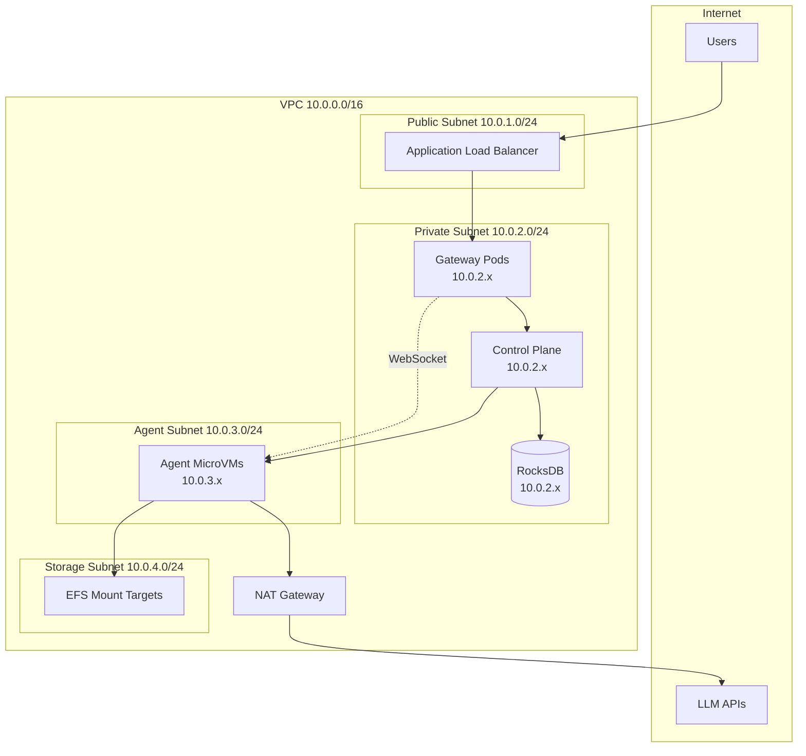
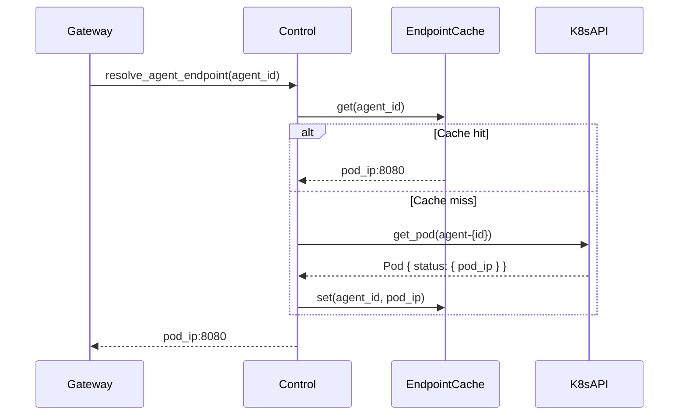
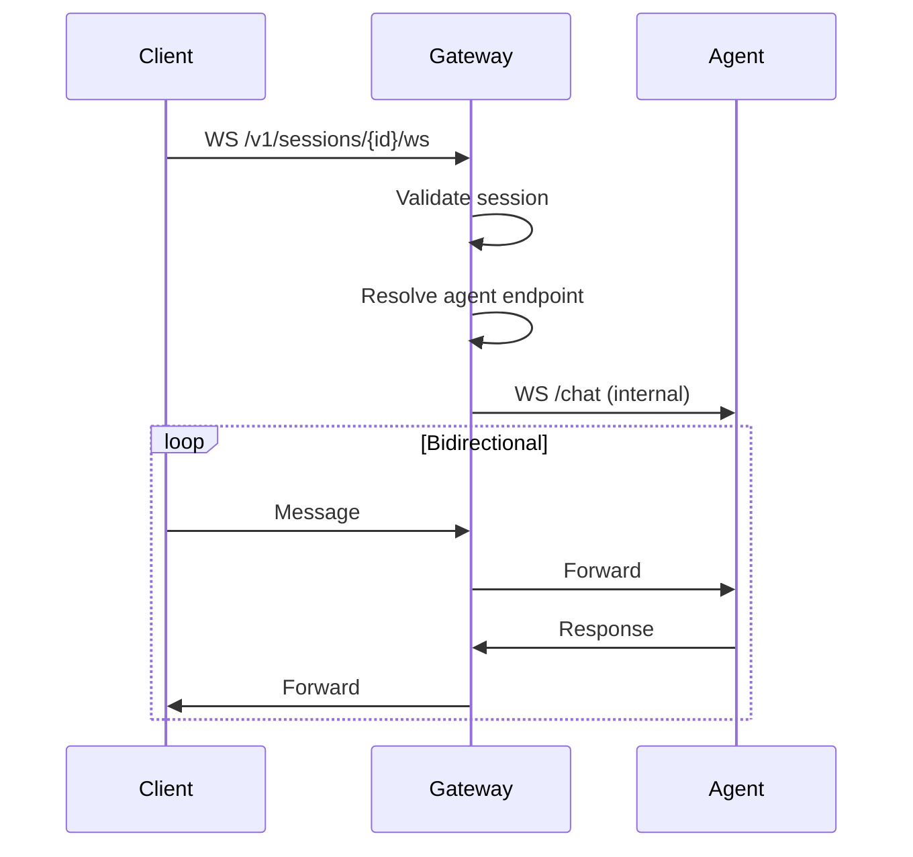

# Networking — Specification v0.1.0

## 1. Overview

This document specifies the networking architecture for the MicroVM Agent Platform, including internal routing, agent endpoint resolution, and egress policies.

### 1.1 Principles

- **No public agent endpoints**: Agents are never directly accessible from the internet
- **Gateway-proxied access**: All user traffic flows through the gateway
- **Internal service mesh**: Platform services communicate over private network
- **Egress allowlists**: Agents can only reach approved external endpoints

---

## 2. Network Topology

### 2.1 Architecture



### 2.2 Subnet Allocation

| Subnet | CIDR | Purpose |
|--------|------|---------|
| Public | 10.0.1.0/24 | Load balancers |
| Private | 10.0.2.0/24 | Platform services |
| Agent | 10.0.3.0/24 | MicroVM pods |
| Storage | 10.0.4.0/24 | EFS mount targets |

---

## 3. Service Discovery

### 3.1 Kubernetes Services

```yaml
# Gateway service
apiVersion: v1
kind: Service
metadata:
  name: aura-swarm-gateway
  namespace: swarm-system
spec:
  selector:
    app: aura-swarm-gateway
  ports:
  - port: 8080
    targetPort: 8080
  type: ClusterIP
---
# Control plane service
apiVersion: v1
kind: Service
metadata:
  name: aura-swarm-control
  namespace: swarm-system
spec:
  selector:
    app: aura-swarm-control
  ports:
  - port: 8080
    targetPort: 8080
  type: ClusterIP
```

### 3.2 DNS Resolution

Internal services are resolved via Kubernetes DNS:

| Service | DNS Name |
|---------|----------|
| Gateway | `aura-swarm-gateway.swarm-system.svc.cluster.local` |
| Control | `aura-swarm-control.swarm-system.svc.cluster.local` |
| Store | `aura-swarm-store.swarm-system.svc.cluster.local` |

---

## 4. Agent Endpoint Resolution

### 4.1 Resolution Flow



### 4.2 Endpoint Cache

```rust
use std::collections::HashMap;
use std::sync::Arc;
use tokio::sync::RwLock;
use std::time::{Duration, Instant};

pub struct EndpointCache {
    entries: RwLock<HashMap<AgentId, CacheEntry>>,
    ttl: Duration,
}

struct CacheEntry {
    endpoint: String,
    created_at: Instant,
}

impl EndpointCache {
    pub fn new(ttl_seconds: u64) -> Self {
        Self {
            entries: RwLock::new(HashMap::new()),
            ttl: Duration::from_secs(ttl_seconds),
        }
    }
    
    pub async fn get(&self, agent_id: &AgentId) -> Option<String> {
        let entries = self.entries.read().await;
        entries.get(agent_id)
            .filter(|e| e.created_at.elapsed() < self.ttl)
            .map(|e| e.endpoint.clone())
    }
    
    pub async fn set(&self, agent_id: AgentId, endpoint: String) {
        let mut entries = self.entries.write().await;
        entries.insert(agent_id, CacheEntry {
            endpoint,
            created_at: Instant::now(),
        });
    }
    
    pub async fn remove(&self, agent_id: &AgentId) {
        let mut entries = self.entries.write().await;
        entries.remove(agent_id);
    }
}
```

### 4.3 Cache Invalidation

The endpoint cache is invalidated when:
- Pod is terminated (via K8s watch)
- Pod IP changes (via K8s watch)
- Cache TTL expires (default: 60 seconds)

---

## 5. Network Policies

### 5.1 Default Deny

```yaml
apiVersion: networking.k8s.io/v1
kind: NetworkPolicy
metadata:
  name: default-deny-all
  namespace: swarm-agents
spec:
  podSelector: {}
  policyTypes:
  - Ingress
  - Egress
```

### 5.2 Agent Ingress Policy

Allow traffic from gateway and control plane only:

```yaml
apiVersion: networking.k8s.io/v1
kind: NetworkPolicy
metadata:
  name: agent-ingress
  namespace: swarm-agents
spec:
  podSelector:
    matchLabels:
      app: swarm-agent
  policyTypes:
  - Ingress
  ingress:
  # Allow from gateway (WebSocket proxy)
  - from:
    - namespaceSelector:
        matchLabels:
          name: swarm-system
      podSelector:
        matchLabels:
          app: aura-swarm-gateway
    ports:
    - port: 8080
  # Allow from control plane (health, lifecycle)
  - from:
    - namespaceSelector:
        matchLabels:
          name: swarm-system
      podSelector:
        matchLabels:
          app: aura-swarm-control
    ports:
    - port: 8080
```

### 5.3 Agent Egress Policy

Allow only specific external destinations:

```yaml
apiVersion: networking.k8s.io/v1
kind: NetworkPolicy
metadata:
  name: agent-egress
  namespace: swarm-agents
spec:
  podSelector:
    matchLabels:
      app: swarm-agent
  policyTypes:
  - Egress
  egress:
  # Allow DNS
  - to:
    - namespaceSelector: {}
      podSelector:
        matchLabels:
          k8s-app: kube-dns
    ports:
    - port: 53
      protocol: UDP
  # Allow control plane (heartbeat)
  - to:
    - namespaceSelector:
        matchLabels:
          name: swarm-system
      podSelector:
        matchLabels:
          app: aura-swarm-control
    ports:
    - port: 8080
  # Allow EFS (NFS)
  - to:
    - ipBlock:
        cidr: 10.0.4.0/24  # Storage subnet
    ports:
    - port: 2049
  # Allow external APIs (via NAT gateway)
  - to:
    - ipBlock:
        cidr: 0.0.0.0/0
        except:
        - 10.0.0.0/8      # Block internal
        - 172.16.0.0/12   # Block internal
        - 192.168.0.0/16  # Block internal
    ports:
    - port: 443
```

### 5.4 Cross-Agent Isolation

Agents cannot communicate with each other:

```yaml
apiVersion: networking.k8s.io/v1
kind: NetworkPolicy
metadata:
  name: deny-agent-to-agent
  namespace: swarm-agents
spec:
  podSelector:
    matchLabels:
      app: swarm-agent
  policyTypes:
  - Ingress
  ingress:
  # Deny from other agents (implicit by not allowing)
  - from:
    - podSelector:
        matchLabels:
          app: swarm-agent
```

---

## 6. Egress Allowlist

### 6.1 Allowed External Endpoints

| Destination | Port | Purpose |
|-------------|------|---------|
| `api.anthropic.com` | 443 | Claude API |
| `api.openai.com` | 443 | OpenAI API |
| `*.amazonaws.com` | 443 | AWS services (S3, etc.) |

### 6.2 Implementation Options

#### Option A: Network Policy + External IPs

Pre-resolve IPs and add to network policy (not recommended, IPs change).

#### Option B: Egress Gateway (Istio/Envoy)

Route external traffic through an egress proxy:

```yaml
apiVersion: networking.istio.io/v1alpha3
kind: ServiceEntry
metadata:
  name: anthropic-api
spec:
  hosts:
  - api.anthropic.com
  ports:
  - number: 443
    name: https
    protocol: HTTPS
  resolution: DNS
  location: MESH_EXTERNAL
---
apiVersion: networking.istio.io/v1alpha3
kind: VirtualService
metadata:
  name: anthropic-api
spec:
  hosts:
  - api.anthropic.com
  tls:
  - match:
    - port: 443
      sniHosts:
      - api.anthropic.com
    route:
    - destination:
        host: api.anthropic.com
        port:
          number: 443
```

#### Option C: NAT Gateway with Security Groups (AWS)

Simpler approach for v0.1.0:
- Agents route through NAT Gateway
- Security group on NAT allows only HTTPS (443)
- DNS resolution happens inside agent

---

## 7. WebSocket Proxy

### 7.1 Proxy Architecture



### 7.2 Proxy Implementation

```rust
use axum::extract::ws::{WebSocket, Message};
use tokio::net::TcpStream;
use tokio_tungstenite::{connect_async, WebSocketStream, MaybeTlsStream};

pub async fn proxy_websocket(
    client: WebSocket,
    agent_endpoint: String,
) {
    // Connect to agent
    let agent_url = format!("ws://{}/chat", agent_endpoint);
    let (agent_ws, _) = match connect_async(&agent_url).await {
        Ok(conn) => conn,
        Err(e) => {
            tracing::error!(error = %e, "Failed to connect to agent");
            return;
        }
    };
    
    let (client_write, client_read) = client.split();
    let (agent_write, agent_read) = agent_ws.split();
    
    // Bidirectional forwarding
    let client_to_agent = forward(client_read, agent_write);
    let agent_to_client = forward(agent_read, client_write);
    
    tokio::select! {
        r = client_to_agent => {
            if let Err(e) = r {
                tracing::debug!(error = %e, "Client->Agent closed");
            }
        }
        r = agent_to_client => {
            if let Err(e) = r {
                tracing::debug!(error = %e, "Agent->Client closed");
            }
        }
    }
}

async fn forward<R, W>(mut read: R, mut write: W) -> Result<(), Error>
where
    R: Stream<Item = Result<Message, Error>> + Unpin,
    W: Sink<Message, Error = Error> + Unpin,
{
    while let Some(msg) = read.next().await {
        let msg = msg?;
        if msg.is_close() {
            break;
        }
        write.send(msg).await?;
    }
    Ok(())
}
```

### 7.3 Connection Limits

| Limit | Value |
|-------|-------|
| Max connections per user | 10 |
| Max message size | 1 MB |
| Idle timeout | 5 minutes |
| Ping interval | 30 seconds |

---

## 8. Load Balancing

### 8.1 External Load Balancer

```yaml
apiVersion: v1
kind: Service
metadata:
  name: aura-swarm-gateway-lb
  namespace: swarm-system
  annotations:
    service.beta.kubernetes.io/aws-load-balancer-type: "nlb"
    service.beta.kubernetes.io/aws-load-balancer-scheme: "internet-facing"
spec:
  type: LoadBalancer
  selector:
    app: aura-swarm-gateway
  ports:
  - port: 443
    targetPort: 8080
```

### 8.2 TLS Termination

TLS is terminated at the load balancer:

```yaml
annotations:
  service.beta.kubernetes.io/aws-load-balancer-ssl-cert: "arn:aws:acm:..."
  service.beta.kubernetes.io/aws-load-balancer-ssl-ports: "443"
```

---

## 9. Security Groups (AWS)

### 9.1 Load Balancer SG

```hcl
resource "aws_security_group" "alb" {
  ingress {
    from_port   = 443
    to_port     = 443
    protocol    = "tcp"
    cidr_blocks = ["0.0.0.0/0"]
  }
  
  egress {
    from_port   = 8080
    to_port     = 8080
    protocol    = "tcp"
    security_groups = [aws_security_group.gateway.id]
  }
}
```

### 9.2 Gateway SG

```hcl
resource "aws_security_group" "gateway" {
  ingress {
    from_port       = 8080
    to_port         = 8080
    protocol        = "tcp"
    security_groups = [aws_security_group.alb.id]
  }
  
  egress {
    from_port   = 8080
    to_port     = 8080
    protocol    = "tcp"
    cidr_blocks = ["10.0.2.0/24", "10.0.3.0/24"]  # Control + Agents
  }
}
```

### 9.3 Agent SG

```hcl
resource "aws_security_group" "agent" {
  ingress {
    from_port       = 8080
    to_port         = 8080
    protocol        = "tcp"
    security_groups = [
      aws_security_group.gateway.id,
      aws_security_group.control.id
    ]
  }
  
  egress {
    from_port   = 443
    to_port     = 443
    protocol    = "tcp"
    cidr_blocks = ["0.0.0.0/0"]  # Via NAT
  }
  
  egress {
    from_port   = 2049
    to_port     = 2049
    protocol    = "tcp"
    cidr_blocks = ["10.0.4.0/24"]  # EFS
  }
}
```

---

## 10. Monitoring

### 10.1 Network Metrics

| Metric | Description |
|--------|-------------|
| `gateway_active_websockets` | Active WebSocket connections |
| `gateway_websocket_messages_total` | Messages forwarded |
| `agent_endpoint_cache_hits` | Cache hit rate |
| `agent_endpoint_cache_misses` | Cache misses requiring K8s lookup |

### 10.2 Network Logs

Log all network policy violations:

```yaml
apiVersion: v1
kind: ConfigMap
metadata:
  name: calico-config
data:
  log_level: "info"
  log_file_path: "/var/log/calico/network-policy.log"
```
