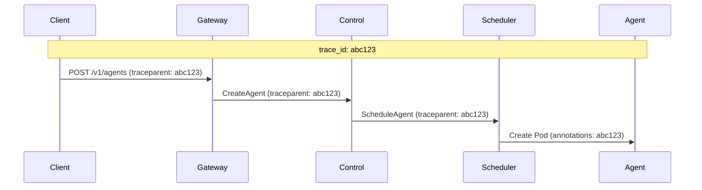
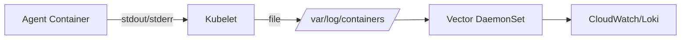

# Observability — Specification v0.1.0

## 1. Overview

This document specifies the observability architecture for the MicroVM Agent Platform, covering logs, metrics, and traces.

### 1.1 Goals

- Provide operators visibility into platform health
- Enable users to view their agent logs
- Support debugging and incident investigation
- Track resource usage for billing (future)

### 1.2 Stack

| Component | Technology |
|-----------|------------|
| Logging | `tracing` → Vector → CloudWatch/Loki |
| Metrics | Prometheus + Grafana |
| Tracing | OpenTelemetry → Jaeger/Tempo |

---

## 2. Structured Logging

### 2.1 Log Format

All services use `tracing` with JSON output:

```json
{
  "timestamp": "2026-01-15T10:30:00.123Z",
  "level": "info",
  "target": "swarm_control::lifecycle",
  "message": "Agent started",
  "agent_id": "a1b2c3d4...",
  "user_id": "u5e6r7i8...",
  "span_id": "abc123",
  "trace_id": "xyz789"
}
```

### 2.2 Log Levels

| Level | Usage |
|-------|-------|
| `error` | Failures requiring attention |
| `warn` | Recoverable issues |
| `info` | Lifecycle events, operations |
| `debug` | Detailed debugging info |
| `trace` | Very verbose, development only |

### 2.3 Standard Fields

All log entries include:

| Field | Description |
|-------|-------------|
| `timestamp` | ISO 8601 timestamp |
| `level` | Log level |
| `target` | Module path |
| `message` | Human-readable message |
| `trace_id` | Distributed trace ID |
| `span_id` | Current span ID |

Context-specific fields:

| Field | When Present |
|-------|--------------|
| `user_id` | User-scoped operations |
| `agent_id` | Agent-scoped operations |
| `session_id` | Session-scoped operations |
| `request_id` | HTTP request handling |
| `duration_ms` | Operation timing |
| `error` | Error details |

### 2.4 Tracing Setup

```rust
use tracing_subscriber::{
    fmt, layer::SubscriberExt, util::SubscriberInitExt, EnvFilter,
};

pub fn init_tracing() {
    let filter = EnvFilter::try_from_default_env()
        .unwrap_or_else(|_| EnvFilter::new("info"));
    
    let fmt_layer = fmt::layer()
        .json()
        .with_target(true)
        .with_thread_ids(false)
        .with_file(true)
        .with_line_number(true);
    
    tracing_subscriber::registry()
        .with(filter)
        .with(fmt_layer)
        .init();
}
```

### 2.5 Span Instrumentation

```rust
use tracing::{instrument, info, error, Span};

#[instrument(skip(self), fields(user_id = %user_id, agent_id))]
async fn create_agent(
    &self,
    user_id: UserId,
    req: CreateAgentRequest,
) -> Result<Agent> {
    let agent_id = AgentId::generate();
    Span::current().record("agent_id", &agent_id.to_string());
    
    info!("Creating agent");
    
    // ... implementation
    
    info!(status = "provisioning", "Agent created");
    Ok(agent)
}
```

---

## 3. Metrics

### 3.1 Prometheus Metrics

#### Platform Metrics

```prometheus
# HTTP request metrics
http_requests_total{method="POST", path="/v1/agents", status="201"} 100
http_request_duration_seconds{method="POST", path="/v1/agents", quantile="0.99"} 0.5

# WebSocket metrics
websocket_connections_active{} 50
websocket_messages_total{direction="inbound"} 10000
websocket_messages_total{direction="outbound"} 15000

# Agent lifecycle metrics
agents_total{status="running"} 100
agents_total{status="stopped"} 50
agents_total{status="hibernating"} 25
agent_state_transitions_total{from="stopped", to="provisioning"} 200

# Session metrics
sessions_active{} 30
sessions_total{} 500
session_duration_seconds{quantile="0.5"} 300
```

#### Resource Metrics

```prometheus
# Per-user resource usage
user_agents_count{user_id="u123..."} 5
user_sessions_active{user_id="u123..."} 2

# Per-agent resource usage
agent_cpu_usage_percent{agent_id="a123..."} 15.5
agent_memory_usage_bytes{agent_id="a123..."} 268435456
agent_uptime_seconds{agent_id="a123..."} 3600
```

#### Database Metrics

```prometheus
# RocksDB metrics
rocksdb_get_latency_seconds{cf="agents", quantile="0.99"} 0.001
rocksdb_put_latency_seconds{cf="agents", quantile="0.99"} 0.002
rocksdb_compaction_bytes_total{} 1073741824
```

### 3.2 Metrics Implementation

```rust
use prometheus::{
    Counter, CounterVec, Gauge, GaugeVec, Histogram, HistogramVec,
    Opts, Registry, register_counter_vec, register_histogram_vec,
};
use lazy_static::lazy_static;

lazy_static! {
    pub static ref HTTP_REQUESTS: CounterVec = register_counter_vec!(
        Opts::new("http_requests_total", "Total HTTP requests"),
        &["method", "path", "status"]
    ).unwrap();
    
    pub static ref HTTP_DURATION: HistogramVec = register_histogram_vec!(
        "http_request_duration_seconds",
        "HTTP request duration",
        &["method", "path"],
        vec![0.001, 0.005, 0.01, 0.05, 0.1, 0.5, 1.0, 5.0]
    ).unwrap();
    
    pub static ref AGENTS_TOTAL: GaugeVec = register_gauge_vec!(
        Opts::new("agents_total", "Total agents by status"),
        &["status"]
    ).unwrap();
    
    pub static ref WEBSOCKET_CONNECTIONS: Gauge = register_gauge!(
        Opts::new("websocket_connections_active", "Active WebSocket connections")
    ).unwrap();
}
```

### 3.3 Metrics Endpoint

```rust
use axum::{routing::get, Router};
use prometheus::{Encoder, TextEncoder};

async fn metrics_handler() -> String {
    let encoder = TextEncoder::new();
    let metric_families = prometheus::gather();
    let mut buffer = Vec::new();
    encoder.encode(&metric_families, &mut buffer).unwrap();
    String::from_utf8(buffer).unwrap()
}

pub fn metrics_router() -> Router {
    Router::new().route("/metrics", get(metrics_handler))
}
```

---

## 4. Distributed Tracing

### 4.1 Trace Context

All operations carry a trace context:

```rust
use opentelemetry::{
    global, trace::{Tracer, TraceContextExt},
    Context,
};

pub fn extract_trace_context(headers: &HeaderMap) -> Context {
    global::get_text_map_propagator(|propagator| {
        propagator.extract(&HeaderExtractor(headers))
    })
}

pub fn inject_trace_context(headers: &mut HeaderMap, cx: &Context) {
    global::get_text_map_propagator(|propagator| {
        propagator.inject_context(cx, &mut HeaderInjector(headers))
    });
}
```

### 4.2 Trace Propagation



### 4.3 OpenTelemetry Setup

```rust
use opentelemetry::sdk::{
    trace::{self, Sampler},
    Resource,
};
use opentelemetry_otlp::WithExportConfig;

pub fn init_tracer(service_name: &str, otlp_endpoint: &str) {
    let tracer = opentelemetry_otlp::new_pipeline()
        .tracing()
        .with_exporter(
            opentelemetry_otlp::new_exporter()
                .tonic()
                .with_endpoint(otlp_endpoint)
        )
        .with_trace_config(
            trace::config()
                .with_sampler(Sampler::AlwaysOn)
                .with_resource(Resource::new(vec![
                    opentelemetry::KeyValue::new("service.name", service_name.to_string()),
                ]))
        )
        .install_batch(opentelemetry::runtime::Tokio)
        .expect("Failed to initialize tracer");
    
    global::set_tracer_provider(tracer);
}
```

---

## 5. Agent Logs

### 5.1 Log Collection

Agent logs are collected via stdout/stderr and aggregated:



### 5.2 Log Access API

Users can access their agent logs via API:

```
GET /v1/agents/{agent_id}/logs?tail=100&since=2026-01-15T10:00:00Z
```

Response:
```json
{
  "logs": [
    {
      "timestamp": "2026-01-15T10:30:00Z",
      "level": "info",
      "message": "Processing user message",
      "seq": 123
    }
  ],
  "next_token": "eyJ0cyI6..."
}
```

### 5.3 Log Filtering

Logs are filtered by user ownership:

```rust
impl ControlPlane {
    async fn get_agent_logs(
        &self,
        user_id: &UserId,
        agent_id: &AgentId,
        opts: LogOptions,
    ) -> Result<Vec<LogEntry>> {
        // Verify ownership
        let agent = self.store.get_agent(agent_id)?
            .ok_or(ControlError::AgentNotFound)?;
        
        if agent.user_id != *user_id {
            return Err(ControlError::NotOwner);
        }
        
        // Fetch logs from log backend
        self.log_client.query(agent_id, opts).await
    }
}
```

---

## 6. Alerting

### 6.1 Alert Rules

```yaml
groups:
- name: swarm-platform
  rules:
  # High error rate
  - alert: HighErrorRate
    expr: |
      sum(rate(http_requests_total{status=~"5.."}[5m]))
      / sum(rate(http_requests_total[5m])) > 0.05
    for: 5m
    labels:
      severity: critical
    annotations:
      summary: "High error rate detected"
  
  # Agent health
  - alert: AgentUnhealthy
    expr: |
      kube_pod_status_ready{namespace="swarm-agents", condition="false"} == 1
    for: 5m
    labels:
      severity: warning
    annotations:
      summary: "Agent pod unhealthy: {{ $labels.pod }}"
  
  # Database latency
  - alert: HighDatabaseLatency
    expr: |
      histogram_quantile(0.99, rocksdb_get_latency_seconds_bucket) > 0.1
    for: 5m
    labels:
      severity: warning
    annotations:
      summary: "High RocksDB latency"
```

### 6.2 Alert Channels

| Severity | Channel |
|----------|---------|
| critical | PagerDuty + Slack |
| warning | Slack |
| info | Slack (optional) |

---

## 7. Dashboards

### 7.1 Platform Overview Dashboard

Panels:
- Request rate and latency
- Error rate by endpoint
- Active agents by status
- Active sessions
- WebSocket connections

### 7.2 Agent Dashboard

Panels:
- Agent status timeline
- CPU/memory usage
- Session history
- Error count
- Model token usage

### 7.3 User Dashboard

Panels:
- Agents count
- Active sessions
- API usage
- Error rate

---

## 8. Correlation IDs

### 8.1 ID Hierarchy

```
trace_id (request scope)
└── span_id (operation scope)
    └── request_id (HTTP request)
        └── session_id (WebSocket session)
            └── message_id (chat message)
```

### 8.2 Correlation Middleware

```rust
use axum::{
    extract::Request,
    middleware::Next,
    response::Response,
};
use uuid::Uuid;

pub async fn request_id_middleware(
    mut request: Request,
    next: Next,
) -> Response {
    let request_id = request
        .headers()
        .get("x-request-id")
        .and_then(|v| v.to_str().ok())
        .map(String::from)
        .unwrap_or_else(|| Uuid::new_v4().to_string());
    
    request.extensions_mut().insert(RequestId(request_id.clone()));
    
    let mut response = next.run(request).await;
    response.headers_mut().insert(
        "x-request-id",
        request_id.parse().unwrap(),
    );
    
    response
}
```

---

## 9. Log Retention

### 9.1 Retention Policies

| Log Type | Retention |
|----------|-----------|
| Platform logs | 30 days |
| Agent logs | 7 days |
| Audit logs | 90 days |
| Metrics | 15 days (full resolution), 1 year (downsampled) |
| Traces | 7 days |

### 9.2 Storage Estimates

| Component | Daily Volume | Monthly Cost (est.) |
|-----------|--------------|---------------------|
| Platform logs | 1 GB | $3 |
| Agent logs | 10 GB | $30 |
| Metrics | 500 MB | $5 |
| Traces | 2 GB | $10 |

---

## 10. Configuration

```rust
#[derive(Debug, Clone, serde::Deserialize)]
pub struct ObservabilityConfig {
    /// Log level (trace, debug, info, warn, error)
    pub log_level: String,
    
    /// Enable JSON log output
    pub log_json: bool,
    
    /// Prometheus metrics port
    pub metrics_port: u16,
    
    /// OTLP exporter endpoint
    pub otlp_endpoint: Option<String>,
    
    /// Trace sampling rate (0.0 - 1.0)
    pub trace_sample_rate: f64,
}

impl Default for ObservabilityConfig {
    fn default() -> Self {
        Self {
            log_level: "info".to_string(),
            log_json: true,
            metrics_port: 9090,
            otlp_endpoint: None,
            trace_sample_rate: 1.0,
        }
    }
}
```

---

## 11. Dependencies

| Crate | Version | Purpose |
|-------|---------|---------|
| `tracing` | 0.1.x | Instrumentation |
| `tracing-subscriber` | 0.3.x | Log formatting |
| `prometheus` | 0.13.x | Metrics |
| `opentelemetry` | 0.21.x | Tracing |
| `opentelemetry-otlp` | 0.14.x | OTLP export |
