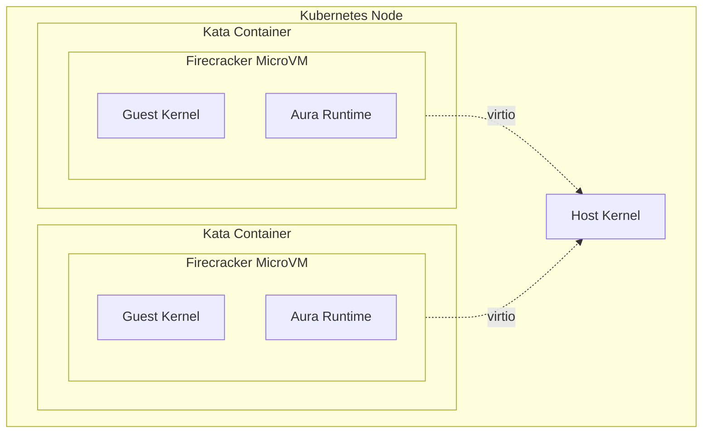

# Security — Specification v0.1.0

## 1. Overview

This document specifies the security architecture for the MicroVM Agent Platform, covering microVM hardening, secrets management, and audit logging.

### 1.1 Security Principles

| Principle | Implementation |
|-----------|----------------|
| **Defense in depth** | Multiple isolation layers (network, container, VM) |
| **Least privilege** | Minimal permissions, drop capabilities |
| **Secure by default** | Conservative defaults, explicit opt-in |
| **Audit everything** | Log security-relevant events |
| **Memory safety** | Rust eliminates entire classes of vulnerabilities |

### 1.2 Threat Model

| Threat | Mitigation |
|--------|------------|
| Cross-user data access | User ID isolation, ownership checks |
| Container escape | MicroVM isolation (Firecracker) |
| Network attacks | Network policies, no public endpoints |
| Token theft | Short-lived JWTs, refresh rotation |
| Supply chain attacks | Signed images, dependency auditing |

---

## 2. MicroVM Hardening

### 2.1 Kata + Firecracker

Each agent runs in a Firecracker microVM via Kata Containers:



### 2.2 Isolation Guarantees

| Layer | Isolation |
|-------|-----------|
| **Kernel** | Separate guest kernel per agent |
| **Memory** | Hardware-enforced VM boundaries |
| **Filesystem** | Read-only rootfs, isolated /state |
| **Network** | Separate virtual NIC per VM |
| **Devices** | Minimal virtio devices only |

### 2.3 Firecracker Configuration

```json
{
  "boot-source": {
    "kernel_image_path": "/var/lib/firecracker/vmlinux",
    "boot_args": "console=ttyS0 reboot=k panic=1 pci=off"
  },
  "machine-config": {
    "vcpu_count": 2,
    "mem_size_mib": 512,
    "smt": false
  },
  "drives": [
    {
      "drive_id": "rootfs",
      "path_on_host": "/var/lib/firecracker/rootfs.ext4",
      "is_root_device": true,
      "is_read_only": true
    }
  ]
}
```

### 2.4 RuntimeClass

```yaml
apiVersion: node.k8s.io/v1
kind: RuntimeClass
metadata:
  name: kata-fc
handler: kata-fc
overhead:
  podFixed:
    memory: "160Mi"
    cpu: "250m"
scheduling:
  nodeSelector:
    katacontainers.io/kata-runtime: "true"
```

---

## 3. Pod Security

### 3.1 Pod Security Standards

Agent pods comply with the **restricted** Pod Security Standard:

```yaml
apiVersion: v1
kind: Pod
metadata:
  name: agent-example
spec:
  runtimeClassName: kata-fc
  
  securityContext:
    runAsNonRoot: true
    runAsUser: 1000
    runAsGroup: 1000
    fsGroup: 1000
    seccompProfile:
      type: RuntimeDefault
  
  containers:
  - name: aura
    securityContext:
      allowPrivilegeEscalation: false
      readOnlyRootFilesystem: true
      capabilities:
        drop:
        - ALL
```

### 3.2 Capability Restrictions

All capabilities are dropped. If needed in future:

| Capability | Status | Reason |
|------------|--------|--------|
| `NET_BIND_SERVICE` | Dropped | Not needed (port 8080) |
| `SYS_PTRACE` | Dropped | Debugging disabled |
| `NET_RAW` | Dropped | No raw sockets |
| All others | Dropped | Least privilege |

### 3.3 Seccomp Profile

Use the default runtime seccomp profile:

```yaml
securityContext:
  seccompProfile:
    type: RuntimeDefault
```

This blocks dangerous syscalls like:
- `ptrace`
- `mount`
- `keyctl`
- `bpf`
- `perf_event_open`

---

## 4. Authorization

### 4.1 Ownership Model

Every resource has an owner:

```rust
pub struct Agent {
    pub agent_id: AgentId,
    pub user_id: UserId,  // Owner
    // ...
}

pub struct Session {
    pub session_id: SessionId,
    pub user_id: UserId,  // Owner
    pub agent_id: AgentId,
    // ...
}
```

### 4.2 Authorization Checks

Every operation verifies ownership:

```rust
impl ControlPlane {
    async fn verify_agent_ownership(
        &self,
        agent_id: &AgentId,
        user_id: &UserId,
    ) -> Result<Agent, ControlError> {
        let agent = self.store.get_agent(agent_id)?
            .ok_or(ControlError::AgentNotFound(agent_id.clone()))?;
        
        if agent.user_id != *user_id {
            tracing::warn!(
                agent_id = %agent_id,
                owner = %agent.user_id,
                requester = %user_id,
                "Authorization failed: not owner"
            );
            return Err(ControlError::NotOwner);
        }
        
        Ok(agent)
    }
}
```

### 4.3 API Authorization Matrix

| Endpoint | Authorization |
|----------|--------------|
| `GET /v1/agents` | List only user's agents |
| `POST /v1/agents` | Create for authenticated user |
| `GET /v1/agents/{id}` | Owner only |
| `DELETE /v1/agents/{id}` | Owner only |
| `POST /v1/agents/{id}:*` | Owner only |
| `POST /v1/agents/{id}/sessions` | Owner only |
| `WS /v1/sessions/{id}/ws` | Session owner only |

---

## 5. Secrets Management

### 5.1 Secret Types

| Secret | Storage | Rotation |
|--------|---------|----------|
| JWT signing keys | Zero-ID (external) | Managed by Zero-ID |
| LLM API keys | Kubernetes Secrets | Manual / External Secrets |
| Database encryption | Not used (RocksDB unencrypted) | N/A |
| TLS certificates | Cert-manager / ACM | Automatic |

### 5.2 LLM API Keys

#### Platform-Managed Keys

```yaml
apiVersion: v1
kind: Secret
metadata:
  name: llm-api-keys
  namespace: swarm-system
type: Opaque
data:
  ANTHROPIC_API_KEY: base64(sk-ant-...)
  OPENAI_API_KEY: base64(sk-...)
```

Injected into agent pods:

```yaml
env:
- name: ANTHROPIC_API_KEY
  valueFrom:
    secretKeyRef:
      name: llm-api-keys
      key: ANTHROPIC_API_KEY
```

#### User-Provided Keys (Future)

```rust
pub struct AgentSecrets {
    pub agent_id: AgentId,
    pub user_id: UserId,
    pub secrets: HashMap<String, EncryptedValue>,
}
```

### 5.3 Secret Hygiene

- Never log secrets
- Never include secrets in error messages
- Use `secrecy` crate for in-memory protection:

```rust
use secrecy::{Secret, ExposeSecret};

pub struct ApiKey(Secret<String>);

impl ApiKey {
    pub fn expose(&self) -> &str {
        self.0.expose_secret()
    }
}

// Automatically redacted in Debug/Display
impl std::fmt::Debug for ApiKey {
    fn fmt(&self, f: &mut std::fmt::Formatter<'_>) -> std::fmt::Result {
        write!(f, "ApiKey([REDACTED])")
    }
}
```

---

## 6. Audit Logging

### 6.1 Audit Events

| Event | Logged Data |
|-------|-------------|
| `agent.created` | user_id, agent_id, spec |
| `agent.deleted` | user_id, agent_id |
| `agent.started` | user_id, agent_id |
| `agent.stopped` | user_id, agent_id |
| `session.created` | user_id, agent_id, session_id |
| `session.closed` | user_id, session_id, duration |
| `auth.login_success` | user_id, ip_address |
| `auth.login_failure` | email, ip_address, reason |
| `auth.token_refresh` | user_id |

### 6.2 Audit Log Format

```json
{
  "timestamp": "2026-01-15T10:30:00.123Z",
  "event_type": "agent.created",
  "actor": {
    "user_id": "u123...",
    "ip_address": "203.0.113.50",
    "user_agent": "Mozilla/5.0..."
  },
  "resource": {
    "type": "agent",
    "id": "a456..."
  },
  "action": "create",
  "outcome": "success",
  "details": {
    "agent_name": "my-agent",
    "cpu_millicores": 500,
    "memory_mb": 512
  }
}
```

### 6.3 Audit Logger Implementation

```rust
use serde::Serialize;

#[derive(Debug, Serialize)]
pub struct AuditEvent {
    pub timestamp: chrono::DateTime<chrono::Utc>,
    pub event_type: String,
    pub actor: AuditActor,
    pub resource: Option<AuditResource>,
    pub action: String,
    pub outcome: AuditOutcome,
    pub details: serde_json::Value,
}

#[derive(Debug, Serialize)]
pub struct AuditActor {
    pub user_id: Option<String>,
    pub ip_address: String,
    pub user_agent: Option<String>,
}

#[derive(Debug, Serialize)]
pub struct AuditResource {
    #[serde(rename = "type")]
    pub resource_type: String,
    pub id: String,
}

#[derive(Debug, Serialize)]
#[serde(rename_all = "snake_case")]
pub enum AuditOutcome {
    Success,
    Failure,
    Denied,
}

pub trait AuditLogger: Send + Sync {
    fn log(&self, event: AuditEvent);
}

pub struct TracingAuditLogger;

impl AuditLogger for TracingAuditLogger {
    fn log(&self, event: AuditEvent) {
        tracing::info!(
            target: "audit",
            event_type = %event.event_type,
            actor.user_id = ?event.actor.user_id,
            actor.ip_address = %event.actor.ip_address,
            resource.type = ?event.resource.as_ref().map(|r| &r.resource_type),
            resource.id = ?event.resource.as_ref().map(|r| &r.id),
            action = %event.action,
            outcome = ?event.outcome,
            details = %event.details,
            "audit"
        );
    }
}
```

### 6.4 Audit Log Retention

- **Retention**: 90 days minimum
- **Storage**: Append-only, tamper-evident
- **Access**: Operator-only, logged access

---

## 7. Input Validation

### 7.1 Validation Rules

| Input | Validation |
|-------|------------|
| Agent name | 3-64 chars, alphanumeric + hyphen |
| CPU millicores | 100-4000 |
| Memory MB | 128-8192 |
| Session ID | Valid UUID |
| Agent ID | Valid 64 hex chars |

### 7.2 Validation Implementation

```rust
use validator::Validate;

#[derive(Debug, Deserialize, Validate)]
pub struct CreateAgentRequest {
    #[validate(length(min = 3, max = 64), regex(path = "AGENT_NAME_REGEX"))]
    pub name: String,
    
    #[validate]
    pub spec: AgentSpecRequest,
}

#[derive(Debug, Deserialize, Validate)]
pub struct AgentSpecRequest {
    #[validate(range(min = 100, max = 4000))]
    pub cpu_millicores: Option<u32>,
    
    #[validate(range(min = 128, max = 8192))]
    pub memory_mb: Option<u32>,
}

lazy_static! {
    static ref AGENT_NAME_REGEX: regex::Regex = 
        regex::Regex::new(r"^[a-z0-9][a-z0-9-]*[a-z0-9]$").unwrap();
}
```

### 7.3 Path Traversal Prevention

Agent state paths are constructed server-side:

```rust
fn state_path(user_id: &UserId, agent_id: &AgentId) -> PathBuf {
    // IDs are hex-encoded, no special characters
    PathBuf::from("/state")
        .join(user_id.to_hex())
        .join(agent_id.to_hex())
}
```

Never accept user-provided paths for state access.

---

## 8. Rate Limiting

### 8.1 Rate Limits

| Scope | Limit | Window |
|-------|-------|--------|
| Per-user API requests | 100 | 1 minute |
| Per-IP unauthenticated | 10 | 1 minute |
| Agent creation | 10 | 1 hour |
| Session creation | 30 | 1 hour |
| WebSocket messages | 100 | 1 second |

### 8.2 Rate Limiter Implementation

```rust
use governor::{Quota, RateLimiter, clock::DefaultClock, state::keyed::DashMapStateStore};
use std::num::NonZeroU32;

pub type KeyedRateLimiter = RateLimiter<String, DashMapStateStore<String>, DefaultClock>;

pub fn create_rate_limiter(requests_per_minute: u32) -> KeyedRateLimiter {
    let quota = Quota::per_minute(NonZeroU32::new(requests_per_minute).unwrap());
    RateLimiter::dashmap(quota)
}

pub async fn check_rate_limit(
    limiter: &KeyedRateLimiter,
    key: &str,
) -> Result<(), ApiError> {
    limiter.check_key(&key.to_string())
        .map_err(|_| ApiError::RateLimited)
}
```

---

## 9. TLS Configuration

### 9.1 External TLS

TLS termination at load balancer:

- **Protocol**: TLS 1.2+
- **Ciphers**: Modern only (ECDHE, AES-GCM)
- **Certificates**: ACM-managed, auto-renewed

### 9.2 Internal mTLS (Future)

For service-to-service communication:

```yaml
apiVersion: security.istio.io/v1beta1
kind: PeerAuthentication
metadata:
  name: default
  namespace: swarm-system
spec:
  mtls:
    mode: STRICT
```

---

## 10. Dependency Security

### 10.1 Rust Security Practices

From `rules-rust.md`:

- `#![forbid(unsafe_code)]` in all crates
- Regular `cargo audit` in CI
- `cargo deny` for license and vulnerability checks
- Minimal dependencies

### 10.2 Container Security

```dockerfile
FROM rust:1.75-slim AS builder
# Build...

FROM gcr.io/distroless/cc-debian12
COPY --from=builder /app/aura-swarm-gateway /
USER nonroot:nonroot
ENTRYPOINT ["/aura-swarm-gateway"]
```

- **Base image**: Distroless (minimal attack surface)
- **User**: Non-root
- **No shell**: No interactive access

### 10.3 Image Signing

```yaml
# cosign verify
- uses: sigstore/cosign-installer@v3
- run: cosign verify ghcr.io/cypher-asi/aura-swarm-gateway:${{ github.sha }}
```

---

## 11. Incident Response

### 11.1 Security Contacts

| Role | Responsibility |
|------|---------------|
| Security Lead | Incident coordination |
| Platform Team | Technical response |
| Legal | Disclosure obligations |

### 11.2 Response Procedures

1. **Detection**: Alert triggered or report received
2. **Triage**: Assess severity and scope
3. **Containment**: Isolate affected systems
4. **Eradication**: Remove threat
5. **Recovery**: Restore normal operations
6. **Post-mortem**: Document and improve

### 11.3 Emergency Actions

```bash
# Freeze all agents (emergency)
kubectl scale deployment aura-swarm-scheduler --replicas=0

# Revoke all sessions
curl -X POST http://aura-swarm-control:8080/admin/revoke-all-sessions

# Block user
curl -X POST http://aura-swarm-control:8080/admin/block-user/{user_id}
```

---

## 12. Compliance Checklist

### 12.1 Security Controls

| Control | Status |
|---------|--------|
| Authentication required | ✓ |
| Authorization on all endpoints | ✓ |
| Input validation | ✓ |
| Output encoding | ✓ |
| Secrets management | ✓ |
| Audit logging | ✓ |
| Rate limiting | ✓ |
| TLS encryption | ✓ |
| Container hardening | ✓ |
| Network isolation | ✓ |

### 12.2 Regular Reviews

| Review | Frequency |
|--------|-----------|
| Dependency audit | Weekly (CI) |
| Access review | Monthly |
| Security assessment | Quarterly |
| Penetration test | Annually |
