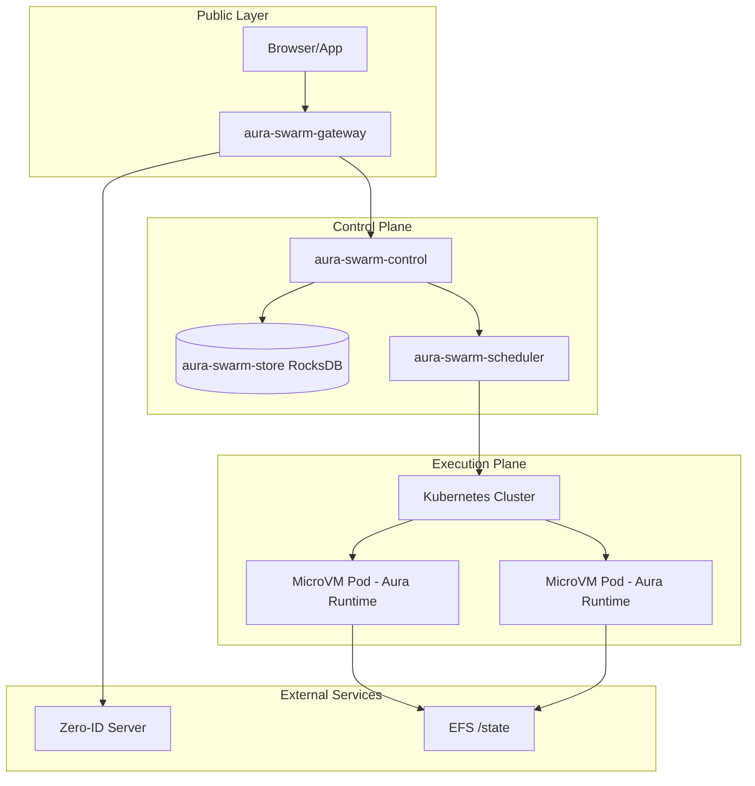
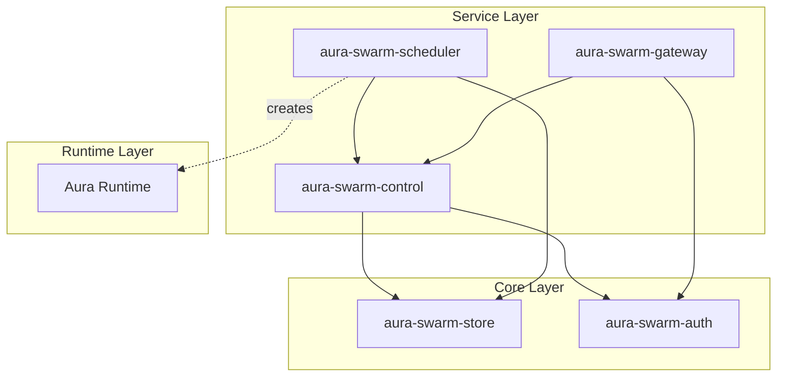

# MicroVM Agent Platform Specification v0.1.0

This directory contains the comprehensive specification for the MicroVM Agent Platform v0.1.0, a multi-user platform for running isolated AI agents in microVMs.

## Document Index

The specifications are organized by component, starting with the system overview.

| # | Document | Component | Description |
|---|----------|-----------|-------------|
| 01 | [01-system-overview.md](./01-system-overview.md) | — | Architecture, principles, trust boundaries |
| 02 | [02-api-gateway.md](./02-api-gateway.md) | `aura-swarm-gateway` | Public API endpoints, WebSocket proxy |
| 03 | [03-control-plane.md](./03-control-plane.md) | `aura-swarm-control` | Agent CRUD, lifecycle, session management |
| 04 | [04-agent-registry.md](./04-agent-registry.md) | `aura-swarm-store` | RocksDB schema, column families, key layouts |
| 05 | [05-scheduler.md](./05-scheduler.md) | `aura-swarm-scheduler` | K8s reconciler, pod templates, health monitoring |
| 06 | [06-agent-runtime.md](./06-agent-runtime.md) | Aura | Runtime contract, sandbox, hibernation |
| 07 | [07-auth.md](./07-auth.md) | `aura-swarm-auth` | Zero-ID integration, JWT validation |
| 08 | [08-networking.md](./08-networking.md) | — | Internal routing, agent resolution, egress |
| 09 | [09-observability.md](./09-observability.md) | — | Logs, metrics, traces |
| 10 | [10-security.md](./10-security.md) | — | MicroVM hardening, secrets, audit |

## Architecture Overview



## Component Dependency Graph



## Terminology

| Term | Definition |
|------|------------|
| **User** | An authenticated individual identified by `user_id` from Zero-ID |
| **Agent** | A long-running Aura runtime instance, owned by a user |
| **MicroVM** | Firecracker-backed VM providing kernel-level isolation per agent |
| **Session** | An interactive WebSocket connection between a user and their agent |
| **Control Plane** | Platform services managing agent lifecycle and routing |
| **Execution Plane** | Kubernetes cluster(s) running MicroVM workloads |
| **State Directory** | Persistent storage at `/state/<user_id>/<agent_id>/` |

## Design Decisions (v0.1.0)

| Decision | Approach |
|----------|----------|
| **Authentication** | Simple email/password via Zero-ID server; JWT tokens |
| **Agent Ownership** | Per-user; no multi-tenant namespaces in v0.1.0 |
| **Database** | Single RocksDB instance; key layout supports future sharding |
| **Replication** | Not required; single-node deployment |
| **Agent Sandbox** | Full filesystem access within `/state` directory |
| **Hibernation** | Supported; instant wake-on-demand |

## Implementation Stack

All platform services are implemented in **Rust** following the conventions in [rules-rust.md](../../../.cursor/rules-rust.md):

- **Async Runtime**: Tokio
- **HTTP Framework**: Axum
- **Database**: RocksDB (embedded)
- **Serialization**: serde + JSON/CBOR
- **Error Handling**: `thiserror` for libraries, `anyhow` at boundaries
- **Logging**: `tracing` with structured fields
- **IDs**: Strongly-typed newtypes (32-byte for `AgentId`, `UserId`; 16-byte for `SessionId`)

## Crate Layout

```
aura-swarm/
├─ aura-swarm-core          # IDs, schemas, errors (shared types)
├─ aura-swarm-store         # RocksDB storage implementation
├─ aura-swarm-auth          # Zero-ID JWT validation
├─ aura-swarm-control       # Agent lifecycle, session management
├─ aura-swarm-scheduler     # K8s reconciler, pod management
├─ aura-swarm-gateway       # Public HTTP/WebSocket API
└─ aura-swarm-cli           # Admin CLI (optional)
```

## Reading Order

For newcomers to the codebase:

1. **[01-system-overview.md](./01-system-overview.md)** — Start here for the big picture
2. **[07-auth.md](./07-auth.md)** — Understand authentication flow
3. **[02-api-gateway.md](./02-api-gateway.md)** — Public API reference
4. **[03-control-plane.md](./03-control-plane.md)** — Agent lifecycle
5. **[06-agent-runtime.md](./06-agent-runtime.md)** — Aura integration contract

For infrastructure focus:

- **[04-agent-registry.md](./04-agent-registry.md)** — Storage schema
- **[05-scheduler.md](./05-scheduler.md)** — Kubernetes integration
- **[08-networking.md](./08-networking.md)** — Routing and egress

## Version History

| Version | Date | Description |
|---------|------|-------------|
| 0.1.0 | 2026-01 | Initial specification |

## Open Questions

- Agent state mirroring strategy (DB metadata vs `/state` filesystem as source of truth)
- LLM credential handling (per-user API keys vs shared platform key)
- Wake-on-demand trigger mechanism for hibernated agents
