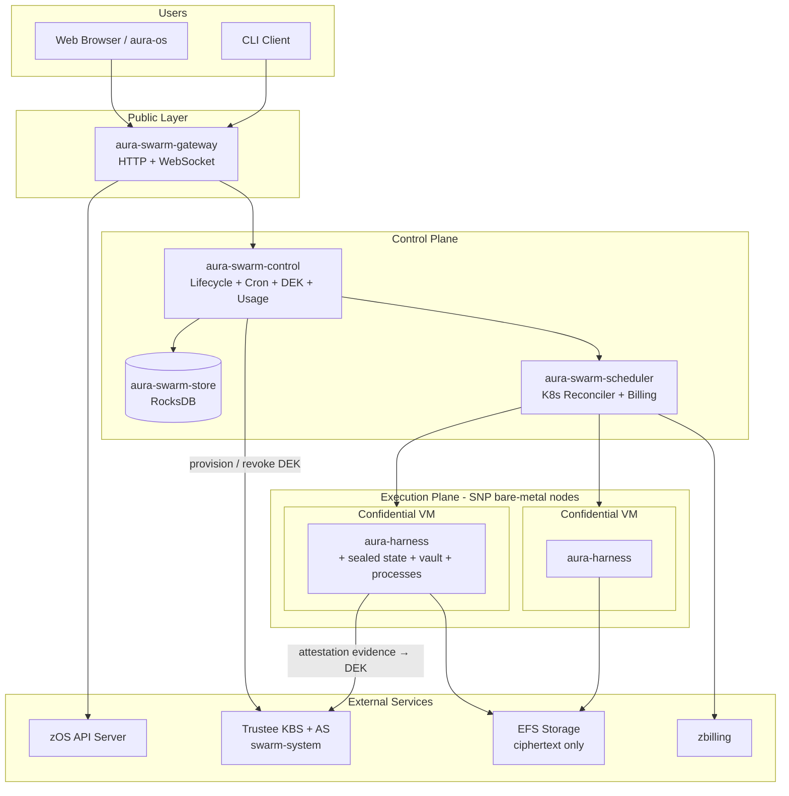
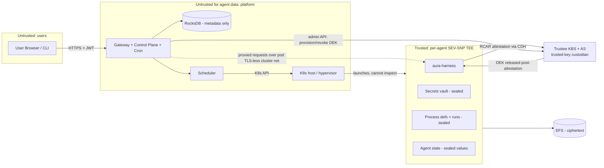
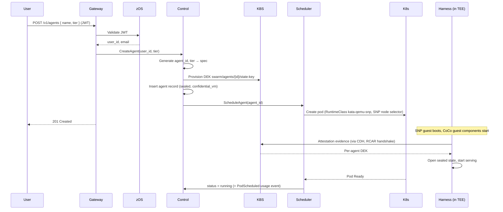
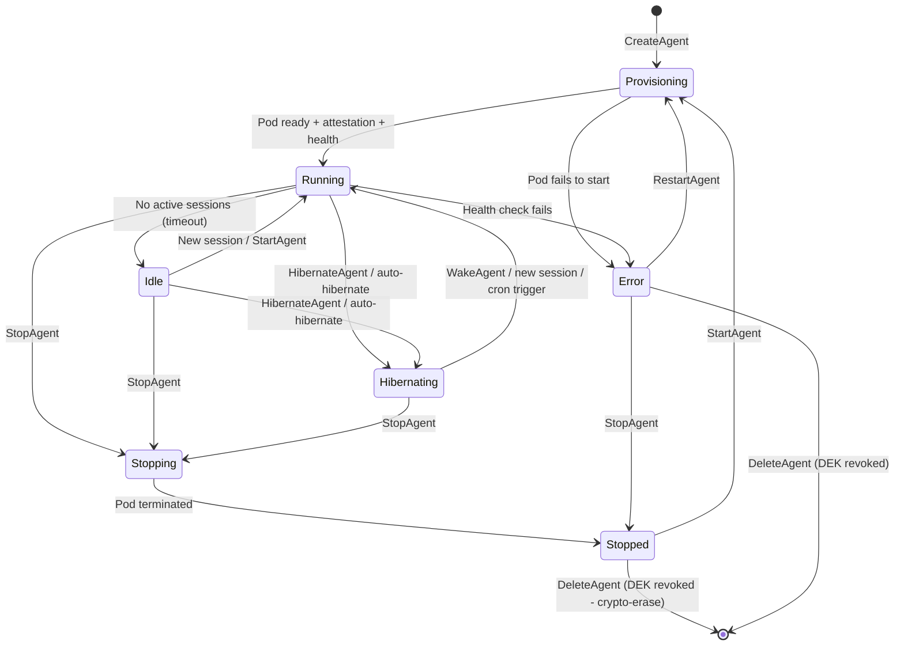
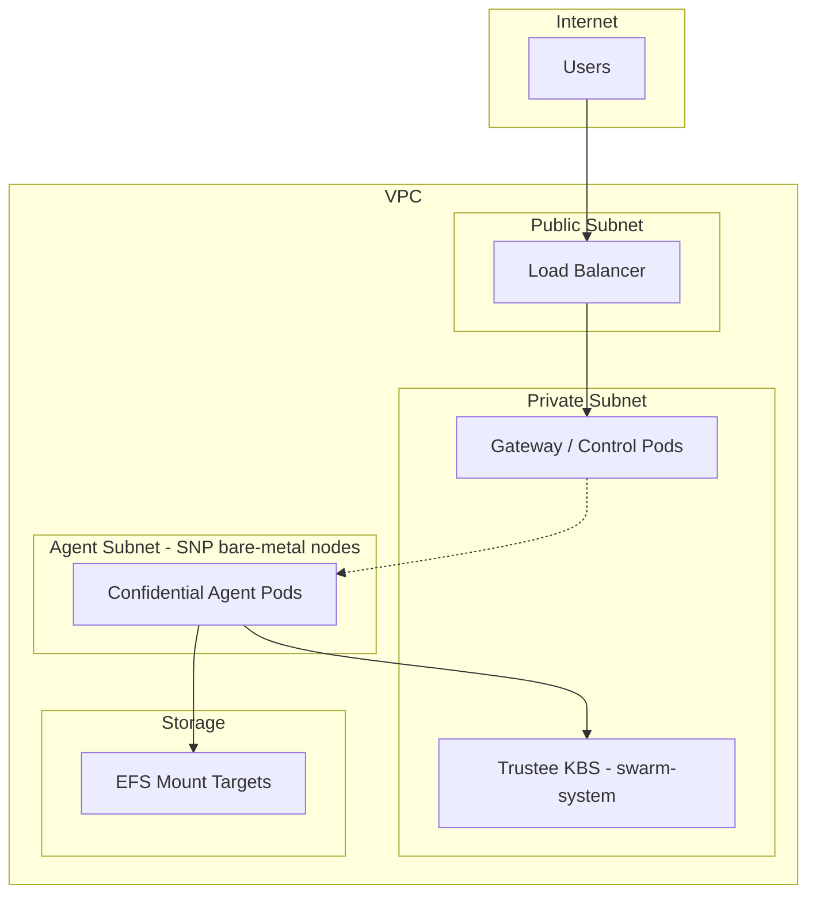
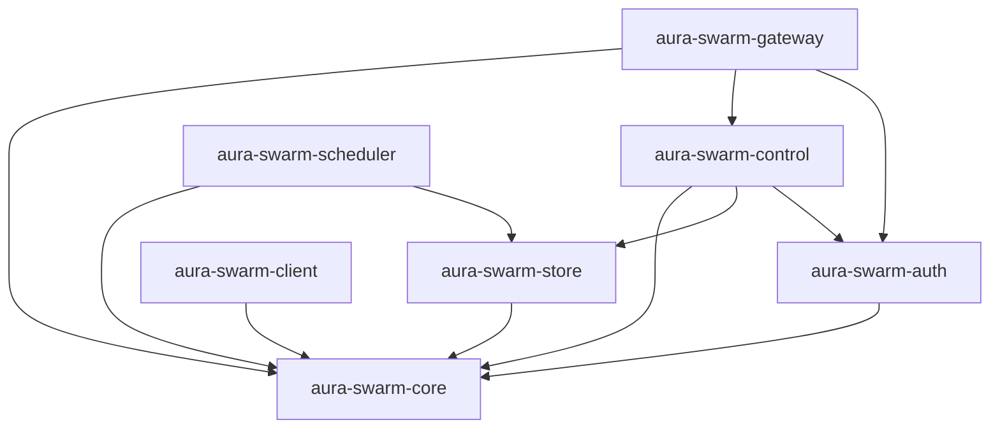

# System Overview — Specification v0.2.0

## 1. Overview

AURA Swarm is a multi-user platform for running isolated AI agents. Every agent runs in its own **confidential SEV-SNP virtual machine** (Confidential Containers: Kata + QEMU via the `kata-qemu-snp` RuntimeClass), with **sealed per-agent storage** whose encryption key is released only after successful remote attestation. The platform — gateway, control plane, scheduler, and the underlying hosts — is outside the trust boundary for agent data.

### 1.1 Purpose

- Allow users to create, manage, and interact with AI agents
- Provide hardware-enforced confidentiality: the host, the Kubernetes cluster, and the platform operators cannot read agent memory or state
- Support long-running background agents with persistent, encrypted state and cron-driven automations
- Enable real-time interaction via WebSocket run streams
- Bill by transparent per-tier hourly pricing

### 1.2 Core Principles

| Principle | Description |
|-----------|-------------|
| **TEE-first isolation** | Every agent is a SEV-SNP confidential VM; there is no non-confidential production tier |
| **Sealed by default** | All content-bearing agent state is AES-256-GCM encrypted under a per-agent DEK; EFS only ever sees ciphertext |
| **Trigger outside, data inside** | Automations execute inside the TEE; only content-free schedule metadata leaves the VM |
| **Stable IDs over ephemeral infra** | Agents addressed by `agent_id`, never by pod IP |
| **No public agent endpoints** | All access flows through the gateway |
| **Rust everywhere** | All platform services written in safe Rust |

### 1.3 Non-Goals (v0.2.0)

- Multi-tenant namespaces and policies (deferred)
- Cross-user agent communication
- Public per-agent DNS/IPs
- Exposing Kubernetes APIs to users
- End-to-end encryption of secret values past the gateway TLS hop (HPKE planned; see [10-security.md](./10-security.md))

---

## 2. High-Level Architecture

### 2.1 System Layers



### 2.2 Component Summary

| Component | Responsibility |
|-----------|---------------|
| **aura-swarm-gateway** | Public API, run/terminal/files/secrets proxying, JWT validation; hosts the control plane and cron service in-process |
| **aura-swarm-control** | Agent CRUD, lifecycle, tier changes, sessions, DEK lifecycle, usage aggregation, ProcessCronService, auto-hibernate |
| **aura-swarm-store** | RocksDB persistence: agents, users, sessions, process triggers, usage events, log snapshots; startup schema migration |
| **aura-swarm-scheduler** | Kubernetes reconciler: confidential pod lifecycle, health monitoring, pod logs, tier-SKU billing reporting |
| **aura-swarm-auth** | zOS integration, token validation |
| **Trustee (KBS + AS)** | Verifies SEV-SNP attestation evidence; stores and conditionally releases per-agent DEKs |
| **aura-harness** | The agent runtime inside the TEE: attestation boot, sealed stores, secrets vault, processes, runs |

### 2.3 Box Tiers

Every agent is created on (or migrated to) a tier. Tiers differ only in size and price — isolation, attestation, and sealing are identical across the lineup.

| Tier | CPU | Memory | Price | SKU |
|------|-----|--------|-------|-----|
| `small` | 500m | 1 GiB | 4¢/h | `swarm.small` |
| `standard` (default) | 1000m | 2 GiB | 8¢/h | `swarm.standard` |
| `pro` | 2000m | 4 GiB | 15¢/h | `swarm.pro` |

The price applies per hour of pod runtime (hibernated agents cost nothing); the prices in force at any moment are stamped onto usage events, so historical cost reporting is immune to re-pricing.

---

## 3. Trust Boundaries

### 3.1 Boundary Diagram



### 3.2 Trust Levels

| Zone | Components | Trust Level |
|------|------------|-------------|
| **Untrusted** | User browsers, CLI clients | None — all input validated |
| **DMZ** | aura-swarm-gateway | Authenticated — validates JWTs |
| **Platform** | Control plane, scheduler, store, K8s hosts | Trusted for orchestration and metadata; **untrusted for agent data** — SEV-SNP memory encryption and sealed storage keep agent content out of reach |
| **Key custodian** | Trustee KBS + Attestation Service | Trusted to release DEKs only into attested guests |
| **TEE** | Per-agent confidential VMs | The only place agent content exists in plaintext |

### 3.3 Security Boundaries

1. **Authentication Boundary**: Gateway validates the zOS JWT before any operation
2. **Authorization Boundary**: Control plane checks `user_id` ownership on every agent operation
3. **Network Boundary**: Agent pods have no public IPs; ingress only from the platform namespace
4. **Hardware Boundary**: Each agent runs in a separate SEV-SNP guest — memory is encrypted with a per-VM key; the host/hypervisor cannot read or tamper with it (integrity-protected)
5. **Attestation Boundary**: The DEK that unlocks an agent's state is released by the KBS only to a guest that proves (RCAR protocol, via the in-guest confidential-data-hub) it is running the expected stack on genuine SEV-SNP hardware
6. **Storage Boundary**: Agents only access their own EFS subPath, and everything written there is ciphertext

---

## 4. Data Flow

### 4.1 Agent Creation Flow



### 4.2 Cron-Triggered Process Flow (trigger outside, data inside)

```mermaid
sequenceDiagram
    participant Cron as ProcessCronService
    participant Control
    participant Scheduler
    participant Harness as Harness (in TEE)

    Note over Cron: ~30s tick; reads process_triggers CF<br/>(process_id, cron, enabled, next_run_at — no payload)
    Cron->>Control: due trigger for hibernating agent → wake
    Control->>Scheduler: schedule pod
    Scheduler-->>Control: pod Ready (attested, sealed state open)
    Cron->>Harness: POST /v1/processes/:id/trigger (internal token)
    Note over Harness: Prompt + config decrypted inside the TEE,<br/>chat run executes, run record sealed
    Cron->>Cron: advance next_run_at (at-most-once per slot)
    Note over Control: auto-hibernate loop later puts the idle agent back to sleep
```

---

## 5. Agent Lifecycle

### 5.1 State Machine



### 5.2 State Descriptions

| State | Description | Pod Status |
|-------|-------------|------------|
| **Provisioning** | Pod being created; SNP guest boots, attests, opens sealed state | Creating/Pending |
| **Running** | Agent active, accepting sessions | Running |
| **Idle** | No active sessions, still running (still billed) | Running |
| **Hibernating** | Sealed state on EFS, pod terminated, no compute cost | None |
| **Stopping** | Graceful shutdown in progress | Terminating |
| **Stopped** | Pod terminated, sealed state preserved | None |
| **Error** | Health check failed or crash | Failed/CrashLoop |

### 5.3 Hibernation and the Three Wake Paths

Hibernation terminates the pod while preserving sealed state on EFS:

1. The final pod stdout tail (~1000 lines) is captured as a log snapshot before deletion
2. The pod is terminated (a `PodTerminated` usage event closes the billable interval)
3. On wake a fresh pod is scheduled, re-attests, re-fetches the DEK, and re-opens the same sealed state

Wake triggers:

- **Explicit API call** — `POST /v1/agents/:id/wake` (or `start`)
- **New session/run** — creating a session against a hibernating agent auto-wakes it
- **Cron trigger** — the ProcessCronService wakes the agent, waits for Ready, fires the trigger, and the auto-hibernate loop puts it back to sleep afterwards

The auto-hibernate loop hibernates agents with no active sessions after a configurable idle window (default 30 minutes; see [03-control-plane.md](./03-control-plane.md)).

### 5.4 Tier Changes

`POST /v1/agents/:id/tier` resizes an agent:

- **Hibernating/Stopped** — record-only update; the new size applies on next wake/start
- **Running/Idle** — credit pre-flight at the new rate, active sessions closed, pod recreated with the new resources (sealed state untouched)
- A `TierChanged` usage event (with both hourly prices) splits cost intervals exactly at the change; the billing reporter re-registers under the new SKU

---

## 6. Storage Architecture

### 6.1 Control Plane Storage (RocksDB)

The control plane stores **metadata only** — never agent content, secret values, or process payloads:

```
aura-swarm-store/
└── db/
    ├── agents/            # Agent records (tier, sealed-storage config, status)
    ├── agents_by_user/    # Index: user_id -> agent_ids
    ├── agents_by_status/  # Index: status -> agents
    ├── users/             # User records (from zOS sync)
    ├── sessions/          # Session records
    ├── process_triggers/  # (process_id, cron, enabled, next_run_at) — no payloads
    ├── usage_events/      # Billable interval + counter events, priced at event time
    ├── agent_logs/        # Capped pod-stdout termination snapshots
    └── meta/              # schema_version (v2)
```

See [04-agent-registry.md](./04-agent-registry.md) for key layouts and the v1 → v2 migration.

### 6.2 Agent State Storage (EFS — ciphertext layout)

Each agent has an isolated subPath on the shared encrypted EFS file system. What EFS (and anyone who reads it — backups, operators, AWS) sees:

```
/state/<agent_id>/                  # pod-mounted subPath
├── db/                             # harness RocksDB
│   ├── CURRENT, MANIFEST-*, *.sst  # standard RocksDB files, BUT every
│   │                               # content-bearing value inside is an
│   │                               # AES-256-GCM ciphertext under the DEK
│   └── ...
├── workspaces/                     # agent working directories
└── .aura-sealed                    # sealed-state marker (post-migration)
```

Sealing is **value-level**: record entries, inbox transactions, memory facts/events/procedures, skill installations, secret values, process definitions, and run records are individually encrypted before hitting RocksDB. Key structure (column families, key ordering) remains visible for scans; content does not. The DEK never touches EFS.

- **Isolation**: Agents can only access their own subPath
- **Persistence**: Sealed state survives pod restarts, hibernation, and tier changes
- **Crypto-erase**: Destroying an agent revokes its DEK in the KBS, rendering the EFS ciphertext permanently unreadable
- **Backups**: EFS/AWS Backup snapshots contain only ciphertext

### 6.3 Key Custody

- Key id: deterministic `swarm/agents/{agent_id}/state-key`
- Provisioned by the control plane in the Trustee KBS at agent create (random 256-bit, generated in-process, never logged or persisted by the platform)
- Released by the KBS only to an attested guest (RCAR handshake via the in-guest CDH)
- Revoked at agent destroy

---

## 7. Networking Model

### 7.1 Network Topology



### 7.2 Network Policies

| Source | Destination | Allowed |
|--------|-------------|---------|
| Internet | Gateway (443) | Yes |
| Gateway | Agent (8080) | Yes (run/terminal/files/secrets/process proxying) |
| Scheduler | K8s API | Yes |
| Agent | Trustee KBS (8080) | Yes (attestation + DEK fetch) |
| Agent | Agent | **No** (cross-agent blocked) |
| Agent | Internet | Allowlist only (LLM APIs via aura-router) |
| Agent | EFS | Yes (own subPath only) |

---

## 8. External Dependencies

### 8.1 zOS

Authentication provider for user identity — JWT with `user_id`/`email` claims, validated by the gateway against zOS JWKS.

### 8.2 aura-harness

The agent runtime inside the TEE: attestation boot, sealed stores, secrets vault, processes, run/terminal/file APIs. See [06-agent-runtime.md](./06-agent-runtime.md).

### 8.3 Kubernetes + Confidential Containers

- **RuntimeClass**: `kata-qemu-snp` (Kata + QEMU on SEV-SNP); installed by the CoCo operator onto nodes labeled `swarm.io/confidential-node=true`
- **Node pool**: AMD bare-metal (default `m6a.metal`), tainted `swarm.io/confidential-node=true:NoSchedule`
- **Trustee**: KBS + Attestation Service deployed in `swarm-system` (`kbs` service, port 8080)

### 8.4 zbilling

Billing source of truth. The scheduler reports per-pod usage with the tier SKU and `hourly_price_cents`; the in-platform usage APIs are user-facing statistics, not the ledger.

---

## 9. Scalability Considerations

### 9.1 v0.2.0 Limits

| Resource | Limit |
|----------|-------|
| Users | Hundreds |
| Agents per user | 10 |
| Total agents | Thousands (bounded by SNP node pool capacity) |
| Concurrent sessions | Hundreds |

### 9.2 Future Scaling

- **SNP pool autoscaling**: grow/shrink the bare-metal node group with fleet size
- **Cell-based architecture**: partition users across clusters
- **RocksDB sharding**: shard by `user_id` prefix
- **Multi-region**: deploy cells in multiple regions

---

## 10. Crate Dependencies


