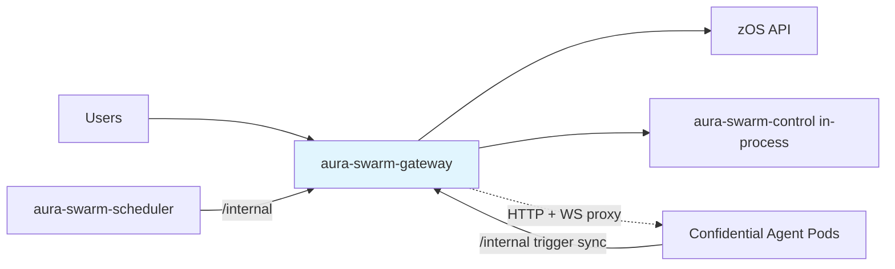
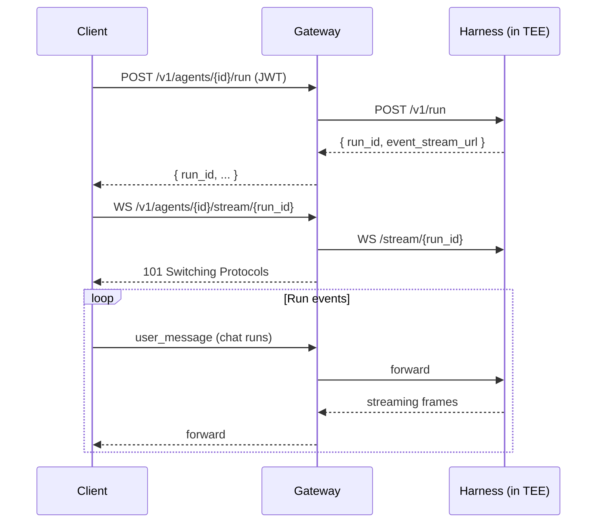

# API Gateway — Specification v0.2.0

## 1. Overview

The `aura-swarm-gateway` crate provides the public-facing HTTP and WebSocket API for the platform. It handles authentication, request routing, run/terminal/file proxying into agent pods, and the pass-through surfaces (secrets, processes) that respect the TEE trust boundary. The control plane, ProcessCronService, and auto-hibernate loop run in-process with the gateway.

### 1.1 Responsibilities

- Expose RESTful HTTP endpoints for agent management, tier changes, usage stats, and logs
- Validate JWT tokens from zOS
- Proxy runs (`POST /v1/run` + `WS /stream/:run_id`), terminals, files, and secrets to agent pods
- Store and serve process-trigger metadata (never payloads)
- Serve internal (service-token) endpoints for the scheduler and the harness
- Rate limiting, request validation, CORS

### 1.2 Position in Architecture



---

## 2. Public Interface

All endpoints require a valid JWT in the `Authorization: Bearer <token>` header unless marked public. Every agent-scoped route enforces ownership (`agent.user_id == jwt.user_id`).

### 2.1 Health (Public)

```
GET /health
```

Response: `200 OK`

```json
{ "status": "healthy", "version": "0.2.0" }
```

### 2.2 Agents

**List Agents**

```
GET /v1/agents
```

**Create Agent**

```
POST /v1/agents
Content-Type: application/json

{
  "name": "my-agent",
  "tier": "standard"
}
```

- `tier` is optional (`"small"` / `"standard"` / `"pro"`); defaults to `"standard"`.
- `agent_id` may optionally be supplied by trusted callers (e.g. aura-network); otherwise generated.
- **R3 compatibility note:** the pre-v0.2.0 raw `spec` field (`cpu_millicores` / `memory_mb`) is no longer a declared field. Unknown JSON fields are ignored, so an old caller sending `{"name", "spec": {...}}` gets a default-tier (`standard`) confidential agent — raw resource numbers are *not* mapped to a tier. Callers choose a size by sending `tier`.

Every created agent is a confidential SEV-SNP VM with sealed storage; a per-agent DEK is provisioned in the Trustee KBS as part of creation. A pre-flight credit check scales with the tier's hourly price.

Response: `201 Created`

```json
{
  "agent_id": "a1b2c3d4...",
  "name": "my-agent",
  "status": "provisioning",
  "tier": "standard",
  "spec": {
    "cpu_millicores": 1000,
    "memory_mb": 2048,
    "isolation": "confidential_vm",
    "storage_encryption": "sealed",
    "state_key_id": "swarm/agents/a1b2c3d4.../state-key",
    "runtime_version": "latest",
    "tier": "standard"
  },
  "created_at": "2026-06-01T10:30:00Z",
  "updated_at": "2026-06-01T10:30:00Z"
}
```

**Get / Delete Agent**

```
GET    /v1/agents/{agent_id}
DELETE /v1/agents/{agent_id}
```

Deleting an agent revokes its state DEK in the KBS (crypto-erase): the sealed ciphertext on EFS becomes permanently unreadable.

### 2.3 Agent Lifecycle

```
POST /v1/agents/{agent_id}/start
POST /v1/agents/{agent_id}/stop
POST /v1/agents/{agent_id}/restart
POST /v1/agents/{agent_id}/hibernate
POST /v1/agents/{agent_id}/wake
```

Response (all): `200 OK`

```json
{ "agent_id": "a1b2c3d4...", "status": "provisioning" }
```

### 2.4 Tier Change

```
POST /v1/agents/{agent_id}/tier
Content-Type: application/json

{ "tier": "pro" }
```

Semantics:

- Same-tier request → no-op (`changed: false`)
- **Hibernating/Stopped** → record-only update; new size on next wake/start (`pod_recreated: false`)
- **Running/Idle** → credit pre-flight at the new tier's rate, active sessions closed, pod recreated with the new resources (`pod_recreated: true`); sealed state on EFS is untouched
- A `TierChanged` usage event with both hourly prices splits billing intervals exactly at the change; the scheduler re-registers the pod under the new SKU

Response: `200 OK`

```json
{
  "agent_id": "a1b2c3d4...",
  "previous_tier": "standard",
  "tier": "pro",
  "changed": true,
  "pod_recreated": true,
  "status": "provisioning"
}
```

Errors: `400` for an unknown tier; the usual `404`/`403` ownership rules.

### 2.5 Secrets (pass-through to the in-TEE vault)

These routes proxy directly to the agent pod's vault API. **The gateway never persists, caches, or logs secret names or values** — it is a pure pass-through; values exist server-side only inside the TEE. (Values do transit the gateway process inside the TLS-terminated request; see [10-security.md](./10-security.md) for the trust caveat and the HPKE plan.)

```
GET    /v1/agents/{agent_id}/secrets               # list names + metadata
GET    /v1/agents/{agent_id}/secrets/{name}        # metadata; ?reveal=true returns the value
PUT    /v1/agents/{agent_id}/secrets/{name}        # create/update
DELETE /v1/agents/{agent_id}/secrets/{name}        # delete
```

**PUT example**

```
PUT /v1/agents/a1b2c3d4.../secrets/OPENAI_API_KEY
Content-Type: application/json

{ "value": "sk-..." }
```

Response: `200 OK`

```json
{ "ok": true, "name": "OPENAI_API_KEY", "created_at": "2026-06-01T11:00:00Z" }
```

Secrets require a running pod (the vault lives inside the TEE); requests against a hibernated agent return `503 agent_unavailable`. Values are sealed at rest under the agent's state DEK.

### 2.6 Process Triggers (metadata only)

```
GET /v1/agents/{agent_id}/process-triggers
```

Owner-read of the registered trigger metadata for an agent. Only the content-free schedule view is ever stored or returned — process prompts/config stay sealed inside the TEE and are reachable only through the harness `/v1/processes` API (in-VM or via authenticated pod proxy).

Response: `200 OK`

```json
{
  "triggers": [
    {
      "agent_id": "a1b2c3d4...",
      "process_id": "p-7f3a...",
      "cron": "0 9 * * 1-5",
      "enabled": true,
      "next_run_at": "2026-06-02T09:00:00Z",
      "last_run_at": "2026-06-01T09:00:04Z"
    }
  ]
}
```

Registration is internal: the harness replace-syncs its trigger set after every process mutation (see §3).

### 2.7 Usage / Cost Stats

zbilling remains the billing source of truth; these endpoints are user-facing statistics aggregated from the `usage_events` column family. `from`/`to` are RFC3339; the range defaults to the last 30 days, and `to` is clamped to now.

**Per-agent usage**

```
GET /v1/agents/{agent_id}/usage?from=2026-05-01T00:00:00Z&to=2026-06-01T00:00:00Z
```

Response: `200 OK`

```json
{
  "agent_id": "a1b2c3d4...",
  "from": "2026-05-01T00:00:00Z",
  "to": "2026-06-01T00:00:00Z",
  "intervals": [
    {
      "start": "2026-05-03T10:00:00Z",
      "end": "2026-05-03T14:30:00Z",
      "tier": "standard",
      "hourly_price_cents": 8,
      "cost_cents": 36
    }
  ],
  "awake_seconds": 16200,
  "cost_cents": 36,
  "wakes": 3,
  "triggers_fired": 12,
  "tier_changes": 1,
  "events": [
    { "at": "2026-05-03T10:00:00Z", "kind": "pod_scheduled", "tier": "standard", "hourly_price_cents": 8 },
    { "at": "2026-05-03T14:30:00Z", "kind": "pod_terminated", "tier": "standard", "hourly_price_cents": 8, "reason": "hibernate" }
  ]
}
```

`events` is the most recent raw events within the range, oldest first (capped).

**Per-user usage**

```
GET /v1/usage?from&to
```

Scoped to the JWT subject — there is no way to query another user's usage.

Response: `200 OK`

```json
{
  "from": "2026-05-01T00:00:00Z",
  "to": "2026-06-01T00:00:00Z",
  "agents": [
    {
      "agent_id": "a1b2c3d4...",
      "name": "my-agent",
      "status": "hibernating",
      "tier": "standard",
      "awake_seconds": 16200,
      "cost_cents": 36,
      "wakes": 3,
      "triggers_fired": 12,
      "tier_changes": 1
    }
  ],
  "total_awake_seconds": 16200,
  "total_cost_cents": 36
}
```

### 2.8 Agent Observability

**Logs — live tail + termination snapshots, merged**

```
GET /v1/agents/{agent_id}/logs?tail=100&since=2026-06-01T10:00:00Z
```

VM/platform logs (pod stdout: boot, attestation, health, harness lifecycle — the harness keeps agent content off stdout). The response merges the live pod tail (when a pod is running) with stored termination snapshots, sorted by timestamp and tagged per entry:

Response: `200 OK`

```json
{
  "logs": [
    { "timestamp": "2026-06-01T09:58:12Z", "line": "sealed state opened (key id swarm/agents/.../state-key)", "source": "snapshot" },
    { "timestamp": "2026-06-01T10:30:00Z", "line": "harness listening on 0.0.0.0:8080", "source": "live" }
  ]
}
```

- `tail` defaults to 100 (live reads capped at 5000 lines / ~700 KB)
- `source` is `"live"` (running pod stdout) or `"snapshot"` (final ~1000-line tail captured by the scheduler when a previous pod was terminated)
- Detailed in-VM agent logs stay sealed inside the guest; they are never stored by the control plane

**Status — real usage-derived metrics**

```
GET /v1/agents/{agent_id}/status
```

Response: `200 OK`

```json
{
  "status": "running",
  "uptime_seconds": 3600,
  "active_sessions": 1,
  "last_heartbeat_at": "2026-06-01T10:40:00Z",
  "tier": "standard",
  "awake_seconds_24h": 9000,
  "estimated_cost_cents_24h": 20,
  "last_wake_at": "2026-06-01T09:58:00Z",
  "wakes_24h": 2,
  "triggers_fired_24h": 5,
  "resource_usage": { "cpu_percent": 0.0, "memory_mb": 2048 }
}
```

`cpu_percent` is always 0 today (no live in-VM CPU metrics source); `memory_mb` is the allocation while a pod is active.

**State (external-client view)**

```
GET /v1/agents/{agent_id}/state
```

Lifecycle-only snapshot designed for external consumers (e.g. aura-os): state, uptime, sessions, tier resources, `runtime_version`, `harness_git_sha`, isolation, error message.

### 2.9 Sessions

```
POST   /v1/agents/{agent_id}/sessions
GET    /v1/agents/{agent_id}/sessions
GET    /v1/sessions/{session_id}
DELETE /v1/sessions/{session_id}
```

Sessions are CRUD/observability records; interactive streaming is driven by the run endpoints below. Creating a session against a hibernating agent auto-wakes it.

### 2.10 Runs (proxied to the pod `POST /v1/run` contract)

```
POST /v1/agents/{agent_id}/run                      # start a run (chat / dev-loop / task)
GET  /v1/agents/{agent_id}/run/list
GET  /v1/agents/{agent_id}/run/{run_id}/status
POST /v1/agents/{agent_id}/run/{run_id}/pause
POST /v1/agents/{agent_id}/run/{run_id}/stop
WS   /v1/agents/{agent_id}/stream/{run_id}          # attach to the run's event stream
GET  /v1/agents/{agent_id}/workspace/resolve
```

A run is created via `POST .../run` (proxying the pod's `POST /v1/run`, returning `run_id` + `event_stream_url`); the client then attaches to `WS .../stream/{run_id}`, which the gateway proxies to the pod's `ws://{pod}/stream/{run_id}`. Chat runs are bidirectional; automaton runs are event-only.

### 2.11 Terminal and Files (proxied to the pod)

```
WS   /v1/agents/{agent_id}/terminal/ws    # spawn/IO/kill as protocol messages
POST /v1/agents/{agent_id}/files          # list directory contents
POST /v1/agents/{agent_id}/read-file      # read file contents
```

---

## 3. Internal Interface (service-token authenticated)

`/internal/*` routes require the platform `INTERNAL_TOKEN` bearer; they are cluster-internal and never user-facing.

| Endpoint | Caller | Purpose |
|----------|--------|---------|
| `PATCH /internal/agents/{agent_id}/status` | scheduler | Pod-state callback (provisioning/running/error/...) |
| `POST /internal/agents/{agent_id}/log-snapshot` | scheduler | Store a final pod-stdout tail captured at termination (capped per agent) |
| `GET /internal/agents/active` | scheduler | Agents expected to have pods (desired-state reconciler input) |
| `GET /internal/agents/all` | deploy tooling | All persisted agents (redeploy verification) |
| `PUT /internal/agents/{agent_id}/process-triggers` | harness | **Replace-sync** the agent's full trigger-metadata set after a process mutation |
| `DELETE /internal/agents/{agent_id}/process-triggers/{process_id}` | harness | Unregister one trigger |
| `GET /internal/health` | probes / verification | Health + `schema_version` |

The harness authenticates trigger registration with the same `INTERNAL_TOKEN` value, injected into confidential pods by the scheduler as `AURA_SWARM_INTERNAL_TOKEN`. Trigger sync is best-effort and content-free: only `(process_id, cron, enabled, next_run_at)` is sent.

---

## 4. WebSocket Protocol

A run is created via `POST /v1/agents/:agent_id/run` (proxying the pod's `POST /v1/run`, which returns a `run_id`). The client attaches to `GET /v1/agents/:agent_id/stream/:run_id`, proxied to the pod's `ws://{pod}/stream/{run_id}`.



Message frames (user_message / assistant deltas / tool events / terminal output / errors) are defined by the harness protocol; see [06-agent-runtime.md](./06-agent-runtime.md).

---

## 5. Error Responses

### 5.1 Error Format

```json
{
  "error": {
    "code": "not_found",
    "message": "Agent not found",
    "details": { "agent_id": "a1b2c3d4..." }
  }
}
```

### 5.2 Error Codes

| Code | HTTP Status | Description |
|------|-------------|-------------|
| `bad_request` | 400 | Invalid input (unknown tier, bad time range, bad agent id) |
| `unauthorized` | 401 | Missing or invalid JWT |
| `forbidden` | 403 | User doesn't own resource |
| `not_found` | 404 | Resource doesn't exist |
| `conflict` | 409 | Resource in wrong state (e.g., start a running agent) |
| `rate_limited` | 429 | Too many requests |
| `internal_error` | 500 | Server error |
| `agent_unavailable` | 503 | Agent pod not reachable (e.g., secrets call against a hibernated agent) |

---

## 6. Security Considerations

### 6.1 Authentication

- All `/v1` endpoints require a valid zOS JWT; `/health` is public
- `/internal` endpoints require the platform `INTERNAL_TOKEN` service bearer
- JWTs validated for signature, expiry, and issuer

### 6.2 Authorization

- Every agent operation checks `agent.user_id == jwt.user_id`
- Usage endpoints are scoped to the JWT subject
- WebSocket connections are validated before upgrade

### 6.3 Pass-through Hygiene

- Secrets routes are body-opaque: no request/response body logging, no persistence, no caching
- Process-trigger storage holds schedule metadata only; registration paths must never widen this shape

### 6.4 Rate Limiting and Input Validation

- Per-user rate limits (configurable, default `RATE_LIMIT_RPS`)
- Request body cap (`MAX_BODY_BYTES`, default 1 MB — also bounds log-snapshot payloads)
- Agent names: 3–64 chars; tiers validated against the known lineup; agent IDs: 64 hex chars

---

## 7. Configuration

Environment variables read by the gateway process:

| Variable | Default | Purpose |
|----------|---------|---------|
| `LISTEN_ADDR` | `0.0.0.0:8080` | Listen address |
| `DATA_DIR` | `/data/aura-swarm` | RocksDB directory |
| `AUTH_BASE_URL` | `https://zosapi.zero.tech` | zOS JWKS/identity base |
| `AUTH_AUDIENCE` | — | Expected JWT audience (optional) |
| `SCHEDULER_URL` | — | Scheduler API base URL |
| `INTERNAL_TOKEN` | — | Service bearer for `/internal` routes, scheduler API calls, and pod trigger calls |
| `CORS_ORIGINS` | `*` | Allowed CORS origins |
| `RATE_LIMIT_RPS` | — | Per-user rate limit |
| `WS_TIMEOUT_SECONDS` / `WS_KEEPALIVE_SECONDS` | — | WebSocket tuning |
| `MAX_BODY_BYTES` | 1 MB | Request body cap |
| `KBS_URL` | `http://kbs.swarm-system.svc.cluster.local:8080` | Trustee KBS (DEK lifecycle) |
| `KBS_ADMIN_KEY_PATH` | — | KBS admin Ed25519 private key (PEM); unset → no-op KBS client (dev) |
| `KBS_ENABLED` | `true` | Enable/disable the DEK lifecycle |
| `PROCESS_CRON_TICK_SECONDS` | 30 | Cron service tick interval |
| `PROCESS_CRON_WAKE_TIMEOUT_SECONDS` | 180 | Max wait for a woken agent to go Ready |
| `AUTO_HIBERNATE_CHECK_SECONDS` | 60 | Auto-hibernate sweep interval |
| `HIBERNATE_AFTER_IDLE_SECONDS` | 1800 | Idle window before auto-hibernate |
| `Z_BILLING_*` | — | Credit pre-flight configuration (see control plane) |

---

## 8. Dependencies

### 8.1 Internal

| Crate | Purpose |
|-------|---------|
| `aura-swarm-core` | `UserId`, `AgentId`, `SessionId` types |
| `aura-swarm-control` | Agent lifecycle, cron, usage, DEK lifecycle |
| `aura-swarm-auth` | JWT validation |

### 8.2 External

| Crate | Purpose |
|-------|---------|
| `axum` | HTTP framework |
| `tokio` | Async runtime |
| `tokio-tungstenite` | WebSocket client (pod side) |
| `tower-http` | CORS, body limits, timeouts, tracing |
| `serde_json` | JSON serialization |
| `tracing` | Structured logging |
