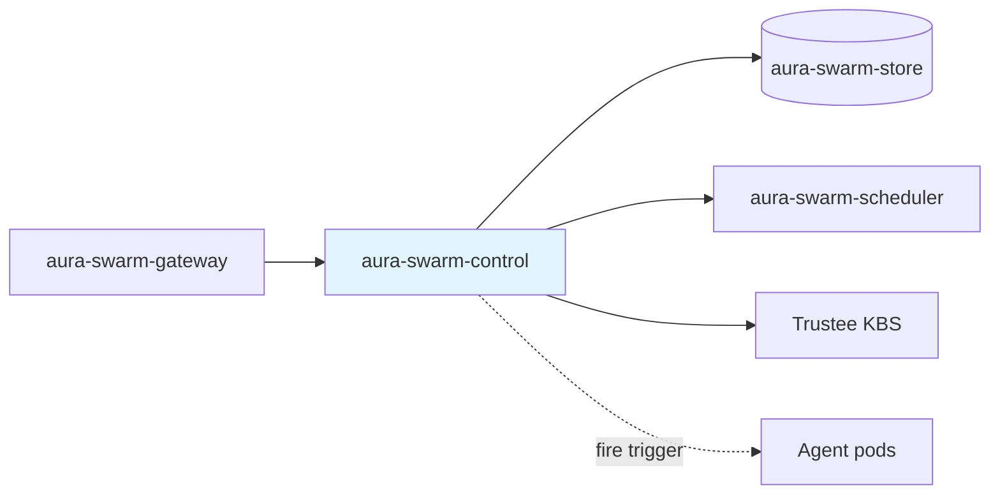
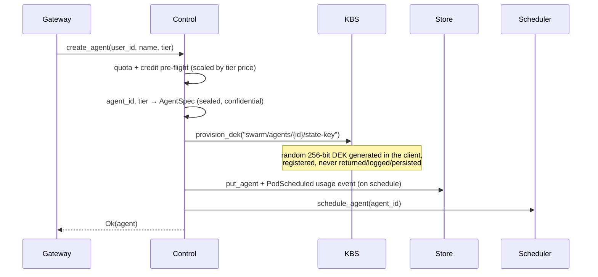

# Control Plane — Specification v0.2.0

## 1. Overview

The `aura-swarm-control` crate is the central coordination service for agent lifecycle, sessions, tier changes, the per-agent DEK lifecycle, usage aggregation, and the platform's automation loops (ProcessCronService + auto-hibernate). It runs in-process with the gateway.

The control plane is **outside the trust boundary for agent data**: it orchestrates confidential VMs but never holds agent content, secret values, process payloads, or DEK material (DEKs transit its KBS client exactly once, at provisioning, and are never logged or persisted).

### 1.1 Responsibilities

- Agent CRUD and lifecycle state machine management
- Tier upgrades/downgrades (`POST /v1/agents/:id/tier` semantics)
- Per-agent state DEK lifecycle against the Trustee KBS (provision at create, revoke at destroy, startup backfill)
- Session creation and tracking; agent endpoint resolution for proxying
- ProcessCronService: firing registered process triggers on schedule
- Auto-hibernate loop
- Usage event recording and aggregation (intervals × tier rate)
- Store schema migration at startup (v1 → v2)

### 1.2 Position in Architecture



---

## 2. Core Types

### 2.1 Agent and Spec

Every agent record carries a required tier and sealed-storage configuration (optional/legacy variants were removed in R3):

```rust
pub struct Agent {
    pub agent_id: AgentId,
    pub user_id: UserId,
    pub name: String,
    pub status: AgentState,
    pub spec: AgentSpec,
    pub created_at: DateTime<Utc>,
    pub updated_at: DateTime<Utc>,
    pub last_heartbeat_at: Option<DateTime<Utc>>,
    pub error_message: Option<String>,
}

pub struct AgentSpec {
    pub tier: String,                       // "small" | "standard" | "pro"
    pub cpu_millicores: u32,                // derived from tier
    pub memory_mb: u32,                     // derived from tier
    pub isolation: Option<IsolationLevel>,  // ConfidentialVM (Container = dev-mode only)
    pub storage_encryption: StorageEncryption, // sealed + deterministic key id
    pub runtime_version: String,
}
```

`BoxTier` is the size/price lineup (see [01-system-overview.md](./01-system-overview.md)): `small` 500m/1Gi at 4¢/h, `standard` 1000m/2Gi at 8¢/h (default), `pro` 2000m/4Gi at 15¢/h, with billing SKUs `swarm.{tier}`. `IsolationLevel::ConfidentialVM` maps to the `kata-qemu-snp` RuntimeClass; `Container` survives strictly for local dev-mode.

### 2.2 AgentState

Unchanged from v0.1.0: `Provisioning`, `Running`, `Idle`, `Hibernating`, `Stopping`, `Stopped`, `Error` (see state machine in [01-system-overview.md](./01-system-overview.md) §5).

### 2.3 ProcessTrigger (content-free)

```rust
pub struct ProcessTrigger {
    pub agent_id: AgentId,
    pub process_id: String,        // opaque off-VM; assigned inside the agent
    pub cron: String,              // schedule only, no payload
    pub enabled: bool,
    pub next_run_at: Option<DateTime<Utc>>,
    pub last_run_at: Option<DateTime<Utc>>,
}
```

This is the **only** process data that ever leaves the TEE. Registration paths must never widen this shape.

### 2.4 UsageEvent

Events are tagged (CBOR `kind` tag string, never variant order) and price-stamped **at event time**, so re-pricing a tier never rewrites usage history:

| Kind | Fields | Meaning |
|------|--------|---------|
| `pod_scheduled` | `tier`, `hourly_price_cents` | Opens a billable interval |
| `pod_terminated` | `tier`, `hourly_price_cents`, `reason` (`hibernate` / `stop` / `tier_change` / `crash` / `stale_image` / `stale_runtime_class`) | Closes the open interval |
| `hibernated` | — | Counter |
| `woke` | — | Counter (drives `wakes`, `last_wake_at`) |
| `trigger_fired` | — | Counter (cron-fired process triggers) |
| `tier_changed` | `from`, `to`, `from_hourly_price_cents`, `to_hourly_price_cents` | Splits cost intervals exactly at the change |

(`from` fields remain `Option`al only for decode compatibility with events persisted before R3.)

---

## 3. Agent Lifecycle Flows

### 3.1 Create Agent



A KBS provisioning failure rolls the create back — an agent must never exist without a fetchable DEK.

### 3.2 Destroy Agent (crypto-erase)

Deletion revokes the DEK in the KBS (best-effort, idempotent — a 404 is success). Once the DEK is gone, the agent's sealed ciphertext on EFS is unrecoverable by anyone.

### 3.3 Tier Change

`change_tier(user_id, agent_id, tier)` semantics by state:

| Agent state | Behavior |
|-------------|----------|
| Same tier | No-op (`changed: false`) |
| Hibernating / Stopped | Record-only spec update; new size on next wake/start; no pod churn |
| Running / Idle | Credit pre-flight at the new rate → close active sessions → terminate pod → persist new spec → schedule replacement pod (recreate-with-state; sealed EFS state untouched) |
| Provisioning / Stopping | `409 InvalidState` (mid-transition) |

Every non-noop change appends a `TierChanged` usage event with both hourly prices; the scheduler's billing reporter re-registers the new pod under the new SKU. Since all tiers share identical isolation/attestation/sealing, a tier change is purely a resize — no security-posture change, no data migration. In-flight runs are interrupted by the pod recreate (same as restart); state and vault persist.

(Historical note: during the R1/R2 dual-mode window this endpoint doubled as per-agent early migration for legacy agents; since R3 there are no legacy agents left.)

---

## 4. DEK Lifecycle

### 4.1 Key Identity

Deterministic per-agent key id: `swarm/agents/{agent_id}/state-key`. The KBS resource path has exactly three segments, so the four-segment key id maps as first segment → repository, last → tag, middle joined with `.` → type: `swarm/agents.{agent_id}/state-key`. The harness mirrors this mapping when fetching the DEK through the CDH.

### 4.2 KBS Client

- **Admin auth**: compact EdDSA JWT signed with the KBS admin Ed25519 private key (`KBS_ADMIN_KEY_PATH`, generated by the deploy scripts into `.secrets/kbs-admin.key`; the public half is the `kbs-auth-public-key` K8s secret). Tokens carry only freshness claims (`exp`/`iat`/`nbf`), TTL 300s.
- **`provision_dek`**: generates a 256-bit DEK from the OS CSPRNG (zeroized on drop, never logged) and POSTs it to `/kbs/v0/resource/{repo}/{type}/{tag}`.
- **`dek_exists`**: GET-first existence check. Trustee's resource POST is an unconditional overwrite that cannot report "exists", so put-if-absent is implemented as GET → 404 → provision. Indeterminate results (auth/transport errors) are surfaced as errors — callers must never provision blind over a possibly-existing DEK (overwriting bricks the agent's sealed state).
- **`revoke_dek`**: DELETE, idempotent (404 = success).
- **Dev mode** (`KBS_ENABLED=false` or no admin key): a no-op client logs operations; no DEKs are provisioned.

### 4.3 Startup DEK Backfill

The v1 → v2 store migration marks legacy agents as sealed without touching the KBS, so on the first post-migration startup those agents have no DEK yet. `backfill_missing_deks()` runs at gateway startup:

- For every sealed agent: `dek_exists` → already present (skip) / definitively absent (provision) / indeterminate (skip with a loud log, counted failed)
- Idempotent across reruns; failures retry on the next startup
- Logged as `DEK backfill pass complete` with a summary (`sealed_agents`, `provisioned`, `already_present`, `failed`)

---

## 5. ProcessCronService

The gateway-hosted tick loop that fires registered process triggers — **trigger outside, data inside**.

### 5.1 Tick Algorithm

Every tick (~30s) the service scans the `process_triggers` CF for enabled triggers whose `next_run_at` has passed. For each due trigger:

1. **Advance the slot first** — `next_run_at` is recomputed from the cron expression and persisted (together with `last_run_at`) **before** anything is fired. A crash, wake failure, or pod error can therefore never double-fire a slot: the slot is consumed up front, and a failed delivery is simply retried at the *next* cron slot (**at-most-once-per-slot**).
2. **Wake** the agent if Hibernating/Stopped (the normal lifecycle wake path) and poll until the pod is Running/Idle with a resolvable endpoint, bounded by the wake timeout (default 180s, poll every 3s).
3. **Fire** — `POST {pod}/v1/processes/{process_id}/trigger` with the process id only, never a payload. The process definition (prompt, config) stays sealed inside the TEE.

Ticks never overlap: the run loop awaits each tick to completion, and a `try_lock` guard makes a concurrent tick invocation a no-op. A successful fire appends a `TriggerFired` usage event.

### 5.2 Pod Trigger Auth

The cron service acts for the platform, not a user, so it has no JWT. It authenticates to the pod with the platform `INTERNAL_TOKEN` — the same value the scheduler injects into confidential pods as `AURA_SWARM_INTERNAL_TOKEN`, which the harness accepts as a valid bearer. A trigger carries no payload; it can only start a process the owner already defined inside the TEE.

### 5.3 Auto-Hibernate Loop

A second loop (default every 60s) watches Idle agents. When an agent has been continuously Idle for longer than `hibernate_after_idle` (default 1800s) with no active sessions, it is hibernated through the normal lifecycle path — so cron agents wake → run → sleep. Idle-since tracking is in-memory: a control-plane restart resets the timers, which merely delays hibernation by one window (never hibernates early).

### 5.4 Configuration

| Variable | Default | Purpose |
|----------|---------|---------|
| `PROCESS_CRON_TICK_SECONDS` | 30 | Cron scan interval |
| `PROCESS_CRON_WAKE_TIMEOUT_SECONDS` | 180 | Max wait for a woken agent to become Ready (slot retried next tick on timeout) |
| `AUTO_HIBERNATE_CHECK_SECONDS` | 60 | Auto-hibernate scan interval |
| `HIBERNATE_AFTER_IDLE_SECONDS` | 1800 | Continuous-idle window before auto-hibernate |

---

## 6. Usage Aggregation

`get_agent_usage` / `get_user_usage` aggregate the `usage_events` CF over a time range:

- **Intervals**: each `PodScheduled` opens an interval; the matching `PodTerminated` closes it. Intervals still open at the range end are closed at `to` (which the gateway clamps to "now" — un-elapsed time is never billed). `TierChanged` splits the open interval so each segment is priced at its own rate.
- **Cost**: `sum(interval_duration × hourly_price_cents_at_event_time)`, reported in cents.
- **Counters**: `wakes`, `triggers_fired`, `tier_changes` within the range; `awake_seconds` is the summed interval time.
- The same aggregation backs the real metrics in `GET /v1/agents/:id/status` (24-hour window).

zbilling remains the billing source of truth; this is user-facing statistics.

---

## 7. Store Migration (v1 → v2)

Runs automatically at gateway startup, before serving traffic (`aura-swarm-store::migrations`):

- `schema_version` lives in the `meta` CF (big-endian `u32`); a database without the key is v1.
- v1 → v2 rewrites every legacy agent record to the all-TEE shape: resources map to the nearest tier (cpu ≤ 500m → `small`, ≤ 1000m → `standard`, else `pro`), `isolation = confidential_vm`, `storage_encryption = sealed` with key id `swarm/agents/{id}/state-key`.
- Records are rewritten in batches (128); **idempotency, not batch atomicity, is the crash-safety mechanism** — the version bump lands only in the final batch, so an interrupted run simply re-runs.
- The legacy (pre-tier) CBOR record shape is decoded **only inside `migrations.rs`** — it is the single surviving legacy decode path, kept for databases restored from pre-R2 backups.
- After the migration the gateway runs the DEK backfill (§4.3). Completion is logged as `Store schema migration complete`; `/internal/health` reports the current `schema_version`.

---

## 8. Session Management

Unchanged in essence from v0.1.0: sessions are owner-checked CRUD records; creating a session against a Hibernating agent auto-wakes it (one of the three wake paths). Lifecycle actions close active sessions before terminating pods. Run streaming is handled by the gateway's run proxy rather than per-session sockets.

---

## 9. Error Types

```rust
pub enum ControlError {
    AgentNotFound(AgentId),
    SessionNotFound(SessionId),
    InvalidState { current: AgentState, expected: Vec<AgentState> },
    InvalidTier(String),
    NotOwner,
    EndpointUnavailable,
    QuotaExceeded(String),
    InsufficientCredits(String),
    Storage(StoreError),
    Scheduler(String),
    Internal(String),
}
```

---

## 10. Security Considerations

- **Ownership**: every operation verifies `agent.user_id == caller`
- **State validation**: transitions validated against the lifecycle state machine
- **DEK hygiene**: DEK bytes exist in the control plane only inside `provision_dek` (zeroizing buffer → request body); never logged, never stored; `Debug` is not implemented for the KBS client
- **Trigger boundary**: the cron service can only fire `(agent_id, process_id)` pairs the owner registered; no payloads cross the boundary
- **Credit pre-flight**: create and tier-change check zbilling credit at the target tier's rate (`Z_BILLING_*` config; fail-closed configurable)

---

## 11. Dependencies

### 11.1 Internal

| Crate | Purpose |
|-------|---------|
| `aura-swarm-core` | `AgentId`, `UserId`, `SessionId` types |
| `aura-swarm-store` | Persistence, migrations, usage events, triggers |

### 11.2 External

| Crate | Purpose |
|-------|---------|
| `tokio` | Async runtime |
| `chrono` | Date/time handling |
| `serde` / `ciborium` | Serialization |
| `reqwest` | KBS admin API, pod trigger calls, zbilling |
| `jsonwebtoken` | EdDSA KBS admin tokens |
| `zeroize` / `getrandom` | DEK generation hygiene |
| `tracing` | Structured logging |
| `thiserror` | Error types |
| `async-trait` | Async trait support |
