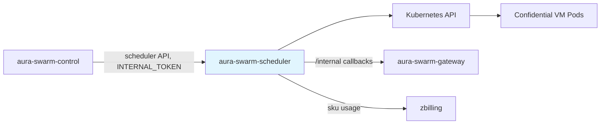

# Scheduler — Specification v0.2.0

## 1. Overview

The `aura-swarm-scheduler` crate manages the lifecycle of agent pods in Kubernetes. It reconciles desired agent state with actual pod state, builds **confidential VM pods** (`kata-qemu-snp` RuntimeClass on the SEV-SNP node pool), injects the attestation/sealing environment, captures pod-log termination snapshots, and reports tier-SKU usage to zbilling.

### 1.1 Responsibilities

- Create pods for agents with the `kata-qemu-snp` RuntimeClass, SNP node selector/toleration, and KBS/sealed-state env
- Monitor pod health and push status callbacks to the gateway
- Desired-state reconciliation: recreate missing pods, roll stale-image pods, roll runtime-class-mismatched pods
- Serve an `INTERNAL_TOKEN`-authenticated HTTP API (schedule, terminate, status, endpoint, **pod logs**)
- Capture a final stdout tail on every pod termination and ship it to the gateway
- Report per-pod usage to zbilling with the tier `sku` and `hourly_price_cents`

### 1.2 Position in Architecture



---

## 2. HTTP API (internal, token-authenticated)

The scheduler exposes its API to the control plane only. All `/v1` routes require the `INTERNAL_TOKEN` bearer when configured (the scheduler **fails boot** on token drift against the gateway); health probes stay open.

| Endpoint | Method | Purpose |
|----------|--------|---------|
| `/health`, `/ready` | GET | Probes (unauthenticated) |
| `/v1/agents/{agent_id}/schedule` | POST | Create the agent's pod from its spec |
| `/v1/agents/{agent_id}` | DELETE | Terminate the agent's pod (captures final log tail first) |
| `/v1/agents/{agent_id}/status` | GET | Pod status |
| `/v1/agents/{agent_id}/endpoint` | GET | Pod IP:port for proxying |
| `/v1/agents/{agent_id}/logs?tail&since` | GET | Live pod stdout tail via the K8s pod-logs API |

---

## 3. Pod Specification

### 3.1 Confidential Pod Template (shape as built by `pod.rs`)

```yaml
apiVersion: v1
kind: Pod
metadata:
  name: agent-{agent_id_short}
  namespace: swarm-agents
  labels:
    app: swarm-agent
    swarm.io/agent-id: "{agent_id}"
  annotations:
    swarm.io/agent-name: "{name}"
    swarm.io/pod-id: "{pod_id}"
spec:
  runtimeClassName: kata-qemu-snp        # confidential VM isolation
  nodeSelector:
    swarm.io/confidential-node: "true"   # SEV-SNP bare-metal pool
  tolerations:
  - key: swarm.io/confidential-node
    operator: Equal
    value: "true"
    effect: NoSchedule

  containers:
  - name: aura
    image: {AURA_HARNESS_IMAGE}          # pinned @sha256 digest in prod
    ports: [{ containerPort: 8080, name: http }]
    env:
    # --- base (all pods) ---
    - { name: AGENT_ID,          value: "{agent_id}" }      # + MACHINE_ID / AURA_MACHINE_ID aliases
    - { name: USER_ID,           value: "{user_id}" }
    - { name: STATE_DIR,         value: "/state" }
    - { name: AURA_LISTEN_ADDR,  value: "0.0.0.0:8080" }
    - { name: CONTROL_PLANE_URL, value: "{gateway internal URL}" }
    - { name: AURA_LLM_ROUTING,  value: "router" }
    - { name: AURA_ROUTER_URL,   value: "{aura-router}" }
    - { name: AURA_STORAGE_URL,  value: "{aura-storage}" }
    - { name: AURA_NETWORK_URL,  value: "{aura-network}" }
    # --- confidential (attestation boot + sealing) ---
    - { name: AURA_KBS_URL,            value: "http://kbs.swarm-system.svc.cluster.local:8080" }
    - { name: AURA_STATE_ENCRYPTION,   value: "sealed" }
    - { name: AURA_STATE_KEY_ID,       value: "swarm/agents/{agent_id}/state-key" }
    - { name: AURA_SWARM_INTERNAL_TOKEN, value: "{INTERNAL_TOKEN}" }   # omitted if empty
    resources:
      requests: { cpu: "{tier cpu}m", memory: "{tier mem}Mi" }
      limits:   { cpu: "{tier cpu}m", memory: "{tier mem}Mi" }
    volumeMounts:
    - { name: state, mountPath: /state, subPath: "{agent_id}" }
    readinessProbe: { httpGet: { path: /health, port: 8080 } }
    livenessProbe:  { httpGet: { path: /health, port: 8080 } }

  volumes:
  - name: state
    persistentVolumeClaim: { claimName: swarm-agent-state }   # EFS, encryption mandatory
  restartPolicy: Always
```

Notes:

- `AURA_KBS_URL` is informational for the guest — the in-guest DEK fetch goes through the local confidential-data-hub (CDH), which performs the RCAR attestation handshake with the KBS transparently (see [06-agent-runtime.md](./06-agent-runtime.md)).
- `AURA_SWARM_INTERNAL_TOKEN` (the platform `INTERNAL_TOKEN`) lets the harness authenticate trigger-metadata registration to the gateway's `/internal` routes, and lets the harness verify the cron service's trigger calls. Dev-mode `Container` pods never get it — they have no attestation boot flow.
- Resources come from the agent's tier (`small` 500m/1Gi, `standard` 1000m/2Gi, `pro` 2000m/4Gi).

### 3.2 RuntimeClass

```yaml
apiVersion: node.k8s.io/v1
kind: RuntimeClass
metadata:
  name: kata-qemu-snp
handler: kata-qemu-snp
overhead:
  podFixed: { memory: "350Mi", cpu: "250m" }
scheduling:
  nodeSelector:
    swarm.io/confidential-node: "true"
```

Owned by `deploy/k8s/09-runtime-class.yaml` (the CoCo operator's CcRuntime CR installs the kata payload but deliberately does not own the RuntimeClass objects, so overhead and scheduling stay under platform control). `kata-fc` was retired in R3.

### 3.3 SNP Node Pool

- Terraform-managed EKS node group of AMD bare-metal instances (default `m6a.metal`)
- Labeled `swarm.io/confidential-node=true`, tainted `swarm.io/confidential-node=true:NoSchedule` — only confidential agent pods (which carry the toleration) and CoCo operator daemonsets land there
- The untainted node group hosts only system components (gateway, scheduler, KBS) since R3

---

## 4. Reconciliation

### 4.1 Desired-State Reconciler

A periodic pass (~30s) lists agents that should have pods (`GET {gateway}/internal/agents/active`) and the actual pods, then:

- **Missing pod** → create it
- **Stale image** (pod image ≠ configured harness image) → delete it; the next pass recreates with the current image
- **Stale runtime class** (pod `runtimeClassName` ≠ the class the agent's spec demands) → delete and recreate. A runtime-class mismatch is **always** stale — the R2 migration gate (`MIGRATION_RECREATE_LEGACY_PODS`) was removed in R3; a pod must never keep running under the wrong isolation level.

Stale replacements are paced **one pod per pass** (shared between the image and runtime-class checks), so fleet-wide rolls happen gradually.

### 4.2 Pod Watcher

A K8s watch on `app=swarm-agent` pods maps pod phase/readiness to agent state and PATCHes the gateway (`/internal/agents/{id}/status`). Hardening shipped in v0.2.0:

- Warning events on Running+Ready pods are ignored (stale-event suppression)
- Pods being intentionally recycled never escalate to Error
- Transient image-pull/sandbox warnings tolerated within a provisioning window; pods stuck unscheduled or in image-pull backoff escalate to Error after a timeout

### 4.3 Termination Log Snapshots

Pod stdout vanishes with the pod, so **every termination path** (hibernate, stop, restart, tier change, stale-image/runtime-class replacement, delete) first captures the final tail and ships it to the gateway:

- Up to **1000 lines** (~700 KB byte cap), parsed with K8s timestamps
- Strictly best-effort with a **10s budget** — a slow or failed capture never blocks or fails the termination
- Shipped as `POST {gateway}/internal/agents/{id}/log-snapshot` with the termination `reason`; stored in the capped `agent_logs` CF
- `GET /v1/agents/{id}/logs` then merges these snapshots with the live tail (entries tagged `snapshot` / `live`)

---

## 5. Billing Reporter

The scheduler periodically reports per-pod usage to zbilling. Since v0.2.0 the payload carries the tier identity:

```json
{
  "event_id": "…",
  "user_id": "…",
  "agent_id": "…",
  "cpu_hours": 0.5,
  "memory_gb_hours": 1.0,
  "sku": "swarm.standard",
  "hourly_price_cents": 8
}
```

- Pods are registered for tracking with their tier at schedule time; a pod recreate (e.g. tier change) re-registers under the new SKU, so reports always reflect the running tier
- Reporting interval and credentials via `Z_BILLING_*` env (see §7)
- zbilling is the billing source of truth; the control plane's `usage_events` are user-facing statistics

---

## 6. Pod Logs API

`GET /v1/agents/{agent_id}/logs?tail&since` reads the pod's stdout via the K8s pod-logs API (`timestamps=true`):

- `tail` capped at 5000 lines; reads capped at ~700 KB (keeps payloads under the gateway body limit)
- `since` filters to lines at or after an RFC3339 timestamp
- Returns structured `{ timestamp, line }` entries; `404 PodNotFound` when the agent has no pod (the gateway then serves snapshots only)

---

## 7. Configuration

| Variable | Default | Purpose |
|----------|---------|---------|
| `SCHEDULER_NAMESPACE` | `swarm-agents` | Pod namespace |
| `AURA_HARNESS_IMAGE` | — | Harness image (pin to `@sha256` digest in prod) |
| `CONTROL_PLANE_URL` / `GATEWAY_URL` | — | Gateway base URL (callbacks + pod env) |
| `STATE_PVC_NAME` | `swarm-agent-state` | EFS-backed PVC |
| `DEFAULT_ISOLATION` | `confidential_vm` | `container` only for local dev |
| `DEFAULT_CPU_MILLICORES` / `DEFAULT_MEMORY_MB` | tier defaults | Fallback sizing |
| `MAX_CPU_MILLICORES` / `MAX_MEMORY_MB` | — | Hard caps |
| `AURA_ROUTER_URL` / `AURA_STORAGE_URL` / `AURA_NETWORK_URL` | — | Injected into pods |
| `INTERNAL_TOKEN` (fallback `GATEWAY_TOKEN`) | — | Bearer for the scheduler API, gateway `/internal` calls, and pod injection as `AURA_SWARM_INTERNAL_TOKEN`; boot fails on drift vs. the gateway |
| `KBS_URL` | `http://kbs.swarm-system.svc.cluster.local:8080` | Injected into confidential pods as `AURA_KBS_URL` |
| `Z_BILLING_URL` / `Z_BILLING_API_KEY` / `Z_BILLING_ENABLED` / `Z_BILLING_REPORT_INTERVAL` / `Z_BILLING_FAIL_CLOSED` | — | Billing reporter |
| `LISTEN_ADDR` | `0.0.0.0:8080` | API listen address |

---

## 8. Dependencies

### 8.1 Internal

| Crate | Purpose |
|-------|---------|
| `aura-swarm-core` | `AgentId` type |
| `aura-swarm-store` | `AgentSpec`, `BoxTier`, `IsolationLevel`, `LogLine` types |

### 8.2 External

| Crate | Purpose |
|-------|---------|
| `kube` / `k8s-openapi` | Kubernetes client and API types |
| `tokio` / `futures` | Async runtime, stream utilities |
| `axum` | Scheduler HTTP API |
| `reqwest` | Gateway callbacks, zbilling, health checks |
| `tracing` | Structured logging |
| `thiserror` | Error types |
