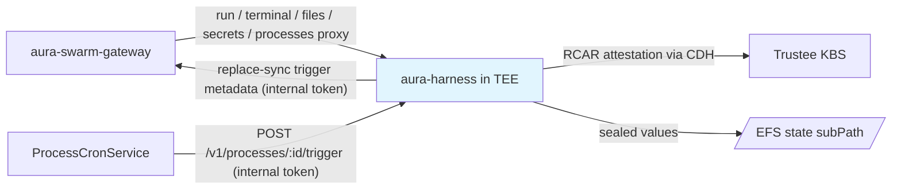

# Agent Runtime — Specification v0.2.0

## 1. Overview

This document specifies the contract between the platform and **aura-harness**, the agent runtime that runs inside each confidential SEV-SNP VM. The harness owns everything inside the TEE: the attestation boot flow, sealed state, the secrets vault, processes/automations, and the run/terminal/file APIs the gateway proxies to.

### 1.1 aura-harness

aura-harness is a deterministic AI agent runtime that:

- Processes user runs (chat / dev-loop / task) through a reasoning loop
- Records all actions and effects in an append-only log
- Executes tools (filesystem, commands) within its sandbox
- Maintains persistent **sealed** state across restarts, hibernation, and tier changes
- Hosts the in-TEE secrets vault and the process/automation store

### 1.2 Integration Points



---

## 2. Launch Contract

### 2.1 Environment Variables

The scheduler launches every confidential pod with:

| Variable | Description | Example |
|----------|-------------|---------|
| `AGENT_ID` (aliases `MACHINE_ID`, `AURA_MACHINE_ID`) | Agent identifier (64 hex chars) | `a1b2c3d4...` |
| `USER_ID` | Owner's user ID | `u1s2e3r4...` |
| `STATE_DIR` | Root directory for persistent state | `/state` |
| `AURA_LISTEN_ADDR` | HTTP/WebSocket listen address | `0.0.0.0:8080` |
| `CONTROL_PLANE_URL` | Gateway internal base URL (heartbeats, trigger registration) | `http://aura-swarm-gateway.swarm-system.svc:8080` |
| `AURA_LLM_ROUTING` / `AURA_ROUTER_URL` | LLM routing through aura-router | — |
| `AURA_STORAGE_URL` / `AURA_NETWORK_URL` | Optional companion services | — |
| **`AURA_STATE_ENCRYPTION`** | `sealed` — enables the attestation boot + sealed stores | `sealed` |
| **`AURA_STATE_KEY_ID`** | Deterministic per-agent DEK key id | `swarm/agents/{agent_id}/state-key` |
| **`AURA_KBS_URL`** | Trustee KBS URL (informational; the in-guest fetch goes through the CDH) | `http://kbs.swarm-system.svc.cluster.local:8080` |
| **`AURA_SWARM_INTERNAL_TOKEN`** | Platform internal token: accepted as a bearer on protected routes (cron trigger calls) and presented when registering trigger metadata | — |

Harness-side knobs (not set by the scheduler):

| Variable | Default | Description |
|----------|---------|-------------|
| `AURA_CDH_URL` | `http://127.0.0.1:8006` | In-guest confidential-data-hub resource endpoint |
| `AURA_STATE_KEY_FILE` | — | **Dev mode**: read/generate the DEK from a local key file instead of the CDH (64 hex chars, created mode 0600 on first boot) |
| `AURA_DEK_FETCH_TIMEOUT_SECS` | 120 | Bound on the total DEK fetch retry window |
| `AURA_SWARM_INTERNAL_URL` | falls back to `CONTROL_PLANE_URL` | Override for the trigger registrar's gateway base |

### 2.2 Attestation Boot Flow

When `AURA_STATE_ENCRYPTION=sealed`, the node fetches the per-agent DEK **before opening or serving any state**:

```mermaid
sequenceDiagram
    participant Harness
    participant CDH as confidential-data-hub (in guest)
    participant KBS as Trustee KBS + AS

    Note over Harness: SNP guest boots; CoCo guest components up
    Harness->>CDH: GET /cdh/resource/swarm/agents.{id}/state-key
    CDH->>KBS: RCAR handshake (SNP attestation evidence)
    KBS->>KBS: Verify evidence against policy
    KBS-->>CDH: DEK (released only into the attested guest)
    CDH-->>Harness: 256-bit DEK (held in zeroizing memory)
    Harness->>Harness: Open sealed stores, start serving
```

- The four-segment key id maps to the three-segment KBS/CDH resource path the same way the control plane maps it: `swarm/agents/{id}/state-key` → `swarm/agents.{id}/state-key`.
- The fetch retries with backoff, bounded by `AURA_DEK_FETCH_TIMEOUT_SECS` (default 120s). If no DEK is obtainable, the node **refuses to start** — sealed mode never falls back to plaintext.
- In the swarm environment (control-plane env vars + `AGENT_ID` present), an *unset* `AURA_STATE_ENCRYPTION` **defaults to `sealed`**, and an explicit `plaintext`/`none` **fails startup**. Local dev without the swarm env keeps the legacy behavior: plaintext by default, or local-keyfile sealed mode with `AURA_STATE_ENCRYPTION=sealed` + `AURA_STATE_KEY_FILE`.
- Key material lives in zeroizing buffers and is never logged.

### 2.3 Sealed Stores (value-level AES-256-GCM)

Sealing is implemented **per value**, not as a filesystem overlay: every *content-bearing* value persisted to the harness RocksDB is AES-256-GCM encrypted under the DEK before it hits disk. Sealed value classes include:

- Record entries and inbox transactions
- Memory facts / events / procedures
- Skill installations and user tool defaults
- Runtime-capability snapshots
- **Secret records** (the vault)
- **Process definitions** (including prompt + config) and process run records

Key structure (column families, key ordering) remains visible for scans; content does not. EFS, backups, and the platform only ever see ciphertext.

### 2.4 Encrypt-in-Place Migration (R2, retained)

On its first sealed boot over a plaintext state directory, the harness performs an **atomic, resumable** encrypt-in-place migration: detect plaintext → copy values through the sealing cipher → fsync → swap → write the `.aura-sealed` marker → delete the transient `*.plaintext-backup` directory. A crash mid-migration resumes safely on the next boot. (Post-R3 the fleet is fully sealed; the path remains for state restored from pre-R2 backups.)

### 2.5 Filesystem Layout

```
/state/                     # pod subPath = {agent_id} on the shared EFS PVC
├── db/                     # harness RocksDB — sealed values (ciphertext)
├── workspaces/             # agent working directories
└── .aura-sealed            # sealed-state marker
```

### 2.6 Resource Limits

Set by the agent's tier: `small` 500m/1Gi, `standard` 1000m/2Gi, `pro` 2000m/4Gi.

---

## 3. Health Contract

```
GET /health
```

Response includes `status`, `agent_id`, `uptime_seconds`, `version`, the harness `git_sha` (surfaced by the gateway on `GET /v1/agents/:id/state` as `harness_git_sha`), and capability flags (`run_command_enabled`, `shell_enabled`, `binary_allowlist`). Kubernetes readiness/liveness probes hit this endpoint; the pod only goes Ready after attestation has succeeded and sealed state is open.

---

## 4. Run Contract

A run is created by `POST /v1/run` with a `RuntimeRequest` body (discriminated on `type.kind` over `chat` / `dev_loop` / `task_run`). The response carries `run_id` and `event_stream_url` (`/stream/:run_id`), which the client (via the gateway proxy) opens as a WebSocket. Chat runs keep the socket open for bidirectional `user_message` / streaming frames; automaton runs are event-only.

Message frames: `user_message`, `cancel`, `assistant_message_start/delta/end`, `tool_use_start`, `tool_result`, `terminal_output`, `error` — unchanged from v0.1.0 §4.

---

## 5. Auth Contract

All routes except `/health` sit behind bearer auth (when `require_auth` is on, as in production):

- The node token (from `$data_dir/auth_token` or per-launch random) is the primary bearer
- **`AURA_SWARM_INTERNAL_TOKEN`** is accepted as an additional valid bearer — this is what the gateway-side ProcessCronService presents on `POST /v1/processes/:id/trigger`
- The gateway's user-facing proxies forward the user's JWT; the harness does not introspect it — the cluster network boundary (no public pod IPs) is the real control

---

## 6. Secrets Vault (in-TEE)

The vault stores per-agent secrets sealed under the state DEK. The swarm gateway proxies it as `/v1/agents/:id/secrets[/:name]`; values never exist server-side outside the TEE.

| Endpoint | Method | Purpose |
|----------|--------|---------|
| `/secrets` | GET | List secret names + metadata (no values) |
| `/secrets/{name}` | GET | Metadata; `?reveal=true` returns the value |
| `/secrets/{name}` | PUT | Create/update (16 KiB body cap) |
| `/secrets/{name}` | DELETE | Delete |

Values only leave the vault on explicit `?reveal=true` reads; they are never logged and never written to disk in plaintext.

---

## 7. Processes / Automations (in-TEE)

First-class persisted process entity: name, cron expression (UTC), prompt, config, enabled flag, plus run history. Definitions and run records are **sealed at rest**; the only exportable view is the trigger-metadata seam (`process_id`, `cron`, `enabled`, `next_run_at`).

### 7.1 API

| Endpoint | Method | Purpose |
|----------|--------|---------|
| `/v1/processes` | GET | List full definitions (in-VM / authenticated proxy only) |
| `/v1/processes` | POST | Create (validates cron/name/prompt → 400 on invalid) |
| `/v1/processes/{id}` | GET | Fetch one |
| `/v1/processes/{id}` | PUT | Partial update (incl. enable/disable) |
| `/v1/processes/{id}` | DELETE | Delete definition + run history |
| `/v1/processes/{id}/trigger` | POST | Execute **now**: starts a chat run through the same internals as `POST /v1/run`; returns `202 Accepted` with the new run record |
| `/v1/processes/{id}/runs` | GET | Capped run history, newest first |

### 7.2 Trigger Execution

A trigger reuses the chat-run path end-to-end: the process prompt is enqueued as the run's first user message; a watcher marks the run record success/failure when the turn completes (bounded by a 30-minute ceiling) and tears the one-shot run down. Run summaries are capped (~500 chars) and sealed.

### 7.3 Trigger Registration (best-effort push)

After every successful process mutation (create/update/delete/trigger-time changes), the harness fires a **best-effort background replace-sync** of its full trigger-metadata set to the gateway:

```
PUT {AURA_SWARM_INTERNAL_URL | CONTROL_PLANE_URL}/internal/agents/{AGENT_ID}/process-triggers
Authorization: Bearer {AURA_SWARM_INTERNAL_TOKEN}
```

- Never blocks or fails the user's call; retries on the next mutation/registrar cycle
- No-op for local agents (registrar disabled unless base URL + token + agent id are all present)
- Payload is the content-free metadata only — never prompts or config

The gateway-side ProcessCronService then wakes the agent and fires `POST /v1/processes/:id/trigger` on schedule (see [03-control-plane.md](./03-control-plane.md) §5).

---

## 8. Hibernation Contract

Swarm initiates hibernation through the gateway lifecycle API; the scheduler terminates the pod (capturing the final stdout tail as a log snapshot first). The harness must:

1. Complete or abort in-flight tool executions safely
2. Flush sealed state to `/state/db/`
3. Exit cleanly

On wake, a fresh pod re-attests, re-fetches the DEK through the CDH, re-opens the same sealed state, and resumes from the last recorded sequence. Conversation history, memory, vault, processes, and workspace files all persist.

---

## 9. Sandbox Environment

Unchanged in shape from v0.1.0: full read/write inside `/state`, `/tmp` scratch, read-only system files; tool capabilities (`fs.*`, `cmd.run`, `search.code`) scoped to the state directory; outbound network restricted to the LLM path (aura-router) and the control plane. The harness keeps sensitive content **off stdout** — pod stdout is the platform-visible log plane (boot, attestation, health, lifecycle); detailed agent logs stay sealed inside the guest.

---

## 10. Harness Endpoints Summary

| Endpoint | Method | Purpose |
|----------|--------|---------|
| `/health` | GET | Health check (public) |
| `/v1/run` | POST | Create a run (chat / dev-loop / task) |
| `/stream/:run_id` | WS | Attach to a run's event stream |
| `/v1/run/list`, `/v1/run/:id/status`, `/v1/run/:id/pause`, `/v1/run/:id/stop` | GET/POST | Run management |
| `/ws/terminal` | WS | Terminal transport |
| `/api/files`, `/api/read-file` | GET | Workspace file access |
| `/workspace/resolve` | GET | Resolve named workspaces |
| `/secrets`, `/secrets/:name` | GET/PUT/DELETE | In-TEE secrets vault |
| `/v1/processes`, `/v1/processes/:id`, `/v1/processes/:id/trigger`, `/v1/processes/:id/runs` | CRUD/POST/GET | In-TEE processes |
| memory / skills route families | — | Memory CRUD, skills (proxied by aura-os) |

---

## 11. Error Handling

Run-level error codes (`agent_not_ready`, `tool_execution_failed`, `model_error`, …) are unchanged from v0.1.0. Sealed-mode-specific failure behavior:

- **DEK unobtainable at boot** → the node exits non-zero (pod restarts; visible in platform logs and agent status)
- **Explicit plaintext in a swarm pod** → startup failure (never serves unsealed)
- **Mid-migration crash** → encrypt-in-place resumes on next boot
