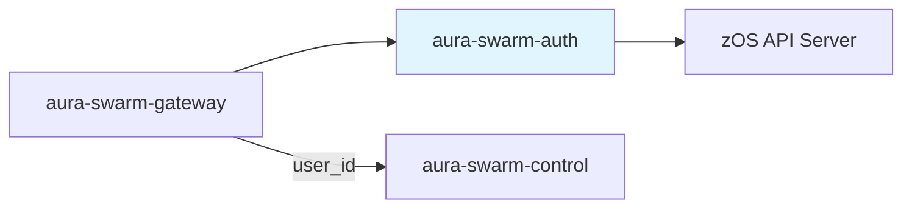
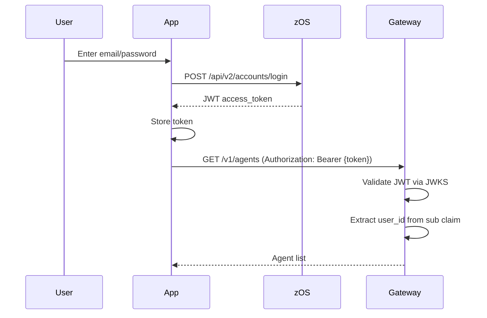

# Authentication — Specification v0.2.0

## 1. Overview

The `aura-swarm-auth` crate provides authentication integration with zOS (`zosapi.zero.tech`). We use email/password authentication with JWT tokens validated locally via JWKS. (Unchanged in substance from v0.1.0; service-to-service authentication — internal tokens, KBS admin JWTs, attestation — is specified in [10-security.md](./10-security.md) §5.)

### 1.1 Scope (v0.2.0)

- Email/password login via zOS API
- JWT token validation with JWKS (supports EdDSA and RS256)
- User ID extraction from tokens
- User info retrieval via zOS API
- No policies (deferred to future versions)

### 1.2 Position in Architecture



---

## 2. Authentication Flow

### 2.1 Login Flow



---

## 3. zOS Integration

### 3.1 Base URLs

| Environment | Base URL |
|-------------|----------|
| Production  | `https://zosapi.zero.tech` |
| Local Dev   | `http://localhost:3000` |

### 3.2 Login Endpoint

```
POST {base_url}/api/v2/accounts/login
Content-Type: application/json

{
  "email": "user@example.com",
  "password": "secret123"
}
```

Response:
```json
{
  "access_token": "eyJhbGciOiJSUzI1NiIsInR5cCI6IkpXVCJ9..."
}
```

### 3.3 User Info Endpoint

```
GET {base_url}/api/users/current
Authorization: Bearer {access_token}
```

Response:
```json
{
  "id": "550e8400-e29b-41d4-a716-446655440000",
  "profileSummary": { ... },
  "primaryZID": "...",
  "wallets": []
}
```

### 3.4 JWKS Endpoint

For JWT validation, zOS exposes public keys:

```
GET {base_url}/.well-known/jwks.json
```

Response (supports both EdDSA and RSA keys):
```json
{
  "keys": [
    {
      "kty": "RSA",
      "n": "...",
      "e": "AQAB",
      "kid": "key-1",
      "alg": "RS256",
      "use": "sig"
    }
  ]
}
```

### 3.5 Error Codes

zOS API errors follow a standard format:

```json
{
  "code": "UNAUTHORIZED",
  "message": "Invalid credentials"
}
```

---

## 4. JWT Structure

### 4.1 Token Claims

```json
{
  "iss": "https://zosapi.zero.tech",
  "sub": "550e8400-e29b-41d4-a716-446655440000",
  "aud": "swarm-platform",
  "exp": 1706745600,
  "iat": 1706742000
}
```

| Claim | Type | Description |
|-------|------|-------------|
| `iss` | String | Issuer (zOS server URL) |
| `sub` | UUID | Subject (user_id) |
| `aud` | String | Audience (optional, validated if configured) |
| `exp` | Number | Expiration timestamp |
| `iat` | Number | Issued at timestamp |

### 4.2 User ID Derivation

The `sub` claim contains the user_id as a UUID string:

```rust
use aura_swarm_core::UserId;

fn extract_user_id(claims: &Claims) -> Result<UserId, AuthError> {
    UserId::from_str(&claims.sub)
        .map_err(|_| AuthError::InvalidUserId)
}
```

---

## 5. Rust Interface

### 5.1 JWT Validator

```rust
use async_trait::async_trait;
use aura_swarm_core::UserId;

#[async_trait]
pub trait JwtValidator: Send + Sync {
    async fn validate(&self, token: &str) -> Result<ValidatedClaims, AuthError>;
}

#[derive(Debug, Clone)]
pub struct ValidatedClaims {
    pub user_id: UserId,
    pub expires_at: chrono::DateTime<chrono::Utc>,
}
```

### 5.2 zOS Client

```rust
pub struct ZosClient { /* ... */ }

pub struct ZosLoginRequest {
    pub email: String,
    pub password: String,
}

pub struct ZosLoginResponse {
    pub access_token: String,
}

impl ZosClient {
    pub fn new(config: AuthConfig) -> Self;
    pub async fn login(&self, req: ZosLoginRequest) -> Result<ZosLoginResponse, AuthError>;
    pub async fn fetch_user_info(&self, token: &str) -> Result<serde_json::Value, AuthError>;
}
```

### 5.3 Error Types

```rust
use thiserror::Error;

#[derive(Error, Debug)]
pub enum AuthError {
    #[error("token expired")]
    TokenExpired,
    
    #[error("invalid signature")]
    InvalidSignature,
    
    #[error("invalid issuer")]
    InvalidIssuer,
    
    #[error("invalid audience")]
    InvalidAudience,
    
    #[error("invalid user ID format")]
    InvalidUserId,
    
    #[error("zOS API error ({status}): [{code}] {message}")]
    ZosApi { status: u16, code: String, message: String },
    
    #[error("missing required claim: {0}")]
    MissingClaim(String),
    
    #[error("JWKS fetch failed: {0}")]
    JwksFetchFailed(String),
    
    #[error("key not found: {0}")]
    KeyNotFound(String),
    
    #[error("invalid token format: {0}")]
    InvalidToken(String),
    
    #[error("internal error: {0}")]
    Internal(String),
}
```

---

## 6. Implementation

### 6.1 JWKS-based Validator

```rust
pub struct JwksValidator {
    config: AuthConfig,
    jwks: JwksProvider,
}

impl JwksValidator {
    pub fn new(config: AuthConfig) -> Self {
        let jwks = JwksProvider::new(config.clone());
        Self { config, jwks }
    }
}

#[async_trait]
impl JwtValidator for JwksValidator {
    async fn validate(&self, token: &str) -> Result<ValidatedClaims, AuthError> {
        // 1. Decode header to get kid and algorithm
        // 2. Get decoding key from JWKS
        // 3. Validate signature and claims (EdDSA or RS256)
        // 4. Extract user_id from sub claim
        // 5. Return ValidatedClaims
    }
}
```

---

## 7. Gateway Integration

### 7.1 Auth Extractor

```rust
use axum::extract::FromRequestParts;

pub struct AuthUser {
    pub user_id: UserId,
}

impl<S> FromRequestParts<S> for AuthUser {
    // Extracts Bearer token, validates JWT, returns AuthUser
}
```

### 7.2 Protected Endpoint Example

```rust
async fn list_agents(
    user: AuthUser,
    State(state): State<Arc<AppState>>,
) -> Result<Json<Vec<Agent>>, ApiError> {
    let agents = state.control
        .list_agents(&user.user_id)
        .await?;
    
    Ok(Json(agents))
}
```

---

## 8. Configuration

```rust
#[derive(Debug, Clone)]
pub struct AuthConfig {
    /// Base URL for zOS (e.g., "https://zosapi.zero.tech")
    pub base_url: String,
    
    /// Expected audience claim (optional)
    pub audience: Option<String>,
    
    /// JWKS cache refresh interval (seconds)
    pub jwks_refresh_seconds: u64,
}

impl AuthConfig {
    pub fn jwks_url(&self) -> String {
        format!("{}/.well-known/jwks.json", self.base_url)
    }
    
    pub fn login_url(&self) -> String {
        format!("{}/api/v2/accounts/login", self.base_url)
    }
    
    pub fn user_info_url(&self) -> String {
        format!("{}/api/users/current", self.base_url)
    }
    
    pub fn issuer(&self) -> &str {
        &self.base_url
    }
}

impl Default for AuthConfig {
    fn default() -> Self {
        Self {
            base_url: "https://zosapi.zero.tech".to_string(),
            audience: None,
            jwks_refresh_seconds: 300,
        }
    }
}
```

---

## 9. Security Considerations

### 9.1 Token Security

- Tokens are validated on every request
- Signature verification using EdDSA or RS256 (auto-detected from JWKS)
- Expiration is checked
- Issuer is validated
- Audience validation is optional (configured per deployment)

### 9.2 Key Rotation

- JWKS is cached but refreshed periodically
- Multiple keys supported via `kid` header
- Both EdDSA and RSA keys supported
- Graceful key rotation without downtime

### 9.3 Error Handling

- Errors do not leak sensitive information
- Failed validations return generic 401
- Detailed errors logged server-side only

---

## 10. Future Enhancements (post-v0.2.0)

### 10.1 Policy Integration

A policy engine could be integrated:

```rust
pub struct PolicyContext {
    pub user_id: UserId,
    pub operation: Operation,
    pub resource: Resource,
}
```

### 10.2 Machine Keys

For agent-to-agent communication (future):

```rust
pub struct MachineAuth {
    pub machine_id: MachineId,
    pub user_id: UserId,
    pub capabilities: u32,
}
```

---

## 11. Dependencies

### 11.1 Internal

| Crate | Purpose |
|-------|---------|
| `aura-swarm-core` | `UserId`, `AgentId`, `SessionId` types |

### 11.2 External

| Crate | Version | Purpose |
|-------|---------|---------|
| `jsonwebtoken` | 9.x | JWT validation |
| `reqwest` | 0.11.x | HTTP client for JWKS and zOS API |
| `serde` | 1.x | JSON serialization |
| `chrono` | 0.4.x | Timestamp handling |
| `thiserror` | 1.x | Error types |
| `async-trait` | 0.1.x | Async trait support |
| `base64` | 0.21.x | Base64 decoding |
| `parking_lot` | 0.12.x | Synchronization primitives |
