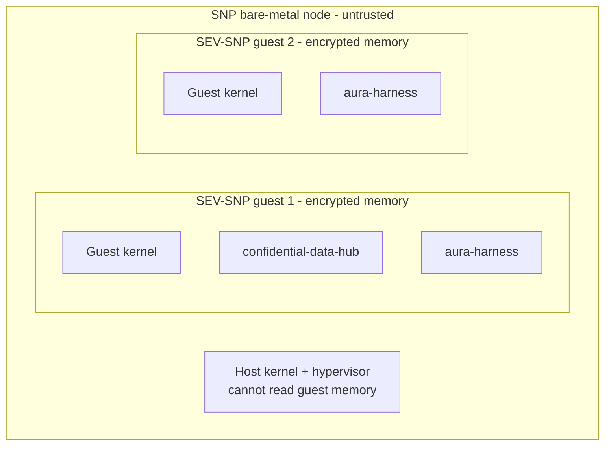
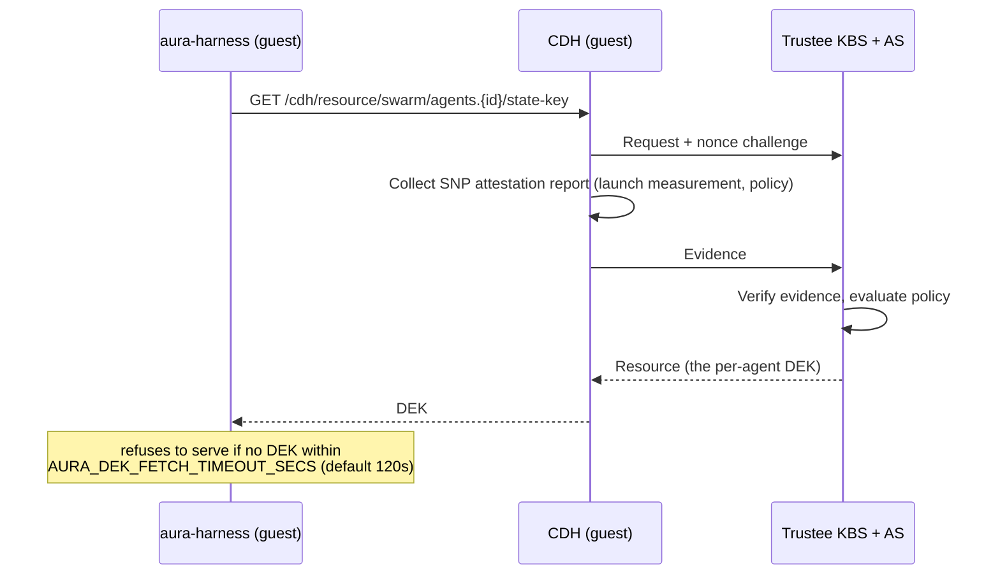

# Security — Specification v0.2.0

## 1. Overview

This document specifies the security architecture of the platform: confidential-computing isolation (SEV-SNP via Confidential Containers), the attestation flow, sealed-storage key custody, what the platform can and cannot see, service-to-service authentication, and the residual gaps with planned mitigations.

The headline change from v0.1.0: the platform no longer asks users to trust the host. In v0.1.0, agent state sat unencrypted in RocksDB/EFS and the threat model stopped at "container escape". In v0.2.0, **the platform itself — gateway, control plane, scheduler, Kubernetes hosts, storage, and operators — is outside the trust boundary for agent data.** Hardware memory encryption protects data in use; per-agent sealed storage protects data at rest; remote attestation gates the key release that connects the two.

### 1.1 Security Principles

| Principle | Implementation |
|-----------|----------------|
| **Confidentiality by hardware** | SEV-SNP encrypted, integrity-protected guest memory; host/hypervisor cannot read or tamper |
| **Sealed by default** | Every content-bearing store value AES-256-GCM encrypted under a per-agent DEK |
| **Attestation-gated keys** | The DEK is released only to a guest that proves its identity to the Trustee KBS |
| **Trigger outside, data inside** | Automations carry no payload across the boundary |
| **Least privilege** | Internal token-scoped service APIs; per-user ownership checks everywhere |
| **Crypto-erase** | Agent destruction revokes the DEK; ciphertext becomes permanently unreadable |
| **Memory safety** | Rust (`unsafe` forbidden workspace-wide) |

### 1.2 Threat Model

| Threat | Mitigation |
|--------|------------|
| Malicious/compromised host or hypervisor reading agent memory | SEV-SNP memory encryption + integrity protection |
| Platform operator (or compromised control plane) reading agent state | Value-level sealing; the DEK never exists in the control plane after provisioning; EFS/backups hold ciphertext only |
| Stolen EFS snapshot / disk | Ciphertext without the DEK; DEK custody in the KBS |
| Rogue pod impersonating an agent to obtain a DEK | KBS releases the DEK only after verifying SNP attestation evidence (RCAR via in-guest CDH) |
| Cross-user data access | `user_id` ownership checks on every operation |
| Cross-agent access | Separate VMs, no pod-to-pod network, per-agent EFS subPath, per-agent DEKs |
| Token theft | Short-lived zOS JWTs; internal token confined to the cluster |
| Unauthorized scheduler/internal API use | `INTERNAL_TOKEN` bearer required; scheduler fails boot on token drift |
| Forged trigger firing | Triggers carry no payload — worst case starts a process the owner already defined |
| Supply chain | Pinned `@sha256` harness digests; `cargo audit`/`deny`; minimal images |

---

## 2. Confidential VM Isolation

### 2.1 Stack

Each agent runs in a Kata + QEMU virtual machine on an AMD SEV-SNP bare-metal node, launched through the `kata-qemu-snp` RuntimeClass installed by the Confidential Containers operator:



### 2.2 Isolation Guarantees

| Layer | Guarantee |
|-------|-----------|
| **Memory** | Per-VM hardware encryption (AES) + SNP integrity protection: the host cannot read, replay, remap, or corrupt guest pages |
| **CPU state** | Register state encrypted on VM exits |
| **Kernel** | Separate guest kernel per agent |
| **Attestation** | Launch measurement covers the guest stack; verified remotely before any secret release |
| **Filesystem** | Per-agent EFS subPath; all content ciphertext (§4) |
| **Network** | No public IPs; no pod-to-pod traffic; egress allowlist |

What SNP does **not** protect against: denial of service by the host (it can refuse to run the VM), traffic analysis (timing/size of encrypted flows), and side channels mitigated at the platform/firmware layer.

---

## 3. Attestation Flow

### 3.1 Components

- **Trustee KBS + Attestation Service** (`swarm-system` namespace, `kbs` service on 8080): stores per-agent DEKs, verifies attestation evidence
- **confidential-data-hub (CDH)**: CoCo guest component; performs the RCAR (Request-Challenge-Attestation-Response) handshake with the KBS on behalf of in-guest consumers
- **aura-harness**: requests its DEK from the CDH at boot, before opening any state

### 3.2 Flow



A guest that fails attestation gets no DEK and the harness exits — there is no plaintext fallback in the swarm environment (an explicit `AURA_STATE_ENCRYPTION=plaintext` fails startup; unset defaults to `sealed`).

### 3.3 KBS Admin Plane

The control plane manages DEKs through the KBS admin API, authenticated with a compact **EdDSA JWT** signed by the KBS admin Ed25519 key:

- Private key: `.secrets/kbs-admin.key` (deploy-generated, mounted into the gateway via `KBS_ADMIN_KEY_PATH`)
- Public key: the `kbs-auth-public-key` K8s secret consumed by the KBS
- Tokens carry freshness claims only (`exp`/`iat`/`nbf`), 300s TTL

---

## 4. Sealed Storage and Key Custody

### 4.1 Key Lifecycle

| Phase | Actor | Action |
|-------|-------|--------|
| Agent create | control plane | Generate random 256-bit DEK (OS CSPRNG, zeroizing buffer), register in KBS under `swarm/agents/{id}/state-key`, forget it |
| Pod boot | harness via CDH | Fetch DEK post-attestation; hold in zeroizing memory only |
| Backfill (startup) | control plane | Put-if-absent for sealed agents missing a DEK (GET-first; never overwrites — an overwrite would brick the agent's sealed state; indeterminate checks skip loudly) |
| Agent destroy | control plane | Revoke (DELETE) the DEK — **crypto-erase**; idempotent |

The DEK is never logged, never persisted by the platform, and never appears on EFS.

### 4.2 What Is Sealed

Value-level AES-256-GCM under the DEK, applied inside the harness before RocksDB write: record entries, inbox transactions, memory (facts/events/procedures), skills/tool defaults, capability snapshots, **secret values**, **process definitions (prompt + config) and run records**. Key structure (CF names, key ordering) remains visible; content does not.

### 4.3 What the Control Plane Can and Cannot See

**Can see (metadata, by design):**

- Agent name, tier, lifecycle state, timestamps, error messages
- Session existence and timing
- Usage events (pod scheduled/terminated, wakes, trigger-fired counts, tier changes — with prices)
- Process-trigger metadata: `(process_id, cron, enabled, next_run_at)` — i.e. *that* something runs and *when*, never *what*
- Pod stdout (platform log plane: boot, attestation, health, lifecycle — the harness keeps agent content off stdout)
- Secret **names** in transit through the pass-through proxy (not persisted)
- EFS ciphertext size/shape and I/O patterns

**Cannot see:**

- Conversation history, run content, agent memory, workspace file contents
- Secret values at rest (sealed in-TEE; never stored/cached/logged by the gateway)
- Process prompts and configurations, run outputs
- Guest memory (SNP) or the DEK

### 4.4 Known Gap: Gateway Sees Secret Values in Transit (HPKE planned)

The secrets pass-through (`PUT/GET /v1/agents/:id/secrets/:name`) terminates the user's TLS at the gateway and re-sends the body to the pod over the cluster network. For the duration of that request, **the plaintext secret value exists in gateway process memory**. The gateway never persists, caches, or logs it — but a fully compromised gateway could observe values in flight.

Planned mitigation: **HPKE end-to-end encryption** — the client encrypts the secret value to a public key whose private half lives only inside the TEE (attestation-bound), making the gateway a true blind relay. Until then, treat the gateway as trusted-for-transit for secret writes/reveals (and only for those: secrets at rest are out of its reach).

The same transit consideration applies to run content streamed through the gateway proxy — interactive traffic necessarily transits the gateway; the at-rest and host-memory protections are unaffected.

---

## 5. Service-to-Service Authentication

| Channel | Auth |
|---------|------|
| User → gateway `/v1/*` | zOS JWT (signature, expiry, issuer; ownership checks) |
| Gateway → scheduler API (`/v1/agents/:id/schedule` etc.) | `INTERNAL_TOKEN` bearer — **scheduler fails boot on token drift vs. the gateway** |
| Scheduler → gateway `/internal/*` (status, log snapshots, active agents) | `INTERNAL_TOKEN` bearer |
| Harness → gateway `/internal/agents/:id/process-triggers` (replace-sync) | `AURA_SWARM_INTERNAL_TOKEN` (same value, injected by the scheduler) |
| Cron service → pod `POST /v1/processes/:id/trigger` | `AURA_SWARM_INTERNAL_TOKEN` accepted by the harness as a valid bearer |
| Control plane → KBS admin API | EdDSA admin JWT (§3.3) |
| Guest → KBS resource API | RCAR attestation handshake via CDH |

Trust note: the gateway's user-facing pod proxies forward the user JWT, which the harness does not introspect — the cluster network boundary (no public pod IPs, network policies) is the operative control on pod reachability. Any holder of the internal token can fire a trigger, but a trigger carries no payload: it can only start a process the owner already defined inside the TEE.

`INTERNAL_TOKEN` is provisioned from `.secrets/INTERNAL_TOKEN` at deploy time and shared by gateway, scheduler, and redeploy verification.

---

## 6. Authorization

Unchanged model, wider surface:

- Every resource has an owner (`user_id`); every operation verifies ownership
- Usage endpoints are scoped to the JWT subject (no cross-user queries)
- Secrets, logs, tier changes, process-trigger reads: owner only

| Endpoint family | Authorization |
|-----------------|--------------|
| `GET /v1/agents` | List only the caller's agents |
| `POST /v1/agents`, lifecycle, `POST .../tier` | Owner only |
| `.../secrets[*]`, `.../logs`, `.../usage`, `.../process-triggers` | Owner only |
| `GET /v1/usage` | Caller's agents only |
| `/internal/*` | Internal token only (no user path) |

---

## 7. Pod Security

Agent pods comply with the restricted Pod Security Standard, now under the confidential runtime:

```yaml
spec:
  runtimeClassName: kata-qemu-snp
  nodeSelector: { swarm.io/confidential-node: "true" }
  tolerations:
  - { key: swarm.io/confidential-node, operator: Equal, value: "true", effect: NoSchedule }
  securityContext:
    runAsNonRoot: true
    seccompProfile: { type: RuntimeDefault }
  containers:
  - name: aura
    securityContext:
      allowPrivilegeEscalation: false
      capabilities: { drop: [ALL] }
```

The SNP node pool is tainted so only confidential agent pods and CoCo operator daemonsets schedule there; system components run on the untainted pool.

---

## 8. Secrets Management (platform-level)

| Secret | Storage | Rotation |
|--------|---------|----------|
| JWT signing keys | zOS (external) | Managed by zOS |
| `INTERNAL_TOKEN` | K8s secret from `.secrets/INTERNAL_TOKEN` | Manual (redeploy) |
| KBS admin key | `.secrets/kbs-admin.key` + `kbs-auth-public-key` secret | Manual |
| Per-agent DEKs | Trustee KBS repository (PVC) | Created/revoked with the agent |
| **User/agent secrets** | **In-TEE vault, sealed under the DEK** | User-managed via the secrets API |
| LLM routing credentials | aura-router (agents do not hold raw provider keys) | Router-managed |
| TLS certificates | LB/ACM | Automatic |

Platform RocksDB holds **metadata only** — the v0.1.0 note "database encryption: not used" is obsolete in spirit: nothing secret lives there to encrypt, and agent data is sealed before it ever reaches a disk.

Hygiene: secrets never logged or echoed in errors; DEK and vault buffers zeroized; KBS client implements no `Debug`.

---

## 9. Audit Logging

Audit-relevant events (structured `tracing`, `audit` target):

| Event | Logged Data |
|-------|-------------|
| `agent.created` / `agent.deleted` | user_id, agent_id, tier (+ DEK provision/revoke outcome) |
| `agent.tier_changed` | user_id, agent_id, from/to tier |
| lifecycle (`started`/`stopped`/`hibernated`/`woke`) | user_id, agent_id, reason |
| `secret.accessed` | agent_id, secret **name**, operation (never the value) |
| `trigger.fired` | agent_id, process_id, outcome |
| `dek.provisioned` / `dek.revoked` / `dek.backfilled` | key id, outcome |
| auth events | user_id/email, IP, outcome |

Retention ≥ 90 days; append-only; operator access logged.

---

## 10. Input Validation and Rate Limiting

| Input | Validation |
|-------|------------|
| Agent name | 3–64 chars |
| Tier | Must be `small` / `standard` / `pro` |
| Agent ID | 64 hex chars |
| Usage range | RFC3339; `from < to`; `to` clamped to now (un-elapsed time is never billed) |
| Log query | `tail` capped (5000 live lines; ~700 KB) |
| Secret bodies | 16 KiB cap |
| State paths | Constructed server-side from IDs only; user paths never accepted |

Rate limits: per-user API caps, stricter per-IP governor on mutating harness endpoints (5/s, burst 10), request body cap 1 MB.

---

## 11. TLS

- External: TLS 1.2+ terminated at the load balancer (ACM-managed certs)
- In-cluster: plaintext HTTP within the private network today; pod reachability is controlled by network policy. Internal mTLS remains future work — note that SNP protects agent data *in the guest* regardless of cluster transport, but cluster-internal TLS would harden the §4.4 transit window.

---

## 12. Dependency and Build Security

- `#![forbid(unsafe_code)]` workspace-wide; `cargo audit` / `cargo deny` in CI
- Multi-stage distroless-style images, non-root, no shell
- Harness image pinned to an immutable `@sha256` digest in production (deploy verification enforces digest convergence)
- CoCo operator pinned via `COCO_OPERATOR_VERSION`

---

## 13. Incident Response

| Scenario | Action |
|----------|--------|
| Suspected platform compromise | Agent data remains protected (SNP + sealing); rotate `INTERNAL_TOKEN`, redeploy, audit `/internal` access |
| Suspected KBS compromise | Freeze agent creates; rotate admin keys; assess attestation policy; per-agent DEKs are only released to attested guests |
| Compromised user account | zOS-side token revocation; agents recoverable by the owner |
| Emergency fleet freeze | Scale the scheduler to 0 (pods stop being created); hibernate via API |
| Data destruction request | Delete the agent — DEK revocation crypto-erases the sealed state |

---

## 14. Compliance Checklist

| Control | Status |
|---------|--------|
| Authentication on all user endpoints | ✓ |
| Ownership authorization | ✓ |
| Confidential execution (SEV-SNP, attested) | ✓ |
| Sealed at rest (per-agent DEK, crypto-erase) | ✓ |
| Secrets never persisted outside the TEE | ✓ |
| Service-to-service auth (internal token, KBS admin JWT) | ✓ |
| Input validation, rate limiting | ✓ |
| Audit logging | ✓ |
| E2E secret encryption past the gateway (HPKE) | ✗ planned (§4.4) |
| In-cluster mTLS | ✗ future work |
