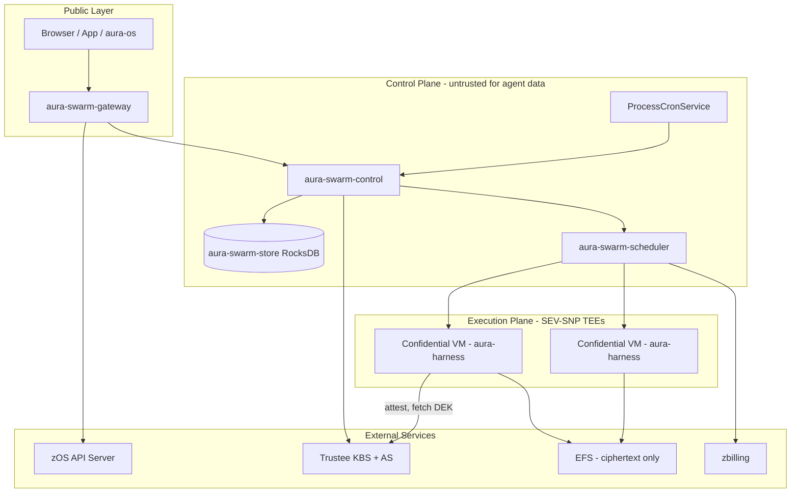

# Confidential Agent Platform Specification v0.2.0

This directory contains the specification for the AURA Swarm platform v0.2.0: a multi-user platform for running isolated AI agents where **every agent is a confidential SEV-SNP VM** (Confidential Containers / Kata + QEMU, `kata-qemu-snp`) with **sealed per-agent storage** and **tier-based pricing**.

v0.2.0 documents the architecture as shipped by the Swarm TEE upgrade (releases R1–R3): the dual-mode rollout (R1), the one-time fleet migration (R2), and the legacy-path cleanup (R3) are complete. There are no MicroVM/`kata-fc` agents anymore; the legacy decode path survives only inside the store migration module.

> **Supersedes** [v0.1.0](../v0.1.0/README.md), which described the Firecracker microVM architecture.

## Document Index

| # | Document | Component | Description |
|---|----------|-----------|-------------|
| 01 | [01-system-overview.md](./01-system-overview.md) | — | Architecture, tiers + pricing, trust boundaries, sealed storage layout |
| 02 | [02-api-gateway.md](./02-api-gateway.md) | `aura-swarm-gateway` | Public API: lifecycle, tier change, secrets pass-through, usage, logs, runs |
| 03 | [03-control-plane.md](./03-control-plane.md) | `aura-swarm-control` | Lifecycle, ProcessCronService, auto-hibernate, DEK lifecycle, usage events, migration |
| 04 | [04-agent-registry.md](./04-agent-registry.md) | `aura-swarm-store` | RocksDB schema, column families, key layouts, schema versioning |
| 05 | [05-scheduler.md](./05-scheduler.md) | `aura-swarm-scheduler` | K8s reconciler, `kata-qemu-snp` pods, KBS env, billing SKUs, pod logs |
| 06 | [06-agent-runtime.md](./06-agent-runtime.md) | aura-harness | Attestation boot, sealed stores, secrets vault, `/v1/processes` API |
| 07 | [07-auth.md](./07-auth.md) | `aura-swarm-auth` | zOS integration, JWT validation |
| 08 | [08-networking.md](./08-networking.md) | — | Internal routing, agent resolution, egress |
| 09 | [09-observability.md](./09-observability.md) | — | Logs, metrics, traces |
| 10 | [10-security.md](./10-security.md) | — | Attestation flow, key custody, control-plane visibility, threat model |

## What Changed Since v0.1.0

| Area | v0.1.0 | v0.2.0 (shipped) |
|------|--------|------------------|
| Isolation | Firecracker microVM (`kata-fc`) | Confidential SEV-SNP VM (CoCo `kata-qemu-snp`), remote attestation via Trustee |
| Sizing | Raw `cpu_millicores` / `memory_mb` spec | Box tiers: `small` / `standard` / `pro`, each with a fixed hourly price |
| State at rest | Plaintext RocksDB on EFS | AES-256-GCM value-level sealing under a per-agent DEK released post-attestation |
| Key custody | None | Trustee KBS; control plane provisions/revokes DEKs, never reads them |
| Secrets | Platform K8s secrets only | In-TEE per-agent secrets vault + gateway pass-through API |
| Automation | None | In-TEE processes (cron + prompt), trigger metadata exported, gateway-side cron service |
| Usage stats | Placeholder | `usage_events` aggregation: `GET /v1/agents/:id/usage`, `GET /v1/usage`, real status metrics |
| Logs | Placeholder | Live pod tail + termination snapshots, merged and source-tagged |
| Billing | cpu/mem-hours | Tier SKU (`swarm.small` etc.) + `hourly_price_cents` per report |

## Architecture Overview



## Terminology

| Term | Definition |
|------|------------|
| **User** | An authenticated individual identified by `user_id` from zOS |
| **Agent** | A long-running aura-harness instance, owned by a user, running in its own confidential VM |
| **Confidential VM** | SEV-SNP guest launched via the `kata-qemu-snp` RuntimeClass (Confidential Containers) |
| **Tier** | The agent's size/price class: `small`, `standard` (default), or `pro` |
| **DEK** | Per-agent 256-bit data encryption key, held by the Trustee KBS, released only into an attested guest |
| **Sealed storage** | AES-256-GCM encryption of every content-bearing store value under the DEK |
| **Process** | An in-TEE automation (cron + prompt + config); only `(process_id, cron, enabled, next_run_at)` ever leaves the VM |
| **Trigger** | The content-free schedule record the gateway-side cron service fires from |
| **Control Plane** | Platform services managing lifecycle and routing — outside the trust boundary for agent data |
| **Execution Plane** | Kubernetes SNP bare-metal nodes running confidential agent pods |

## Box Tiers

| Tier | CPU | Memory | Price | Billing SKU |
|------|-----|--------|-------|-------------|
| `small` | 500m | 1 GiB | 4¢/hour | `swarm.small` |
| `standard` (default) | 1000m | 2 GiB | 8¢/hour | `swarm.standard` |
| `pro` | 2000m | 4 GiB | 15¢/hour | `swarm.pro` |

All tiers share identical isolation (SEV-SNP), attestation, and sealing; a tier change is purely a resize. Pricing is captured on usage events at event time, so re-pricing a tier never rewrites history.

## Implementation Stack

All platform services are implemented in **Rust**:

- **Async Runtime**: Tokio
- **HTTP Framework**: Axum
- **Database**: RocksDB (embedded), CBOR-encoded values
- **Confidential Computing**: Confidential Containers (CoCo) operator, Kata + QEMU SEV-SNP, Trustee (KBS + Attestation Service), in-guest confidential-data-hub (CDH)
- **Error Handling**: `thiserror` for libraries, `anyhow` at boundaries
- **Logging**: `tracing` with structured fields
- **IDs**: Strongly-typed newtypes (32-byte `AgentId`, `UserId`; 16-byte `SessionId`)

## Crate Layout

```
aura-swarm/
├─ aura-swarm-core          # IDs, schemas, errors (shared types)
├─ aura-swarm-store         # RocksDB storage + schema migrations
├─ aura-swarm-auth          # zOS JWT validation
├─ aura-swarm-control       # Agent lifecycle, sessions, cron, DEK lifecycle, usage
├─ aura-swarm-scheduler     # K8s reconciler, confidential pod builder, billing reporter
├─ aura-swarm-gateway       # Public HTTP/WebSocket API
├─ aura-swarm-client        # Typed client for external consumers (aura-os, aura-network)
└─ aura-swarm-cli           # Admin CLI / terminal UI
```

## Reading Order

For newcomers:

1. **[01-system-overview.md](./01-system-overview.md)** — the big picture and trust boundaries
2. **[10-security.md](./10-security.md)** — attestation, key custody, what the platform can and cannot see
3. **[02-api-gateway.md](./02-api-gateway.md)** — public API reference
4. **[03-control-plane.md](./03-control-plane.md)** — lifecycle, cron, usage
5. **[06-agent-runtime.md](./06-agent-runtime.md)** — the harness contract inside the TEE

## Version History

| Version | Date | Description |
|---------|------|-------------|
| 0.1.0 | 2026-01 | Initial specification (Firecracker microVMs) — superseded |
| 0.2.0 | 2026-06 | All-TEE fleet: SEV-SNP confidential VMs, tiers, sealed storage, vault, processes, usage/logs APIs |
